public:: true
cover:: {:height 286, :width 199}
type:: [[Book]] [[Resources]] 
subtype:: [[Cookbook]]
domain:: [[Food & Cooking]] [[Health & Diet]]
author:: Michael Greger
publisher:: Flatiron Books
year:: 2021
source:: Commercial publication
diet:: [[Whole Food Plant-Based]]
title:: The How Not To Diet Cookbook

- ## APA 7 Reference
  Greger, M. (2021). *The how not to diet cookbook: 100+ recipes for healthy, permanent weight loss*. Flatiron Books.
- How Not To Diet Cookbook (PDF)
  
- CONTENTS
  hl-page:: 436
  ls-type:: annotation
  id:: 6996a522-0c31-417e-aa2f-9d6c28d6c6ec
  hl-color:: purple
	- INTRODUCTION
	- SOUPS
	  collapsed:: true
		- SPRING GREENS SOUP WITH ROASTED ASPARAGUS ==Less than 100 calories==
		  ((69cf1b37-2d6b-4713-bf6d-b08bc87ddc81))
			- MAKES: 4 servings DIFFICULTY: Easy
			  collapsed:: true
				- This bright and comforting soup is packed with fresh greens, peas and roasted asparagus. Enjoy it hot, warm or chilled.
				- **Ingredients**
					- 8 ounces/225g thin asparagus, trimmed and cut into 11/2-inch (4cm) pieces (reserve the tips)
					- 1 onion, chopped
					- 2 teaspoons finely chopped garlic
					- 6 cups/1.5 litres Light Vegetable Broth
					- 6 cups/150g coarsely chopped spinach or chard
					- 2 cups/50g coarsely chopped rocket, watercress or mustard greens
					- 1 cup/150g fresh or thawed frozen peas
					- 3 spring onions, coarsely chopped
					- 1 tablespoon nutritional yeast
					- 1 teaspoon white miso paste
					- Ground black pepper
					- 1 tablespoon fresh lemon juice
					- 1 tablespoon coarsely ground nigella seeds
				- **Instructions**
					- 1. Preheat the oven to 200°C/400°F/gas mark 6. Line a rimmed roasting tin with a silicone mat or baking parchment.
					- 2. Arrange all of the cut asparagus in the prepared roasting tin in a single layer, but keep the tips separate from the rest of the asparagus. Roast in the oven until tender and the edges begin to brown, about 15 minutes. Remove from the oven and set aside, again keeping the tips separate.
					- 3. Heat 1¼ cup/60ml of water in a large saucepan over medium heat. Add the onion and cook until softened, about 5 minutes. Add the garlic and cook, stirring, for another minute.
					- 4. Add the Light Vegetable Broth and bring to the boil. Lower the heat to a simmer and cook for 7 minutes. Remove the pot from the heat.
					- 5. Stir in the spinach, rocket, peas and spring onions and cook until the greens are wilted and tender from the hot broth, about 2 minutes.
					- 6. Stir in the roasted asparagus (except the tips), nutritional yeast, miso paste and black pepper to taste.
					- 7. Working in batches, transfer the soup to a high-powered blender and blend until smooth.
					- 8. Return the soup to the pot and heat, if desired.
					- 9. Stir in the lemon juice and then taste and adjust the seasonings, if needed.
					- 10. Ladle the soup into bowls and top with the asparagus tips and nigella seeds.
		- CHUNKY GAZPACHO WITH CUMIN ==Less than 100 calories== 
		  ((69cf1bce-b761-443e-ac2a-1eea9db7f553))
			- MAKES: 4 servings DIFFICULTY: Easy
			  collapsed:: true
				- Cumin lovers take note: with cumin featured in this soup twice, this soup is for you.
				- **Ingredients**
					- 2 mini cucumbers, peeled and chopped
					- 1 red pepper, de-seeded and chopped
					- 2 1/2 pounds/1.1kg ripe tomatoes, cored and chopped
					- 1/3 cup/50g chopped onion
					- 1 garlic clove, chopped
					- 3 tablespoons finely chopped fresh parsley
					- 2 1/2 tablespoons sherry vinegar or red wine vinegar
					- Super-Charged Spice Blend
					- 1/2 teaspoon ground cumin
					- 1/4 teaspoon ground black pepper
					- 1 teaspoon Salt-Free Hot Sauce (optional)
					- 2 tablespoons finely chopped spring onion
					- 2 tablespoons chopped fresh coriander or basil
					- 6 firm yellow cherry tomatoes, thinly sliced (optional)
					- 1 teaspoon coarsely ground nigella seeds
				- **Instructions**
					- 1. In a large bowl, combine 1 chopped cucumber, half of the chopped pepper, half of the chopped tomatoes and the chopped onion. Set aside.
					- 2. In a blender or food processor, combine the garlic with the remaining cucumber, remaining chopped pepper and remaining chopped tomatoes and process until smooth.
					- 3. Pour the pureed vegetables into the same bowl as the chopped vegetables.
					- 4. Add the parsley, vinegar, Super-Charged Spice Blend to taste, cumin, black pepper and Salt-Free Hot Sauce (if using).
					- 5. Cover the bowl and refrigerate for at least 2 hours, preferably overnight, to chill and allow the flavours to develop.
					- 6. Stir in the spring onion and coriander. Taste and adjust the seasonings, if needed.
					- 7. Serve the soup chilled, garnished with the yellow tomato slices (if using) and sprinkled with the nigella seeds.
		- ITALIAN ESCAROLE SOUP 
		  ((69cf1bee-ed84-4083-8fba-f58c3cbbfd85))
			- MAKES: 4 servings DIFFICULTY: Easy
			  collapsed:: true
				- A member of the chicory family, escarole is a hearty bitter green widely used in Italian cooking and is frequently paired with cannellini beans. Endive or chicory would also taste good.
				- **Ingredients**
					- 4 garlic cloves, finely chopped
					- 2 medium heads escarole, chopped
					- 6 cups/1.5 litres Light Vegetable Broth
					- 3 cups/525g cooked or 2 (400g) BPA-free tins or Tetra Paks salt-free cannellini beans, drained and rinsed
					- 2 teaspoons Dr Greger's Special Spice Blend, or to taste
					- 1/2 teaspoon dried oregano
					- 1/2 teaspoon garlic powder
					- 1/2 teaspoon onion powder
					- 1/4 teaspoon red pepper flakes, or to taste
					- 1 tablespoon nutritional yeast
					- Ground black pepper
				- **Instructions**
					- 1. Heat 1¼ cup/60ml water in a large pot over medium heat. Add the garlic and cook until fragrant, about 30 seconds.
					- 2. Add the escarole and cook, stirring, until wilted, about 4 minutes. Pour in the Light Vegetable Broth.
					- 3. Add the beans, Dr Greger's Special Spice Blend, oregano, garlic powder, onion powder, red pepper flakes, nutritional yeast and black pepper to taste.
					- 4. Cover and simmer until the escarole is tender and the soup is heated through, about 30 minutes.
		- RED BEAN AND BUTTERNUT CALDO VERDE 
		  ((69cf1c51-e509-4d94-a42a-7958a7a91035))
			- MAKES: 4 servings DIFFICULTY: Easy
			  collapsed:: true
				- The traditional Portuguese soup is made with dark greens, potatoes and sliced sausage, but this elevated, healthier version keeps the greens while swapping in butternut squash for potatoes (though you can add potatoes, too, if you’d like*) and replaces the sausage with red kidney beans.
				- **Ingredients**
					- 1 red onion, chopped
					- 4 garlic cloves, finely chopped
					- 1 butternut squash, halved, de-seeded and cut into 1/2-inch (1cm) dice (about 3 1/2 cups/490g)
					- 1/2 teaspoon dried oregano
					- 1/4 teaspoon red pepper flakes, or to taste
					- 2 bay leaves
					- 6 cups/1.5 litres Light Vegetable Broth
					- 6 cups/220g chopped fresh kale, collards or other dark greens
					- 1 1/2 cups/265g cooked or 1 (400g) BPA-free tin or Tetra Pak salt-free red kidney beans, drained and rinsed
					- Super-Charged Spice Blend
					- 1 teaspoon white miso paste
					- 3 tablespoons nutritional yeast
					- 2 tablespoons chopped fresh parsley
				- **Instructions**
					- 1. Heat 1¼ cup/60ml water in a large pot over medium heat. Add the onion, garlic, squash, oregano, red pepper flakes and bay leaves. Cover and cook for 5 minutes.
					- 2. Stir in the Light Vegetable Broth and bring to the boil.
					- 3. Lower the heat to a simmer and cook, partially covered, until the vegetables are just tender, about 20 minutes.
					- 4. Stir in the kale, kidney beans and Super-Charged Spice Blend to taste and cook for 10 minutes longer.
					- 5. In a small bowl, combine the miso paste with about 1/4 cup/60ml of the hot broth, stirring to blend.
					- 6. Pour the miso mixture into the soup and remove and discard the bay leaves.
					- 7. Stir in the nutritional yeast and parsley. Taste and adjust the seasoning, if needed. Serve hot.
		- BORSCHT WITH CABBAGE AND DILL ==Less than 100 calories== 
		  ((69cf1c78-70a6-4157-9ae0-3714b8df12fa))
			- MAKES: 4 servings DIFFICULTY: Easy
			  collapsed:: true
				- Beetroot may be the star of this soup, but there are a lot of supporting players, from cabbage to parsnips, and a seasoning of fresh dill and a splash of vinegar brighten the flavour.
				- **Ingredients**
					- 1 red onion, chopped
					- 2 garlic cloves, finely chopped
					- 1 celery stalk, chopped
					- 1 parsnip, chopped
					- 1 carrot, chopped
					- 3 beetroot, peeled and chopped
					- 2 tablespoons salt-free tomato puree
					- 6 cups/1.5 litres Light Vegetable Broth
					- 4 cups/400g shredded savoy cabbage
					- 1 teaspoon dried marjoram
					- 1 bay leaf
					- 2 teaspoons Dr Greger's Special Spice Blend, or to taste
					- 1/2 teaspoon ground black pepper
					- 1/4 cup/4 tablespoons finely chopped fresh dill
					- 1 to 2 tablespoons red wine vinegar, or to taste
				- **Instructions**
					- 1. Heat 1¼ cup/60ml water in a large pot over medium heat. Add the onion and garlic. Cook, stirring frequently, until the onion is softened, about 5 minutes.
					- 2. Add the celery, parsnip, carrot and beetroot. Cover and cook over a low heat, stirring occasionally, until the vegetables are slightly tender, about 7 minutes.
					- 3. Add the tomato puree, Light Vegetable Broth, cabbage, marjoram, bay leaf, Dr Greger's Special Spice Blend and black pepper.
					- 4. Bring the soup to the boil, then lower the heat to a simmer, partially cover and cook for 30 minutes, or until the vegetables are completely tender.
					- 5. Remove and discard the bay leaf and stir in the dill and red wine vinegar.
					- 6. Taste and adjust the seasonings, if needed.
		- RIBOLLITA WITH WHITE BEANS AND CAVOLO NERO
			- MAKES: 6 servings DIFFICULTY: Easy
			  collapsed:: true
				- Ribollita is an Italian peasant soup that, like most soups, tastes even better when reheated and served the next day, as the flavours are allowed to develop even more – hence the name ribollita, which means ‘reboiled’. Traditional ribollita contains Parmesan and chunks of crusty Italian bread, but this cleaner, more modern version skips the cheese and bread in favour of superstars cavolo nero and cabbage. This soup is delicious no matter when you enjoy it, but if you have time, try to prepare it a day before you plan to serve it so it’s truly a ribollita, a ‘reboiled’ peasant soup.
				- **Ingredients**
					- 1 large red onion, chopped
					- 4 garlic cloves, finely chopped
					- 2 carrots, chopped
					- 6 cups/1.5 litres Light Vegetable Broth
					- 2 celery stalks, chopped
					- 2 floury potatoes, diced
					- 1 head savoy cabbage, chopped
					- 1 bunch cavolo nero, chopped
					- 2 (400g) BPA-free tins or Tetra Paks salt-free chopped tomatoes, undrained
					- 3 cups/525g cooked or 2 (400g) BPA-free tins or Tetra Paks salt-free cannellini beans, drained and rinsed
					- 1/4 to 1/2 teaspoon red pepper flakes
					- 1 sprig rosemary
					- 1 bay leaf
					- 3 tablespoons nutritional yeast
				- **Instructions**
					- 1. Heat 1½ cup/60ml water in a large pot over a medium heat. Add the onion, garlic and carrots. Cover and cook, stirring occasionally, until the vegetables have softened, about 5 minutes.
					- 2. Add the Light Vegetable Broth, celery, potatoes, cabbage, cavolo nero, tomatoes, beans, red pepper flakes, rosemary sprig and bay leaf.
					- 3. Bring to the boil, then lower the heat to a simmer, and continue to cook until the vegetables are very soft, about 45 minutes.
					- 4. Remove and discard the rosemary sprig and bay leaf, and stir in the nutritional yeast. Serve hot.
		- HOT AND SOUR SOUP WITH SHIITAKES AND ASIAN GREENS ==Less than 100 calories==
		  ((69cf1cc3-f757-4d3b-afed-32ef8e013cad))
			- MAKES: 4 servings DIFFICULTY: Easy
			  collapsed:: true
				- This soup is easily customizable to please your palate. If you don’t like spicy food, feel free to cut back on the hot chillies or even skip them altogether, for instance. And if you prefer as heartier soup, add some cooked whole grains or 100% buckwheat noodles just before serving.
				- **Ingredients**
					- 6 cups/1.5 litres Light Vegetable Broth
					- 1 (4-inch/10cm) piece lemongrass, crushed
					- 2 (1/4-inch/1cm) slices fresh ginger
					- 1 garlic clove, crushed
					- 4 cups/400g thinly sliced bok choy, napa cabbage or other Asian greens
					- 3 cups/225g sliced shiitake mushroom caps
					- 2 shallots, cut lengthways into thin slivers
					- 1 or 2 serrano or other small hot chillies, de-seeded and thinly sliced
					- 1 cup/110g grated carrot
					- 2 cups/300g cherry tomatoes, quartered
					- 3 spring onions, chopped
					- 2 tablespoons apple cider vinegar
					- 2 teaspoons Dr Greger's Special Spice Blend, or to taste
					- 1/4 cup/4 tablespoons chopped fresh coriander or Thai basil
				- **Instructions**
					- 1. In a large pot, combine the Light Vegetable Broth, lemongrass, ginger and garlic. Bring to the boil, then lower the heat to low, cover and simmer for 20 minutes.
					- 2. Strain the broth through a sieve and discard the aromatics.
					- 3. Return the broth to the large pot and bring to the boil.
					- 4. Add the bok choy, mushrooms, shallots, chillies and carrot. Lower the heat to low and cook for 5 minutes.
					- 5. Stir in the tomatoes, spring onions, apple cider vinegar and Dr Greger's Special Spice Blend.
					- 6. Simmer until hot, about 3 minutes. Taste and adjust the seasonings, if needed. Garnish with coriander and serve hot.
		- THREE-BEAN SOUP WITH TURMERIC AND LENTILS
		  ((69cf1ce9-3443-4edd-9ed1-5126bc1eecbe))
			- MAKES: 4 to 6 servings DIFFICULTY: Easy
			  collapsed:: true
				- Turmeric casts a gorgeous golden glow on this hearty soup featuring lentils and three kinds of beans.
				- **Ingredients**
					- 1 red onion, chopped
					- 4 garlic cloves, thinly sliced
					- 1 tablespoon ground turmeric
					- 1 teaspoon ground coriander
					- 1/2 teaspoon ground cumin
					- 1/2 cup/100g dried brown lentils
					- 7 cups/1.75 litres Light Vegetable Broth
					- 1 1/2 cups/260g cooked or 1 (400g) BPA-free tin or Tetra Pak salt-free red kidney beans, drained and rinsed
					- 1 1/2 cups/250g cooked or 1 (400g) BPA-free tin or Tetra Pak salt-free chickpeas, drained and rinsed
					- 1 1/2 cups/260g cooked or 1 (400g) BPA-free tin or Tetra Pak salt-free cannellini beans, drained and rinsed
					- 6 cups/150g chopped spinach
					- 1 cup/60g chopped fresh parsley
					- 1 bunch spring onions, finely chopped
					- 2 tablespoons chopped fresh mint, or 2 teaspoons dried
					- 1/4 teaspoon ground black pepper
					- Super-Charged Spice Blend
				- **Instructions**
					- 1. Heat 1½ cup/60ml water in a large pot over a medium heat. Add the onion and garlic and cook for 5 minutes, to soften.
					- 2. Stir in the turmeric, coriander, cumin and lentils. Add the Light Vegetable Broth and bring to the boil.
					- 3. Lower the heat to a simmer and add the kidney beans, chickpeas and cannellini beans. Cover and cook until the lentils are tender, 30 to 40 minutes.
					- 4. Add the spinach, parsley, spring onions, mint, black pepper and Super-Charged Spice Blend to taste and continue to cook for 10 minutes.
					- 5. Taste and adjust the seasonings, if needed. Serve hot.
		- GINGER CARROT SOUP ==Less than 100 calories==
		  ((69cf1d18-d9cd-4370-81f2-fd84bd1b8754))
			- MAKES: 4 servings DIFFICULTY: Easy
			  collapsed:: true
				- Fresh ginger perfectly complements the flavour of the carrots in this rich soup that can be enjoyed hot, warm or chilled. Feeling adventurous? To change up the flavour, add a teaspoon (or more) of your favourite curry powder or paste.
				- **Ingredients**
					- 1 small onion, chopped
					- 2 garlic cloves, chopped
					- 1 1/2 pounds/675g carrots, chopped
					- 1 apple, cored and coarsely chopped
					- 2 teaspoons grated fresh ginger, or to taste
					- 1/4 teaspoon ground black pepper
					- 4 cups/1 litre Light Vegetable Broth
					- 1 tablespoon white miso paste
					- 1 tablespoon apple cider vinegar
					- Optional garnishes: snipped fresh chives, chopped fresh parsley, or coarsely ground nigella seeds
				- **Instructions**
					- 1. Heat 1½ cup/60ml of water in a large pot over a medium heat. Add the onion and cook until softened, stirring occasionally, about 5 minutes.
					- 2. Add the garlic and carrots and cook for 5 minutes longer, stirring occasionally.
					- 3. Stir in the apple, ginger, black pepper and Light Vegetable Broth. Lower the heat to a simmer. Cover and cook until the carrots are soft, about 30 minutes.
					- 4. Ladle 1¼ cup/60ml of the hot broth into a small bowl or cup, add the miso paste, and stir until blended.
					- 5. Add the miso mixture to the soup along with the apple cider vinegar.
					- 6. Working in batches, transfer the soup to a blender and blend until smooth. Taste and adjust the seasonings, if needed.
					- 7. Return the pureed soup to the pot and heat until hot, if needed.
					- 8. To serve, ladle the soup into bowls and top with your choice of optional garnishes.
		- CHEESY BROCCOLI SOUP
		  ((69cf1d38-9e29-444e-9614-77d0b314f58a))
			- MAKES: 4 servings DIFFICULTY: Easy
			  collapsed:: true
				- We eat first with our eyes, and the lovely green broccoli florets against a backdrop of cheesy broth will have you wanting to eat with your mouth, too. If you prefer a smoother soup, you can puree all or part of the cooked broccoli, but I find it more satisfying to bite into broccoli florets with every spoonful of soup.
				- **Ingredients**
					- 1 small onion, chopped
					- 2 garlic cloves, finely chopped
					- 1 celery stalk, chopped
					- 6 cups/1.5 litres Light Vegetable Broth
					- 6 cups/425g small broccoli florets
					- 1 cup/175g cooked salt-free cannellini beans, drained and rinsed
					- 3/4 cup/115g raw cashews, soaked in boiling water for 30 minutes and then drained
					- 1 (1/4-inch/5mm) piece fresh turmeric, grated, or 1/4 teaspoon ground
					- 1/3 cup/45g nutritional yeast
					- 1 tablespoon apple cider vinegar
					- 1 teaspoon white miso paste
					- 1 teaspoon smoked paprika
					- Ground black pepper
				- **Instructions**
					- 1. Heat 1¼ cup/60ml of water in a large pot over a medium heat. Add the onion, garlic and celery and cook for 5 minutes.
					- 2. Add 2 cups/500ml of the Light Vegetable Broth and bring to the boil. Lower the heat to low and simmer until the vegetables are tender, about 5 minutes longer.
					- 3. Transfer the soup mixture to a high-powered blender and blend until smooth.
					- 4. Transfer the pureed soup mixture back to the pot. Add the remaining 4 cups/1 litre of broth and bring to the boil.
					- 5. Add the broccoli and lower the heat to a simmer. Cook for 3 to 4 minutes, or until the broccoli is just softened. Do not overcook.
					- 6. In the same blender (no need to clean it), combine 2 tablespoons of water and the cannellini beans, cashews, turmeric, nutritional yeast, apple cider vinegar, miso paste, paprika and black pepper to taste. Process until smooth. Taste and adjust the seasonings, if needed.
					- 7. Stir the bean mixture into the soup and heat over a low heat until hot.
		- RATATOUILLE-INSPIRED PUY LENTIL SOUP
		  ((69cf1d50-277f-4065-8b31-ce0c15ba8029))
			- MAKES: 4 servings DIFFICULTY: Moderate
			  collapsed:: true
				- The famous French vegetable stew is the inspiration for this lentil soup, made with Puy lentils, of course. Herbes de Provence is a special blend of dried herbs that adds a unique depth of flavour and can be found in well-stocked supermarkets or online.
				- **Ingredients**
					- 1 red onion, chopped
					- 1 large orange or yellow pepper, de-seeded and cut into 1/2-inch/1cm dice
					- 2 courgettes, cut into 1/2-inch/1cm dice
					- 1 yellow squash, cut into 1/2-inch/1cm dice
					- 3 to 4 garlic cloves, smashed
					- 2 teaspoons Dr Greger's Special Spice Blend, or to taste
					- 1 cup/200g Puy lentils
					- 5 cups/1.25 litres Light Vegetable Broth
					- 2 pounds/900g ripe tomatoes, cored and halved
					- 1 teaspoon herbes de Provence, or 1/2 teaspoon dried oregano and 1/2 teaspoon dried basil
					- 1/4 teaspoon ground black pepper or red pepper flakes
					- 1/4 cup/4 tablespoons chopped fresh basil
				- **Instructions**
					- 1. Preheat the oven to 220°C/425°F/gas mark 7. Line a large, rimmed baking tray with a silicone baking mat or baking parchment.
					- 2. Spread the onion, pepper, courgette, yellow squash and garlic in a single layer on the prepared tray. (You may need two trays to fit all the vegetables.) Roast in the oven for 15 minutes.
					- 3. Remove from the oven and sprinkle with Dr Greger's Special Spice Blend. Use a metal spatula to flip the vegetables and return the tray(s) to the oven. Roast until the vegetables are tender and slightly caramelized, about 10 minutes longer. Remove from the oven and set aside.
					- 4. While the vegetables are roasting, combine the lentils and Light Vegetable Broth in a large pot over a high heat. Bring to the boil, then lower the heat to a simmer, cover and cook until the lentils are just tender, about 20 minutes.
					- 5. While the lentils are cooking, remove the roasted garlic from the baking tray and transfer to a food processor. Add the tomatoes and process until they are pureed and then add them to the pot.
					- 6. Stir in the herbes de Provence and black pepper.
					- 7. Add the roasted vegetables to the pot and simmer over a low heat for 5 minutes to blend the flavours.
					- 8. Remove the pot from the heat. Stir in the fresh basil. Taste and adjust the seasonings, if needed. Serve hot.
		- MY MINESTRONE
		  ((69cf1d69-a57c-4736-849b-a16c7571a483))
			- MAKES: 4 servings DIFFICULTY: Easy
			  collapsed:: true
				- Minestrone is a popular vegetable soup from Italy that is enjoyed around the world. My version is loaded with even more vegetables than usual and topped with a spoonful of Basil Pesto for added flavour.
				- **Ingredients**
					- 1 large red onion, chopped
					- 2 carrots, cut into thin rounds
					- 3 garlic cloves, finely chopped
					- 1 red pepper, de-seeded and chopped
					- 1 courgette, cut into 1/4-inch/5mm dice
					- 1 (400g) BPA-free tin or Tetra Pak salt-free chopped tomatoes, undrained
					- 2 tablespoons salt-free tomato puree
					- 8 ounces/225g green beans, trimmed and cut into 2-inch/5cm pieces
					- 1 teaspoon finely chopped fresh oregano, or 1/2 teaspoon dried
					- 6 cups/1.5 litres Light Vegetable Broth
					- 1/2 teaspoon ground black pepper
					- 3 cups/75g baby kale
					- 1 1/2 cups/250g cooked or 1 (400g) BPA-free tin or Tetra Pak salt-free chickpeas, drained and rinsed
					- 2 tablespoons Basil Pesto
				- **Instructions**
					- 1. Heat 1¼ cup/60ml of water in a large pot over a medium heat. Add the onion, carrots and garlic and cook for 5 minutes to soften.
					- 2. Add the pepper, courgette, tomatoes with their juices, tomato puree, green beans, oregano, Light Vegetable Broth and black pepper.
					- 3. Bring to the boil, then lower the heat to a simmer. Cover and cook until the vegetables are tender, about 20 minutes.
					- 4. Stir in the baby kale and chickpeas and cook for 10 minutes longer.
					- 5. Ladle the hot soup into bowls and top each with a spoonful of Basil Pesto. Serve hot.
		- MUSHROOM BARLEY SOUP
		  ((69cf1d7a-f171-4f09-9077-db93a1be9eae))
			- MAKES: 4 to 6 servings DIFFICULTY: Easy
			  collapsed:: true
				- Be sure to use pot barley (groats) instead of pearl barley to get the most nutrients
				- **Ingredients**
					- 1 small red onion, chopped
					- 1 carrot, chopped
					- 1 celery stalk, chopped
					- 3/4 cup/150g pot barley (groats), washed, rinsed, and drained
					- 8 cups/2 litres Light Vegetable Broth
					- 3 cups/300g chopped savoy cabbage
					- 1 pound/450g baby portobello or white button mushrooms, sliced or diced
					- 2 teaspoons Dr Greger's Special Spice Blend, or to taste
					- 1 1/2 teaspoons dried thyme
					- Ground black pepper
					- Chopped fresh parsley or dill
				- **Instructions**
					- 1. Heat 1¼ cup/60ml of water in a large pot over a medium heat. Add the onion, carrot and celery. Cover and cook until softened, about 5 minutes, stirring occasionally.
					- 2. Add the barley and Light Vegetable Broth. Bring to the boil, then lower the heat to a simmer, cover and cook for 30 minutes.
					- 3. Stir in the cabbage, mushrooms, Dr Greger's Special Spice Blend, thyme and black pepper to taste.
					- 4. Cover and simmer until the barley and vegetables are tender, about 30 minutes longer.
					- 5. Taste and adjust the seasonings, if needed. To serve, ladle the soup into bowls and garnish with parsley or dill.
		- CORN CHOWDER
		  ((69cf1d92-80eb-4175-8261-35d6e2c5b90a))
			- MAKES: 4 servings DIFFICULTY: Easy
			  collapsed:: true
				- This chowder can be as thick and creamy as you like, depending on how much of the soup you puree. Don’t forget to put the Salt-Free Hot Sauce on the table for those who want to add a little heat.
				- **Ingredients**
					- 1 onion, chopped
					- 2 celery stalks, chopped
					- 2 floury potatoes, diced
					- 1/4 cup/35g nutritional yeast
					- 1/2 teaspoon smoked paprika
					- 1/2 teaspoon dried thyme
					- 1/4 teaspoon ground black pepper
					- 4 cups/1 litre Light Vegetable Broth
					- 1 pound/450g fresh or thawed frozen sweetcorn
					- 2 teaspoons white miso paste
					- 2 teaspoons fresh lemon juice
					- 1 tablespoon finely chopped fresh parsley
					- Salt-Free Hot Sauce (optional)
				- **Instructions**
					- 1. Heat 1¼ cup/60ml of water in a large pot over a medium heat. Add the onion, celery and potatoes. Cover and cook, stirring occasionally, for 5 minutes, or until softened.
					- 2. Stir in the nutritional yeast, paprika, thyme, black pepper and Light Vegetable Broth.
					- 3. Bring to the boil, then lower the heat to low, stir in the sweetcorn and simmer for 20 minutes, or until the vegetables are tender.
					- 4. Scoop 2 cups/500ml of the soup solids into a high-powered blender, add the miso paste, and blend until smooth.
					- 5. Stir the pureed mixture back into the soup. Add the lemon juice, then taste and adjust the seasonings, if needed. If you prefer a thicker chowder, puree another cup/250ml of soup solids and add it back to the pot.
					- 6. Heat the soup until hot and serve sprinkled with parsley and with Salt-Free Hot Sauce on the side (if using).
		- CURRIED LENTIL AND KALE SOUP
		  ((69cf1dcd-c7b7-45f0-bb63-9f2eafc2f6d8))
			- MAKES: 4 servings DIFFICULTY: Easy
			  collapsed:: true
				- This simple soup is so full of flavour, it tastes as if it took hours to make. Spinach, chard or other dark leafy greens may be substituted for the kale if desired.
				- **Ingredients**
					- 1 red onion, chopped
					- 2 cups/270g diced sweet potato or de-seeded butternut squash
					- 1 garlic clove, finely chopped
					- 1 tablespoon grated fresh ginger
					- 1 tablespoon curry powder
					- 1 teaspoon ground coriander
					- 1/2 teaspoon ground cumin
					- 1/4 teaspoon ground black pepper
					- 1 cup/200g dried red lentils, picked over and rinsed
					- 5 cups/1.25 litres Light Vegetable Broth
					- 1 (400g) BPA-free tin or Tetra Pak salt-free finely chopped tomatoes
					- 3 cups/200g chopped kale
					- 1 teaspoon fresh lemon juice
					- Super-Charged Spice Blend
					- 1 teaspoon coarsely ground nigella seeds
				- **Instructions**
					- 1. Heat 1/4 cup/60ml of water in a large pot over a medium heat. Add the onion, sweet potato and garlic. Cover and cook until softened, about 8 minutes.
					- 2. Stir in the ginger, curry powder, coriander, cumin and black pepper.
					- 3. Add the lentils and Light Vegetable Broth and bring to the boil.
					- 4. Lower the heat to low and simmer until the lentils and vegetables are tender, stirring occasionally, about 30 minutes.
					- 5. Stir in the tomatoes and kale and continue to cook until the kale is tender, 10 to 15 minutes.
					- 6. Stir in the lemon juice and Super-Charged Spice Blend to taste. Adjust the seasonings, if needed.
					- 7. Serve hot, sprinkled with nigella seeds.
		- TUSCAN WHITE BEAN SOUP WITH ROASTED FENNEL
		  ((69cf1de2-5280-4da1-b147-50605fede65a))
			- MAKES: 4 servings DIFFICULTY: Moderate
			  collapsed:: true
				- The slightly anise flavour of fennel is a welcome addition to this soup. Pureeing half of the beans and leaving the rest whole adds creaminess to the broth while still keeping some texture for a more complex soup.
				- **Ingredients**
					- 1 large fennel bulb
					- 1 small onion, chopped
					- 4 garlic cloves, finely chopped
					- 3 cups/525g cooked or 2 (400g) BPA-free tins or Tetra Paks salt-free cannellini beans, drained and rinsed
					- 4 cups/1 litre Light Vegetable Broth
					- 2 teaspoons chopped fresh rosemary, plus more to serve (optional)
					- 1/2 teaspoon ground fennel seeds
					- 1/4 teaspoon ground black pepper
					- 1 teaspoon fresh lemon juice
				- **Instructions**
					- 1. Preheat the oven to 220°C/425°F/gas mark 7. Line a rimmed baking tray with a silicone mat or baking parchment.
					- 2. Cut off the bottom and top of the fennel bulb, reserving some fronds for garnish, if you wish. Slice the bulb in half, lengthways; then cut lengthways into 1/4-inch/5mm slices.
					- 3. Spread out the fennel pieces on the prepared baking tray. Roast in the oven for about 30 minutes, or until tender and browned, turning once about halfway through.
					- 4. Heat 1/4 cup/60ml of water in a large pot over a medium heat. Add the onion and garlic. Cover and cook, stirring occasionally, until the onion is tender, about 8 minutes.
					- 5. Add half of the cannellini beans, Light Vegetable Broth, rosemary, ground fennel seeds and black pepper and bring to the boil. Lower the heat to a simmer and cook for 10 minutes.
					- 6. Remove from the heat and allow the soup to cool slightly.
					- 7. Use a hand blender to puree the soup or, working in batches, transfer the soup to a blender and puree before returning the soup to the pot.
					- 8. Stir in the remaining half of the beans and return to a simmer to heat through for about 10 minutes, stirring occasionally.
					- 9. Stir in the lemon juice; then taste and adjust the seasonings, if needed.
					- 10. To serve, ladle the soup into bowls and top with a portion of the roasted fennel and more chopped fresh rosemary or reserved chopped fennel fronds, if desired.
	- SALADS
		- 96 per cent of Americans don’t eat the minimum recommended daily amount of beans, 96 per cent don’t eat the measly minimum for greens, and 99 per cent don’t get enough whole grains. Nearly the entire US population fails to eat enough whole-plant foods – the only place fibre is naturally found in abundance. One of my favourite ways to load up on these satiating, powerful foods is with a hearty salad, and the creativity and variety of these recipes are sure to guarantee you’ll be as salad crazed as I am.
		- SUMMER SALAD ==Less than 100 calories==
		  ((69cf1dfc-b01e-4112-a40e-407702179877))
			- MAKES: 4 servings DIFFICULTY: Easy
			  collapsed:: true
				- This refreshing salad is delicious year-round, but I especially love it when summer produce is at its peak.
				- **Ingredients**
					- 3 ripe tomatoes, cut into 1/2-inch/1cm dice, or 3 cups/450g cherry tomatoes, halved
					- 1 cucumber, ends trimmed and cut into 1/4-inch/5mm slices
					- 1 small yellow pepper, de-seeded and cut into 1/2-inch/1cm dice
					- 1/4 cup/30g thinly sliced red onion
					- 3 tablespoons chopped fresh herbs, such as parsley, dill, basil or chives
					- 1/3 cup/75ml apple cider vinegar
					- 1 teaspoon white miso paste
					- 1/4 teaspoon dried basil
					- 1/4 teaspoon dried oregano
					- 1/4 teaspoon ground black pepper
				- **Instructions**
					- 1. In a large bowl, combine the tomatoes, cucumber, pepper, onion and fresh herbs. Set aside.
					- 2. In a small bowl, whisk together 1½ cup/75ml of water with the apple cider vinegar, miso paste, dried basil, dried oregano and black pepper.
					- 3. Pour the dressing over the vegetables and toss gently to coat. Serve.
		- WALDORF SLAW
		  ((69cf1e0d-1191-4bba-b8e5-761acc4bc9fc))
			- MAKES: 4 servings DIFFICULTY: Easy
				- The classic Waldorf salad reimagined as a tasty slaw. You'll still find the apples, walnuts, celery and grapes, but in this version, hold the heavy mayo and enjoy more veggies.
				- **Ingredients**
					- 3 to 4 Gala or Fuji apples, cored and cut into 1/2-inch/1cm dice
					- 2 tablespoons fresh lemon juice
					- 2 tablespoons apple cider vinegar
					- 1 soft pitted date, soaked for 10 minutes in hot water and then drained (optional)
					- 1 teaspoon grated fresh ginger
					- 1 teaspoon white miso paste
					- 1/4 teaspoon ground black pepper
					- 3 cups/300g shredded cabbage
					- 1 large carrot, grated
					- 1/2 cup/50g seedless red grapes, halved
					- 1 celery stalk, finely chopped
					- 1/2 cup/60g chopped walnuts
					- 2 spring onions, finely chopped
				- **Instructions**
					- 1. Place the diced apples in a large bowl and toss lightly with the lemon juice to coat.
					- 2. Scoop out 1/2 cup/50g of the diced apple mixture and transfer to a blender.
					- 3. Add 2 tablespoons of water, the apple cider vinegar, date (if using), ginger, miso paste, and black pepper and blend until smooth. Set the dressing aside.
					- 4. To the large bowl of diced apple, add the cabbage, carrot, grapes, celery, walnuts and spring onions.
					- 5. Add the dressing to the slaw and toss gently to combine. Taste and adjust the seasonings, if needed.
		- THAI GREEN PAPAYA SALAD ==Less than 100 calories==
		  ((69cf1e22-76f7-43d4-8f4e-87a14dc38bd7))
			- MAKES: 4 servings DIFFICULTY: Easy
				- No need to go out to a Thai restaurant to enjoy this flavour-packed salad. With this simple (and simply delicious) recipe, you can make it at home. Grate the papaya and carrot on a mandoline slicer or box grater. If you can't get hold of green papaya, you could try cucumber and/or shredded cabbage. Leave off the red pepper flakes if you don't want the heat, or add even more if you really like to spice things up.
				- **Ingredients**
					- Zest and juice of 1 lime
					- 2 garlic cloves, finely chopped
					- 2 tablespoons apple cider vinegar
					- 2 teaspoons grated fresh ginger
					- 1 teaspoon white miso paste
					- 1 teaspoon Date Syrup
					- 1/4 teaspoon red pepper flakes, or to taste
					- 1 large green papaya, peeled, de-seeded and grated
					- 1 carrot, peeled and grated
					- 1 1/2 cups/165g green beans, cut into 1 1/2-inch/4cm pieces and lightly steamed
					- 1 cup/150g cherry tomatoes, halved lengthways
					- 2 spring onions, finely chopped
					- 1/3 cup/40g crushed unsalted roasted peanuts
				- **Instructions**
					- 1. In a small bowl, combine 2 tablespoons of water, the lime zest and juice, garlic, apple cider vinegar, ginger, miso paste, Date Syrup and red pepper flakes. Set the dressing aside.
					- 2. In a large bowl, combine the papaya, carrot, green beans, tomatoes and spring onions.
					- 3. Pour the dressing on the salad and toss to combine. Sprinkle with the peanuts and serve.
		- RYE GRAIN SALAD
		  ((69cf1e45-e359-4707-baf1-a1edf6874c3a))
			- MAKES: 4 servings DIFFICULTY: Moderate
				- Hearty, chewy rye grains are featured in this salad made with chickpeas, veggies and a zesty mustard dressing. They may take a moment to cook, but rye grains are well worth the time. Your palate and your health will thank you.
				- **Ingredients**
					- 1 cup/170g rye grains, soaked overnight in water and then drained
					- 2 large carrots, grated
					- 1/2 small red onion, finely chopped
					- 1 1/2 cups/150g finely chopped celery
					- 1 1/2 cups/250g cooked or 1 (400g) BPA-free tin or Tetra Pak salt-free chickpeas, drained and rinsed
					- 3 tablespoons dried goji berries
					- 1/2 cup/50g sliced almonds
					- 1/4 cup/15g chopped fresh coriander or parsley
					- 1/4 teaspoon ground black pepper
					- 1 orange, peeled and quartered
					- 2 teaspoons fresh lemon juice
					- 2 tablespoons balsamic or sherry vinegar
					- 1 tablespoon white miso paste
					- 1 soft pitted date, soaked for 10 minutes in hot water and then drained
					- 1 garlic clove, finely chopped
					- 2 teaspoons salt-free wholegrain mustard
				- **Instructions**
					- 1. Cook the rye grains in a pressure cooker or a pot on the stovetop. Set aside to cool.
					- 2. Transfer the cooled rye grains to a large bowl. Add the carrots, onion, celery, chickpeas, goji berries, almonds, coriander and black pepper. Set aside.
					- 3. In a blender, combine the orange, lemon juice, vinegar, miso paste, date, garlic and mustard. Blend until smooth. Taste and adjust the seasonings, if needed.
					- 4. Pour the dressing over the rye mixture and toss gently to coat. Cover and set aside for 30 minutes to allow the flavours to blend. If not serving right away, store, covered, in the refrigerator.
		- VEGETABLE CHIRASHI BOWLS
		  ((69cf1e5b-d34c-453c-88ac-1c0107f06954))
			- MAKES: 4 servings DIFFICULTY: Moderate
				- The refreshing Japanese 'scattered sushi' salad known as chirashi-zushi typically calls for raw fish on a bed of rice. This lighter version features vegetables instead of fish, and quinoa replaces the sticky rice. The salad is topped with nori strips as a nod to the sea.
				- **Ingredients**
					- 1 cup/170g uncooked quinoa, well rinsed
					- 2 tablespoons rice vinegar
					- 1 tablespoon white miso paste
					- 1 carrot, cut into thin, 2-inch/5cm strips
					- 1 cup/75g de-stemmed and thinly sliced shiitake mushrooms
					- 1 cup/150g frozen peas
					- 1 cup/100g trimmed and diagonally cut 1-inch/2.5cm pieces of mange tout
					- 1 cup/100g fresh bean sprouts
					- 1 spring onion, finely chopped
					- 1 tablespoon sesame seeds
					- 1 sheet nori, cut into 2-inch x 1/4-inch/5cm x 5mm strips
					- Umami Sauce Redux
				- **Instructions**
					- 1. Bring 2 cups/500ml of water to the boil in a saucepan. Add the quinoa and lower the heat to low. Cover and simmer until the water is absorbed, about 15 minutes.
					- 2. Drain well to remove any excess moisture and set aside for 5 minutes to make sure all the water is absorbed. Sprinkle the cooked quinoa with the vinegar and toss gently to combine.
					- 3. Transfer the quinoa to a shallow serving bowl and set aside to cool to room temperature.
					- 4. In a saucepan over a medium heat, combine 1 cup/250ml of water with the miso paste, stirring to dissolve the miso. Bring the water to a simmer, add the carrot, mushrooms and peas and cook until softened, about 2 minutes.
					- 5. Add the mange tout and bean sprouts and cook until the mange tout turn bright green, about 1 minute longer.
					- 6. Remove from the heat. Drain well and rinse under cold water to stop the cooking process and cool the vegetables.
					- 7. Spread ('scatter') the vegetables over the quinoa. Sprinkle with the spring onion, sesame seeds and nori strips. Serve at room temperature with the Umami Sauce Redux on the table to add as desired.
		- SOUTHWEST KALE SALAD WITH CUMIN–TOMATO DRESSING
		  ((69cf1e80-3e17-4f81-abae-040a7d0ec50b))
			- MAKES: 4 servings DIFFICULTY: Easy
				- Favourite flavours of the Southwest combine in this hearty main-dish salad starring kale and black beans.
				- **Ingredients**
					- **DRESSING**
					- 1 large ripe tomato, cored and quartered
					- 1 garlic clove, crushed
					- 1/4 cup/60ml apple cider vinegar
					- 2 tablespoons nutritional yeast
					- 1 teaspoon ground cumin
					- 1/2 teaspoon dried oregano
					- 1/2 teaspoon white miso paste
					- 1/2 teaspoon Super-Charged Spice Blend, or to taste
					- 1/4 teaspoon ground black pepper
					- **SALAD**
					- 1 large bunch kale, tough stems removed
					- 1 1/2 cups/250g cooked or 1 (400g) BPA-free tin or Tetra Pak salt-free black beans, drained and rinsed
					- 1 small red pepper, de-seeded and diced
					- 1 1/2 cups/260g fresh or thawed frozen sweetcorn
					- 1 ripe Hass avocado, peeled, pitted, and diced
					- 1/4 cup/4 tablespoons chopped fresh coriander or parsley
					- **TO SERVE**
					- Coarsely ground nigella seeds
				- **Instructions**
					- 1. FOR THE DRESSING: In a blender, combine all the dressing ingredients. Blend well until smooth, scraping down the sides as needed. Add up to 1/4 cup/60ml of water if the dressing is too thick, or add more tomato if too thin. Taste to adjust the seasonings.
					- 2. FOR THE SALAD: Finely chop the kale and place in a large bowl. Add the black beans, pepper, corn, avocado and coriander.
					- 3. TO SERVE: Pour on as much of the dressing on the salad as desired and toss gently to combine. Sprinkle the top with nigella seeds.
		- MARRAKECH SORGHUM SALAD WITH FRESH APRICOTS AND MINT
		  ((69cf1e94-31e0-42d8-8766-ee0d4b588daf))
			- MAKES: 4 servings DIFFICULTY: Moderate
				- Hearty sorghum in a vibrant Moroccan salad seasoned with Ras el Hanout and fresh mint leaves.
				- **Ingredients**
					- **SORGHUM**
						- 1½ cups/300g sorghum, soaked overnight
						- 1 carrot, grated
						- ½ cup/30g chopped fresh parsley
						- 2 tablespoons finely chopped chives or spring onions
						- 1 tablespoon sherry vinegar
						- 1 teaspoon Ras el Hanout
					- **DRESSING**
						- 1 teaspoon Ras el Hanout
						- 2 garlic cloves, crushed
						- 2 tablespoons almond butter
						- 1 tablespoon fresh lemon juice
						- 1 teaspoon white miso paste
					- **SALAD**
						- ½ cup/50g sliced almonds or sunflower seeds
						- 4 fresh ripe apricots, pitted and cut into wedges
						- 1 cup/50g chopped fresh mint leaves
					- **TO SERVE**
						- Chopped romaine lettuce and rocket
				- **Instructions**
					- 1. **SORGHUM:** Drain/rinse sorghum. Cook in a pot or pressure cooker. Cool, then add carrot, parsley, chives, vinegar, and Ras el Hanout.
					- 2. **DRESSING:** Blend ¼ cup/60ml water with all dressing ingredients until smooth.
					- 3. **SALAD:** Add dressing to sorghum. Add almonds, apricots, and mint; toss to coat.
					- 4. **TO SERVE:** Serve on lettuce/rocket.
		- RAS EL HANOUT
			- MAKES: 3 tablespoons DIFFICULTY: Easy
			  collapsed:: true
				- Meaning ‘head of the shop’, this Moroccan spice blend is easy to make at home.
				- **Ingredients**
					- 1½ teaspoons ground ginger
					- 1½ teaspoons ground coriander seeds
					- 1 teaspoon ground turmeric
					- 1 teaspoon ground cinnamon
					- 1 teaspoon ground cumin
					- ½ teaspoon ground allspice
					- ½ teaspoon ground cardamom
					- ½ teaspoon ground anise or fennel seeds
					- ½ teaspoon ground black pepper
					- ¼ teaspoon cayenne
					- ¼ teaspoon ground cloves
				- **Instructions**
					- 1. Combine all ingredients in a small bowl. Store in an airtight container at room temperature.
		- SWEETCORN AND BLACK-EYED BEAN SALAD
		  ((69cf1eaf-dd36-41ac-acdc-90b892bdad81))
			- MAKES: 4 servings DIFFICULTY: Easy
			  collapsed:: true
				- A variety of textures, colours and flavours makes this salad a hit at potlucks and picnics.
				- **Ingredients**
					- 3 cups/500g cooked black-eyed beans, drained and rinsed
					- 2 cups/350g sweetcorn
					- ¼ cup/40g finely chopped red onion
					- 1 small red pepper, de-seeded and diced
					- 1 ripe Hass avocado, peeled, pitted and diced
					- 1 small jalapeño pepper, de-seeded and finely chopped (optional)
					- ⅓ cup/20g chopped fresh coriander
					- **DRESSING**
						- 1 large ripe tomato, cored and quartered
						- ¼ cup/60ml fresh lemon juice
						- ½ teaspoon smoked paprika
						- ½ teaspoon chilli powder
						- 1 teaspoon Super-Charged Spice Blend, or to taste
						- Ground black pepper
					- **TO SERVE**
						- 1 tablespoon sunflower seeds
				- **Instructions**
					- 1. **SALAD:** Combine beans, corn, onion, pepper, avocado, jalapeño, and coriander in a large bowl.
					- 2. **DRESSING:** Blend dressing ingredients in a small blender.
					- 3. **TO SERVE:** Pour dressing over salad, toss gently, sprinkle with sunflower seeds, and serve.
		- BARLEY TABBOULEH SALAD WITH TAHINI DRIZZLE
		  ((69cf1ec9-2e08-4571-b4cb-1d0a7da7ef09))
			- MAKES: 4 servings DIFFICULTY: Moderate
			  collapsed:: true
				- Intact barley stands in for cracked bulgur in this hearty salad, topped with a unique tahini sauce.
				- **Ingredients**
					- **TABBOULEH**
						- ¾ cup/150g pot barley, soaked overnight and drained
						- 2 ripe plum tomatoes, chopped
						- 1 cucumber, peeled, de-seeded and chopped
						- 1½ cups/330g cooked chickpeas, drained and rinsed
						- 2 bunches parsley, finely chopped
						- ½ cup/25g chopped fresh mint
						- 2 spring onions, finely chopped
						- 4 tablespoons fresh lemon juice
						- 1 teaspoon white miso paste
						- ½ teaspoon garlic powder
						- ¼ teaspoon ground cumin
						- Super-Charged Spice Blend
					- **TAHINI SAUCE**
						- 1 garlic clove, crushed
						- 3 tablespoons tahini
						- 1 tablespoon fresh lemon juice
						- 1 teaspoon white miso paste
						- Pinch of ground cumin
					- **TO SERVE**
						- 6 cups/200g mesclun greens
						- Coarsely ground nigella seeds
				- **Instructions**
					- 1. Cook barley, drain, and cool. Add tomatoes, cucumber, chickpeas, parsley, mint, and spring onions.
					- 2. Mix lemon juice, miso, garlic powder, cumin, and spice blend; pour over barley and toss. Let sit 20 mins.
					- 3. Blend tahini sauce ingredients with ¼ cup/60ml water until smooth.
					- 4. Serve tabbouleh on greens, drizzle with tahini sauce, and sprinkle with nigella seeds.
		- RED BEAN AND ROCKET SALAD WITH MANGO BALSAMIC DRESSING ==Less than 100 calories==
		  ((69cf1edb-b71d-4cd0-a934-6342c0a4eb28))
			- MAKES: 4 servings DIFFICULTY: Easy
			  collapsed:: true
				- A vibrant mix of mango, red beans, and spicy rocket.
				- **Ingredients**
					- 1 ripe mango, peeled, pitted, and coarsely chopped
					- 2 tablespoons balsamic vinegar
					- 1 tablespoon finely chopped spring onion
					- 2 teaspoons finely chopped fresh parsley or coriander
					- 1 teaspoon white miso paste
					- 1 piece (¼-inch/5mm) fresh turmeric, grated
					- 6 cups/150g chopped rocket or baby spinach leaves
					- 1½ cups/260g cooked red kidney beans or adzuki beans, drained and rinsed
					- 1 cucumber, thinly sliced
					- 1 cup/150g cherry tomatoes, halved lengthways
				- **Instructions**
					- 1. Blend mango, vinegar, spring onion, parsley, miso, and turmeric until smooth.
					- 2. Combine rocket, beans, cucumber, and tomatoes in a bowl.
					- 3. Pour dressing over salad, toss gently, and serve immediately.
		- LETTUCE CUPS WITH CURRIED TEMPEH AND CHICKPEAS
		  ((69cf1eeb-6675-47f7-989e-e195a5ed35f8))
			- MAKES: 4 servings DIFFICULTY: Easy
			  collapsed:: true
				- Soft lettuce leaves holding a bold, curried mixture of tempeh, chickpeas, and crunchy vegetables.
				- **Ingredients**
					- 8 ounces/225g tempeh, steamed 20 mins, cooled, and crumbled
					- 1½ cups/250g cooked chickpeas, drained and rinsed
					- ½ cup/50g chopped celery
					- ⅓ cup/60g grated carrot
					- 1 Fuji or Gala apple, cored and chopped
					- 1 tablespoon chopped spring onion
					- 1½ teaspoons curry powder
					- 2 teaspoons fresh lemon juice
					- 1 teaspoon white miso paste
					- 8 to 10 whole leaves round lettuce
				- **Instructions**
					- 1. In a food processor or bowl, combine all ingredients (except lettuce) with 3 tablespoons water.
					- 2. Pulse/mix until desired consistency (chunky or smooth). Adjust seasoning.
					- 3. Spoon into lettuce cups and serve immediately.
		- WATERCRESS AND SUMMER FRUIT WITH BALSAMIC SYRUP ==Less than 100 Calories==
		  ((69cf1efd-5413-4f54-883a-206f4bdd51d4))
			- MAKES: 4 servings DIFFICULTY: Easy
			  collapsed:: true
				- A refreshing peak-summer salad using watermelon, peaches, and blueberries.
				- **Ingredients**
					- 3 cups/450g diced watermelon
					- 3 ripe peaches, cut into wedges
					- 1 cup/100g fresh blueberries
					- 2 teaspoons fresh lemon juice
					- 2 bunches watercress, tough stems removed, coarsely chopped
					- Balsamic Syrup
					- Coarsely ground black pepper
				- **Instructions**
					- 1. Combine fruit and lemon juice in a large bowl. Toss.
					- 2. Add watercress and toss again.
					- 3. Drizzle with Balsamic Syrup and sprinkle with black pepper to serve.
		- ROASTED POTATO SALAD WITH BASIL PESTO DRESSING
		  ((69cf1f0c-c582-4391-8d50-26cfe2f13f0d))
			- MAKES: 4 servings DIFFICULTY: Easy
			  collapsed:: true
				- Waxy potatoes roasted until golden, then tossed with a creamy basil pesto and white beans.
				- **Ingredients**
					- 1½ pounds/675g waxy or new potatoes, cut into 1-inch chunks
					- 2 tablespoons white wine vinegar
					- ¼ teaspoon onion powder
					- ¼ teaspoon garlic powder
					- ¼ teaspoon ground black pepper
					- 2 celery stalks, finely chopped
					- 1 carrot, grated
					- 1 cup/175g cooked cannellini beans, drained and rinsed
					- 3 spring onions, finely chopped
					- 1 tablespoon fresh lemon juice
					- 1 tablespoon white balsamic vinegar
					- 1 cup/250ml Basil Pesto, or to taste
				- **Instructions**
					- 1. Preheat oven to 220°C/425°F. Toss potatoes with vinegar, onion/garlic powder, and pepper.
					- 2. Roast on a tray for 25 mins until tender. Cool.
					- 3. Add remaining ingredients and Basil Pesto; toss to combine.
		- CHOPPED SALAD BOWL ==Less than 100 Calories==
		  ((69cf1f1e-eb82-4b2c-8f84-f2189a3dd1ba))
			- MAKES: 4 servings DIFFICULTY: Easy
			  collapsed:: true
				- A versatile, nutrient-dense bowl loaded with broccoli, sweet potato, and avocado.
				- **Ingredients**
					- **DRESSING**
						- 2 tablespoons tahini
						- 2 tablespoons apple cider vinegar
						- 1 tablespoon fresh lemon juice
						- 1 tablespoon nutritional yeast
						- 1 teaspoon white miso paste
						- 1 teaspoon dried basil
						- ¼ teaspoon onion powder
						- ¼ teaspoon garlic powder
						- ¼ teaspoon ground black pepper
					- **SALAD**
						- 1 head romaine lettuce, chopped
						- 1 cucumber, chopped
						- 2 cups/350g steamed broccoli or cauliflower florets
						- 1 sweet potato, roasted and diced
						- 1 large ripe tomato, chopped
						- 1 yellow pepper, de-seeded and chopped
						- 1 Hass avocado, peeled and diced
						- 3 radishes, chopped
						- 1 tablespoon sunflower seeds or hemp hearts
				- **Instructions**
					- 1. **DRESSING:** Blend dressing ingredients with 3 tablespoons water until smooth.
					- 2. **SALAD:** Combine all salad ingredients (except seeds) in a large bowl.
					- 3. Toss with dressing and sprinkle with sunflower seeds to serve.
		- ANTIPASTO VEGETABLES WITH TUSCAN WHITE BEAN DRESSING
		  ((69cf1f31-4719-48d8-a4df-52d225410f20))
			- MAKES: 4 servings DIFFICULTY: Easy
				- A hearty platter of roasted vegetables served over rocket with a bean-based dressing.
				- **Ingredients**
					- **VEGETABLES**
						- 1 red onion, sliced
						- 1 courgette, cut into strips
						- 1 yellow summer squash, cut into strips
						- 1 red pepper, cut into strips
						- 2 large portobello mushroom caps, sliced
						- 2 cups/300g cherry tomatoes, halved
					- **DRESSING**
						- 2 garlic cloves
						- 2 tablespoons nutritional yeast
						- ½ cup/90g cooked cannellini beans
						- 1 piece (¼-inch/5mm) fresh turmeric, grated
						- 2 tablespoons white balsamic vinegar
						- 1 tablespoon fresh lemon juice
						- 2 teaspoons white miso paste
						- ½ teaspoon salt-free mustard
						- 1 tablespoon chopped parsley
						- ¾ teaspoon chopped rosemary
						- ½ teaspoon chopped sage
						- Dr Greger’s Special Spice Blend
					- **TO SERVE**
						- 3 cups/75g rocket
						- ½ cup/15g fresh basil leaves
				- **Instructions**
					- 1. Preheat oven to 220°C/425°F. Roast vegetables (except tomatoes) on a tray for 20 mins, turning once. Scatter tomatoes on top during roasting. Cool.
					- 2. Blend all dressing ingredients until smooth.
					- 3. Spread rocket on a platter, top with roasted vegetables, drizzle with dressing, and scatter basil.
		- INDONESIAN GADO-GADO
		  ((69cf1f51-9aa7-4218-a23c-51bf069ef36e))
			- MAKES: 4 servings DIFFICULTY: Easy
				- A classic vegetable salad with steamed tempeh and a savory peanut sauce.
				- **Ingredients**
					- **PEANUT SAUCE**
						- 1 garlic clove, crushed
						- 1½ tablespoons grated fresh ginger
						- ¼ to ½ teaspoon cayenne
						- 1 teaspoon ground coriander
						- ½ teaspoon garlic powder
						- ½ teaspoon onion powder
						- 1 tablespoon lemon juice
						- 2 tablespoons apple cider vinegar
						- ⅓ cup/60g peanut butter
						- 2 tablespoons Umami Sauce Redux
						- 1 cup/250ml hot water (or as needed)
					- **SALAD**
						- 1 large sweet potato, sliced
						- 8 ounces/225g green beans, trimmed
						- 2 carrots, sliced
						- 8 ounces/225g steamed tempeh, diced
					- **TO SERVE**
						- Lettuce/spinach, cucumber, red pepper, bean sprouts, coriander, roasted peanuts.
				- **Instructions**
					- 1. **SAUCE:** Blend all sauce ingredients (except hot water). Add water slowly until pourable.
					- 2. **SALAD:** Roast sweet potato slices at 220°C/425°F for 20 mins. Steam green beans and carrots for 3 mins, then ice-water bath.
					- 3. **TO SERVE:** Arrange lettuce on a platter. Layer sweet potato, beans, carrots, raw veggies, and tempeh. Drizzle with sauce and sprinkle peanuts.
	- PASTA
		- We don’t have to say basta to pasta. True, bread collapses into a slurry of starch that is rapidly absorbed,40 but the compact structure of pasta caused by the high-pressure compression during production slows down digestion,41 so there’s no need to completely deflour our diet. Is some pasta better than others? Whole-grain pasta leaves people feeling fuller compared to refined-grain pasta,42 and ‘pasta’ made from vegetables, such as spiralized courgettes and spaghetti squash noodles, gives you all the heart and weight-loss benefits of veggies in a pasta-like form. Mangia! Mangia!
		- CAULIFLOWER ALFREDO LINGUINE WITH ROASTED ASPARAGUS
		  ((69cf1f63-b872-45f0-b047-9863b7e6f47f))
			- MAKES: 4 servings DIFFICULTY: Easy
			  collapsed:: true
				- Cauliflower is so versatile, delicious whether roasted, riced, pureed, steamed, water-sautéed or enjoyed raw. This amazing-for-you crucifer works its magic to make this creamy Alfredo sauce that tastes so decadent.
				- **Ingredients**
					- **ALFREDO SAUCE**
						- ½ cup/75g chopped onion, or 2 large shallots, chopped
						- 3 garlic cloves, finely chopped
						- 1 head cauliflower, cored and chopped (3 to 4 cups/375 to 500g)
						- 1 cup/250ml Light Vegetable Broth
						- 2 tablespoons nutritional yeast
						- 1 tablespoon white miso paste
						- ½ tablespoon fresh lemon juice
					- **ASPARAGUS**
						- 1 pound/450g asparagus, trimmed and cut into 1½-inch/4cm pieces
					- **LINGUINE**
						- 8 ounces/225g whole-grain or bean-based linguine
					- **TO SERVE**
						- Brazil Nut Parm
						- 2 tablespoons chopped fresh basil
						- Coarsely ground black pepper
				- **Instructions**
					- 1. **ALFREDO SAUCE:** Heat ¼ cup/60ml of water in a large saucepan over a medium-high heat. Add the onion and cook for 4 minutes to soften. Add the garlic and cook for 30 seconds. Add the cauliflower and Light Vegetable Broth and bring to the boil. Lower the heat to a simmer, cover, and cook for about 12 minutes, or until the cauliflower is soft.
					- 2. Transfer the cauliflower mixture to a high-powered blender and blend on high speed until smooth. Add the nutritional yeast, miso paste, and lemon juice and blend until smooth and creamy. Pour the sauce into a saucepan and keep warm over a very low heat.
					- 3. **ASPARAGUS:** Preheat the oven to 220°C/425°F/gas mark 7. Line a rimmed baking tray with a silicone mat or baking parchment. Arrange the asparagus in a single layer on the prepared tray. Roast in the oven for 15 minutes, or until the asparagus is tender and slightly browned.
					- 4. **LINGUINE:** Cook the linguine according to the package instructions in a pot of boiling water, stirring occasionally, until al dente. Drain the pasta and return it to the pot. Add the roasted asparagus and Alfredo sauce and heat for a few minutes until hot, tossing gently to combine.
					- 5. **TO SERVE:** Divide the pasta among shallow serving bowls or plates and serve hot, topped with the Brazil Nut Parm to taste, basil, and black pepper to taste.
		- PASTA WITH CREAMY PUMPKIN SAUCE
		  ((69cf1f84-bbeb-4222-8620-225ccec468c2))
			- MAKES: 4 servings DIFFICULTY: Easy
			  collapsed:: true
				- This creamy pasta dish is especially welcome on cold autumn nights. Use your favourite whole-grain or bean-based pasta shape. Consider serving the sauce over black bean pasta for Halloween!
				- **Ingredients**
					- ½ cup/125ml Light Vegetable Broth
					- 1 onion, chopped
					- 3 garlic cloves, finely chopped
					- 1 teaspoon garlic powder
					- 1 teaspoon onion powder
					- ½ teaspoon dried oregano
					- ½ teaspoon dried basil
					- ¼ teaspoon red pepper flakes
					- 1 (400g) BPA-free tin solid-pack pumpkin puree (not pumpkin pie filling)
					- 1 (400g) BPA-free tin or Tetra Pak salt-free finely chopped tomatoes
					- 2 tablespoons nutritional yeast
					- 2 teaspoons white miso paste
					- 2 teaspoons balsamic vinegar
					- Ground black pepper
					- 8 ounces/225g whole-grain or bean-based pasta of choice
					- Chopped fresh parsley
					- Brazil Nut Parm (optional)
				- **Instructions**
					- 1. Heat the Light Vegetable Broth in a saucepan over a medium heat. Add the onion and garlic and cook, stirring frequently, until the onion is soft, 5 to 7 minutes.
					- 2. Add the garlic powder, onion powder, oregano, basil and red pepper flakes. Stir in the pumpkin puree and finely chopped tomatoes and cook, stirring, for about 10 minutes. Taste and adjust the seasonings as desired. Remove from the heat.
					- 3. Carefully transfer the pumpkin mixture to a blender. Add the nutritional yeast, miso paste, vinegar and black pepper to taste. Blend until smooth and creamy. If the sauce is too thick, add a little more Light Vegetable Broth or water.
					- 4. Cook the pasta according to the package instructions in a pot of oiling water until al dente. Drain the pasta and return it to the pot. Add as much of the sauce as desired, tossing gently to coat the pasta, and heat the sauce.
					- 5. **TO SERVE:** Serve hot, topped with fresh parsley and Brazil Nut Parm (if using).
		- COURGETTE LINGUINE WITH MUSHROOM– LENTIL BOLOGNESE
		  ((69cf1f93-2a55-46d6-abc2-8a8a08cc8125))
			- MAKES: 4 servings DIFFICULTY: Moderate
			  collapsed:: true
				- If you’ve never made your own courgette noodles, you may be surprised how easy it is. You can also substitute 8 ounces/225g of whole-grain or bean-based linguine, if you prefer. I use black lentils in the sauce, but you can use any type of lentils you have on hand.
				- **Ingredients**
					- **BOLOGNESE SAUCE**
						- ¾ cup/150g dried black lentils
						- 1 onion, finely chopped
						- 3 garlic cloves, finely chopped
						- 8 ounces/225g baby portobello mushrooms, finely chopped
						- 3 tablespoons salt-free tomato puree
						- 1 tablespoon white miso paste
						- 2 tablespoons nutritional yeast
						- ½ teaspoon dried oregano
						- ½ teaspoon dried basil
						- ¼ teaspoon red pepper flakes (optional)
						- 2 (400g) BPA-free tins or Tetra Paks salt-free finely chopped tomatoes
						- 1 teaspoon balsamic vinegar
					- **COURGETTE NOODLES**
						- 4 to 6 courgettes, trimmed and spiralized or cut into long, thin strips to resemble noodles
					- **TO SERVE**
						- Brazil Nut Parm
				- **Instructions**
					- 1. **FOR THE BOLOGNESE SAUCE:** Cook the lentils in a pressure cooker or a pot on the stovetop. Set aside.
					- 2. Heat ¼ cup/60ml of water in a large, deep skillet or saucepan over a medium heat. Add the onion and garlic and cook, stirring occasionally, until softened, about 5 minutes. Add the mushrooms and cook for 3 minutes longer, and then stir in the tomato puree, miso paste, nutritional yeast, oregano, basil and red pepper flakes (if using).
					- 3. Add the tomatoes and cooked lentils and simmer, stirring frequently, for 15 minutes or until the sauce has thickened and the flavours have blended. Stir in the vinegar and then taste and adjust the seasonings, if needed. Keep warm over a low heat.
					- 4. **FOR THE COURGETTE NOODLES:** While the sauce is simmering, cook the courgette noodles in a large pot of boiling water, stirring occasionally, until they are just tender, 3 to 5 minutes. Drain and set aside.
					- 5. **TO SERVE:** Divide the cooked courgette noodles among shallow serving bowls or plates and top with the sauce. Sprinkle with Brazil Nut Parm to taste and serve hot.
		- PENNE PRIMAVERA
		  ((69cf1fa5-2efe-44e8-9405-01fcb464a1c7))
			- MAKES: 4 servings DIFFICULTY: Easy
			  collapsed:: true
				- When you see ‘primavera’, you know there will be a lot of vegetables. This take on a classic features veggies tossed with whole-grain pasta and a creamy white bean sauce.
				- **Ingredients**
					- 1 cup/175g cooked or BPA-free tinned white beans, drained and rinsed
					- 1 cup/250ml Light Vegetable Broth
					- 3 tablespoons nutritional yeast
					- 2 teaspoons miso paste
					- 1 teaspoon balsamic vinegar
					- 1 teaspoon fresh lemon juice
					- 1 teaspoon onion powder
					- ½ teaspoon garlic powder
					- 1½ teaspoons dried basil
					- ½ teaspoon dried marjoram
					- Ground black pepper
					- 8 ounces/225g whole-grain or bean-based penne
					- 1½ cups/100g small broccoli florets
					- 1 carrot, thinly sliced
					- 1 small courgette or yellow squash, cut into ¼-inch/5mm dice
					- 2 spring onions, chopped
					- 1 cup/150g cherry tomatoes, halved lengthways
					- 2 tablespoons Brazil Nut Parm
					- 2 tablespoons chopped fresh basil or flat-leaf parsley
				- **Instructions**
					- 1. In a high-powered blender or food processor, combine the white beans, Light Vegetable Broth, nutritional yeast, miso paste, vinegar, lemon juice, onion powder, garlic powder, basil, marjoram and black pepper to taste. Blend until smooth. Set the sauce aside.
					- 2. Cook the penne according to the packet instructions in a large pot of boiling water. About 5 minutes before the pasta is cooked, add the broccoli and carrots. About 2 minutes before the pasta is cooked, add the courgette.
					- 3. Drain the cooked pasta and vegetables and return them to the pot. Add the sauce, spring onions and tomatoes and cook over a medium-low heat for a few minutes, tossing gently to heat through and coat the pasta and veggies with the sauce.
					- 4. **TO SERVE:** Serve hot, sprinkled with the Brazil Nut Parm and fresh basil or parsley.
		- PESTO-TOSSED SPAGHETTI SQUASH NOODLES AND WHITE BEANS
		  ((69cf1fb4-c26f-4dc9-98e9-152a3db8ad1e))
			- MAKES: 4 servings DIFFICULTY: Easy
			  collapsed:: true
				- The fragrant Basil Pesto and cooked white beans add a deep flavour and interesting texture to baked spaghetti squash and are delicious with cooked courgette noodles and whole-grain pasta, too.
				- **Ingredients**
					- 1 large spaghetti squash, halved crosswise
					- 1½ cups/375ml Basil Pesto
					- 1 cup/175g cooked or BPA-free tinned white beans, drained and rinsed
					- Brazil Nut Parm
					- ¼ to ½ teaspoon red pepper flakes (optional)
				- **Instructions**
					- 1. **IN THE OVEN:** Preheat the oven to 200°C/400°F/gas mark 6. Place the squash halves, cut side up, in a baking dish. Add about an inch/2.5cm of water and cover the dish tightly with a lid. Bake until tender, 45 minutes to 1 hour. Scrape the squash into strands with a fork and place them in a large bowl.
					- 2. **IN A MULTICOOKER:** Pour 1 cup/250ml of water into the bottom of the pot. Place the squash halves on a steamer basket and secure the lid. Cook for 8 minutes on high pressure. Use Quick Release. Allow to cool for 10 minutes before removing the seeds and shredding the flesh.
					- 3. **TO SERVE:** Add the Basil Pesto and white beans and toss gently to combine. Serve sprinkled with Brazil Nut Parm and red pepper flakes (if using).
		- PASTA WITH ROASTED TOMATO SAUCE
		  ((69cf1fc2-bc24-427d-aba5-48539a6a80b0))
			- MAKES: 4 servings DIFFICULTY: Easy
			  collapsed:: true
				- Sometimes simplest is best. This easy-to-make tomato sauce has a rich depth of flavour, owing to the slow-roasting. Large plum tomatoes are best as they are less watery.
				- **Ingredients**
					- **ROASTED TOMATO SAUCE**
						- 2 pounds/900g ripe plum tomatoes, cored and halved
						- ½ small red onion, chopped
						- 3 garlic cloves, finely chopped
						- 1 tablespoon Italian seasoning
						- Ground black pepper
					- **PASTA**
						- 8 ounces/225g whole-grain or bean-based pasta of choice
						- 2 tablespoons chopped fresh basil or flat-leaf parsley
						- Brazil Nut Parm
				- **Instructions**
					- 1. **FOR THE ROASTED TOMATO SAUCE:** Preheat the oven to 160°C/325°F/gas mark 3. Place the tomato halves, cut side up, in a prepared baking tray. Sprinkle with the onion, garlic, Italian seasoning and black pepper to taste. Roast for 2 hours, or until the tomatoes break down.
					- 2. Transfer the tomato mixture to a food processor and process until it reaches the consistency you prefer. Transfer to a saucepan and heat over a low heat until hot.
					- 3. **FOR THE PASTA:** Cook the pasta according to the package instructions until al dente. Drain and return to the pot. Add as much of the sauce as desired, tossing gently to coat.
					- 4. **TO SERVE:** Serve hot, topped with basil or parsley and Brazil Nut Parm.
		- GEMELLI WITH COURGETTE MEATBALLS AND CHIMICHURRI
		  ((69cf1fd3-b9be-4cf1-b2c6-6586a4e73ec0))
			- MAKES: 4 servings DIFFICULTY: Moderate
			  collapsed:: true
				- Don’t let this recipe’s length intimidate you. It’s as simple to make as it is delicious. I like to make the meatballs and sauce ahead of time so their flavours develop even more.
				- **Ingredients**
					- **COURGETTE MEATBALLS**
						- 1 (400g) BPA-free tin salt-free chickpeas, drained, rinsed, and blotted dry
						- 3 garlic cloves, smashed
						- ⅓ cup/35g old-fashioned rolled oats
						- 3 tablespoons nutritional yeast
						- 3 tablespoons ground flaxseeds
						- 1 tablespoon ground chia seeds
						- 2 teaspoons fresh lemon juice
						- 1 teaspoon white miso paste
						- 1½ teaspoons dried basil
						- 1½ teaspoons dried oregano
						- 1 teaspoon onion powder
						- ¼ teaspoon ground black pepper
						- 1 cup/150g grated courgette, squeezed dry
					- **CHIMICHURRI SAUCE**
						- 2 ripe Hass avocados, peeled and pitted
						- 2 tablespoons fresh lemon juice
						- 1 tablespoon red wine vinegar
						- 2 to 3 garlic cloves, finely chopped
						- 1 teaspoon white miso paste
						- ½ teaspoon dried oregano
						- ¼ teaspoon red pepper flakes, or to taste
						- ¼ teaspoon ground black pepper
						- ¼ cup/4 tablespoons chopped fresh coriander
						- ¼ cup/4 tablespoons chopped fresh parsley
					- **PASTA**
						- 8 ounces/225g whole-grain or bean-based gemelli or other pasta
				- **Instructions**
					- 1. **FOR THE COURGETTE MEATBALLS:** Combine chickpeas, garlic, oats, yeast, flax, and chia in a food processor; pulse until finely chopped. Add lemon juice, miso, and spices. Pulse until mixed. Transfer to a bowl and add grated courgette; stir well.
					- 2. Roll into 2-tablespoon balls. Bake on a lined tray at 190°C/375°F for 25 minutes, or until firm and lightly browned.
					- 3. **FOR THE CHIMICHURRI SAUCE:** In a food processor, combine all sauce ingredients plus ¼ cup/60ml of water and pulse to combine.
					- 4. **FOR THE PASTA:** Cook the pasta until al dente. Drain and return to the pot. Add the chimichurri sauce and toss gently.
					- 5. **TO SERVE:** Divide into bowls and top each portion with 3 or 4 meatballs.
		- PASTA WITH GARLICKY WHITE BEANS AND CAVOLO NERO
		  ((69cf1fe6-1bd2-43d7-9fec-4272df736931))
			- MAKES: 4 to 6 servings DIFFICULTY: Easy
			  collapsed:: true
				- Many Italian dishes combine greens and beans – and pasta, of course! This one is made with cavolo nero (Italian kale), but you can substitute any dark leafy greens.
				- **Ingredients**
					- ½ cup/75g finely chopped red onion
					- 3 garlic cloves, finely chopped
					- ½ cup/125ml Light Vegetable Broth
					- 3 tablespoons nutritional yeast
					- 1 tablespoon white miso paste
					- ½ teaspoon garlic powder
					- ¼ teaspoon red pepper flakes
					- 1 pound/450g cavolo nero, trimmed and cut into 1-inch/2.5cm slices
					- 3 cups/525g cooked cannellini or white beans, drained and rinsed
					- Ground black pepper
					- 1 tablespoon white balsamic vinegar
					- 8 ounces/225g whole-grain or bean-based pasta of choice
				- **Instructions**
					- 1. Heat ¼ cup/60ml of water in a skillet. Add onion and garlic; cook until soft (7 mins). Lower heat to simmer and stir in broth, yeast, miso, garlic powder and flakes.
					- 2. Add cavolo nero; cook until wilted (2 mins). Add beans and black pepper. Cover and cook until cavolo nero is tender (10 mins). Stir in vinegar. Keep warm.
					- 3. Cook the pasta until al dente. Drain well and return to the pot. Add the cavolo nero mixture and toss gently to combine. Serve hot.
		- ROOT VEGETABLE MAC ’N CHEESE
		  ((69cf1ff4-8aff-46e0-a13e-a7c239f043ed))
			- MAKES: 4 servings DIFFICULTY: Moderate
			  collapsed:: true
				- This dish not only features chunks of roasted root vegetables, but there are pureed root veggies in the sauce, too. Follow the recipe closely, or use your own combination of root vegetables (about 3 pounds/1.35kg total).
				- **Ingredients**
					- **ROOT VEGETABLES**
						- 1 parsnip, cut into 1-inch/2.5cm dice
						- 1 carrot, cut into 1-inch/2.5cm dice
						- 1 sweet potato, cut into 1-inch/2.5cm dice
						- 1 waxy potato, cut into 1-inch/2.5cm dice
						- ½ cup/75g chopped onion
						- ½ teaspoon onion powder
						- ¼ teaspoon ground black pepper
					- **MAC ’N CHEESE SAUCE**
						- 2 cups/500ml Light Vegetable Broth
						- ½ cup/70g nutritional yeast
						- 1 tablespoon fresh lemon juice
						- 1 teaspoon white miso paste
						- 1 teaspoon salt-free mustard
						- ½ teaspoon onion powder
						- ½ teaspoon garlic powder
						- ½ teaspoon smoked paprika
						- ¼ teaspoon grated fresh turmeric
					- **PASTA**
						- 8 ounces/225g whole-grain or bean-based elbow macaroni
				- **Instructions**
					- 1. **FOR THE ROOT VEGETABLES:** Preheat the oven to 220°C/425°F. Roast vegetables on lined trays with onion powder and black pepper for 45 to 60 minutes until tender and caramelized. Remove and set aside.
					- 2. **FOR THE MAC ’N CHEESE:** Put 2 cups/350g of the roasted vegetables into a high-powered blender. Add broth, yeast, lemon, miso, mustard, and spices. Blend until very smooth. Adjust broth for desired consistency.
					- 3. **FOR THE PASTA:** Cook macaroni until al dente. Drain and return to the pot. Add the remaining roasted vegetables and the sauce, stirring over a low heat to combine. Serve hot.
		- GREEN BEAN AND MUSHROOM STROGANOFF
		  ((69cf2007-d282-49ae-a2f0-ec4b736e74cc))
			- MAKES: 4 servings DIFFICULTY: Moderate
			  collapsed:: true
				- A versatile savoury Stroganoff that uses white beans and nutritional yeast for a creamy, dairy-free finish. Instead of serving over pasta, you can spoon it over cooked greens or whole grains.
				- **Ingredients**
					- 8 ounces/225g green beans, trimmed and cut into 1.5-inch/4cm pieces
					- 1 cup/250ml Light Vegetable Broth
					- 1 onion, chopped
					- 3 garlic cloves, finely chopped
					- 1 pound/450g baby portobello mushrooms, quartered
					- 1 teaspoon dried thyme
					- ¼ teaspoon ground black pepper
					- 1 cup/175g cooked white beans, drained and rinsed
					- 3 tablespoons nutritional yeast
					- 2 teaspoons fresh lemon juice
					- 2 teaspoons white miso paste
					- 8 ounces/225g whole-grain or bean-based linguine
					- ⅓ cup/20g chopped fresh parsley
				- **Instructions**
					- 1. Steam the green beans over boiling water until just tender (4 mins). Set aside.
					- 2. Heat broth in a saucepan. Add onion and garlic; cook until tender (5 mins). Stir in mushrooms, thyme and black pepper. Cook for another 5 mins until mushrooms release juices.
					- 3. In a blender, combine white beans, nutritional yeast, lemon juice, miso paste and ¼ cup/60ml of water. Blend until smooth. Scoop out 1 cup/250ml of the mushroom mixture, add it to the blender, and blend again.
					- 4. Stir the blended bean mixture into the saucepan with the remaining mushrooms. Add the steamed green beans and heat through.
					- 5. Cook the pasta until al dente. Drain and divide among bowls. Top with the Stroganoff and sprinkle with fresh parsley.
	- MAIN-LY VEGETABLES
		- Many vegetables have such a low calorie density that you would tire from chewing before you could overdo it. You’d have to eat a wheelbarrow full of cabbage before you’d ever need to begin worrying about overindulging. And the more water-rich the food, the fewer calories are being taken in overall. Higher-volume foods also take longer to eat, which slows the rate of consumption and increases ‘oropharyngeal stimulation’, the sensation of food in our mouth and throat. The more we chew, taste, and feel food in our mouth, the more our brain gets tipped off that we’re filling up.
		- THREE SISTERS STEW
		  ((69cf2020-9905-48a3-8e49-ecd82916f657))
			- MAKES: 6 servings DIFFICULTY: Easy
				- According to Native American tradition, beans, corn and squash are the ‘three sisters’, planted together to support one other and allowing each to thrive.
				- **Ingredients**
					- 1 large butternut squash (about 2 pounds/900g), halved lengthways
					- ½ teaspoon onion powder
					- ½ teaspoon smoked paprika
					- 1 cup/250ml Light Vegetable Broth or water
					- 1 onion, chopped
					- 3 garlic cloves, finely chopped
					- 1 large red pepper, cut into ½-inch/1cm dice
					- 1 small fresh hot chilli, de-seeded and chopped
					- 1 (400g) tin salt-free chopped tomatoes, undrained
					- 3 cups/500g cooked pinto beans, drained and rinsed
					- 2 cups/350g fresh or frozen sweetcorn
					- 2 teaspoons ground cumin
					- 2 teaspoons chilli powder
					- 1 teaspoon dried oregano
					- Super-Charged Spice Blend
					- Ground black pepper
					- ¼ cup/4 tablespoons chopped fresh coriander or parsley
				- **Instructions**
					- 1. Preheat oven to 190°C/375°F. Roast diced squash (1½-inch/4cm dice) with onion powder and paprika for 45 mins on a lined tray until just tender.
					- 2. Heat broth in a large pot. Sauté onion (5 mins), then add garlic, pepper, and chilli for 5 more mins.
					- 3. Stir in tomatoes, beans, corn, cumin, chilli powder, and oregano. Season with spice blend and pepper.
					- 4. Add roasted squash and simmer for 20 mins until vegetables are tender. Stir in coriander before serving.
		- CHEESY CAULIFLOWER POTATO BAKE
		  ((69cf202e-bc42-47e9-9773-0d15a2bb5b1d))
			- MAKES: 4 servings DIFFICULTY: Easy
			  collapsed:: true
				- A crisp green salad is the perfect accompaniment to this cozy casserole made with cauliflower, potatoes and white beans.
				- **Ingredients**
					- 1½ cups/260g cooked white beans, drained and rinsed
					- ⅔ cup/90g nutritional yeast
					- 1½ tablespoons fresh lemon juice
					- 1 tablespoon apple cider vinegar
					- 2 teaspoons white miso paste
					- 1 teaspoon salt-free mustard
					- 1 teaspoon onion powder
					- 1 teaspoon dried thyme
					- 1 (½-inch/1cm) piece fresh turmeric, grated
					- ½ teaspoon garlic powder
					- Ground black pepper
					- 2 cups/500ml Light Vegetable Broth
					- 1 head cauliflower, cored and cut into ¼-inch/5mm slices
					- 2 floury potatoes, thinly sliced
					- ¼ cup/25g finely ground walnuts
					- ½ teaspoon smoked paprika
				- **Instructions**
					- 1. Blend beans, yeast, lemon, vinegar, miso, mustard, spices, and pepper until smooth. Add broth and blend again.
					- 2. Preheat oven to 200°C/400°F.
					- 3. Layer sauce, cauliflower, and potatoes in a shallow baking dish, repeating until ingredients are used, ending with sauce.
					- 4. Cover and bake for 45 mins. Uncover, sprinkle with walnuts and paprika, and bake for 15 more mins until golden.
		- ETHIOPIAN COLLARD GREENS AND BEANS
		  ((69cf203e-7fee-4571-bde7-19896aaafa74))
			- MAKES: 4 servings DIFFICULTY: Easy
			  collapsed:: true
				- If you can’t find fresh collard greens, kale is a good alternative, but keep in mind that the cooking time will be a bit shorter.
				- **Ingredients**
					- 1 large red onion, finely chopped
					- 3 garlic cloves, finely chopped
					- 1½ teaspoons grated fresh ginger
					- 1 teaspoon ground cumin
					- 1 teaspoon ground coriander
					- 1 teaspoon smoked paprika
					- ½ teaspoon ground turmeric
					- ¼ teaspoon ground fenugreek seeds
					- ¼ teaspoon ground cardamom
					- ¼ teaspoon cayenne
					- Super-Charged Spice Blend
					- Ground black pepper
					- 2 cups/500ml Light Vegetable Broth
					- 1 bunch collard greens (12oz/350g), stems removed, chopped
					- 1½ cups/260g cooked black-eyed beans, drained and rinsed
					- White balsamic vinegar
					- Cooked whole grains (for serving)
					- ¼ teaspoon ground nigella seeds
				- **Instructions**
					- 1. Sauté onion in ¼ cup water (5 mins). Add garlic and ginger (1 min).
					- 2. Stir in spices, broth, and greens. Simmer until wilted, then cover and cook 30 mins.
					- 3. Add black-eyed beans. Cook uncovered until liquid evaporates and greens are tender.
					- 4. Stir in vinegar. Serve over grains and top with nigella seeds.
		- NIGELLA SEED-RUBBED BALSAMIC ROASTED CAULIFLOWER
		  ((69cf204f-8cb8-450b-a54c-1e5a3b73070f))
			- MAKES: 4 servings DIFFICULTY: Easy
			  collapsed:: true
				- A whole, roasted cauliflower makes a great centrepiece on the dinner table with its gorgeous dark bronze glaze.
				- **Ingredients**
					- 1 cup/250ml balsamic vinegar
					- 2 tablespoons Date Syrup
					- 2 teaspoons ground nigella seeds
					- 1 large head cauliflower, cored
					- 1 red onion, cut into wedges
					- 8 ounces/225g baby potatoes, halved
					- 2 cups/300g cherry tomatoes, halved
					- 2 tablespoons chopped fresh parsley
				- **Instructions**
					- 1. Simmer vinegar, syrup, and 1 tsp nigella seeds in a pan for 20 mins until reduced by half.
					- 2. Blanch cauliflower head in boiling water for 5 mins. Place upright in a baking dish.
					- 3. Surround with onion, potatoes, and tomatoes. Rub cauliflower with glaze and remaining nigella seeds.
					- 4. Roast at 200°C/400°F for 40 mins, basting with glaze and turning vegetables once. Garnish with parsley.
		- ROASTED ROOT VEGETABLES ON GARLIC– BRAISED GREENS
		  ((69cf2064-6afd-4c68-a0f8-9558daab9297))
			- MAKES: 4 servings DIFFICULTY: Easy
			  collapsed:: true
				- Garlicky dark greens are an ideal complement for the caramelized sweetness of the root vegetables.
				- **Ingredients**
					- **ROOT VEGETABLES**
						- 1 parsnip, diced
						- 1 carrot, diced
						- 1 sweet potato, diced
						- 1 waxy potato, diced
						- ½ cup/75g chopped onion
						- ½ teaspoon onion powder
						- ¼ teaspoon ground black pepper
					- **GARLICKY GREENS**
						- ⅓ cup/75ml Light Vegetable Broth or water
						- 3 to 4 garlic cloves, chopped
						- ½ teaspoon dried oregano
						- ¼ teaspoon red pepper flakes
						- 2 teaspoons white miso paste
						- 1 pound/450g dark leafy greens, chopped
				- **Instructions**
					- 1. **ROOT VEGETABLES:** Roast diced veg at 220°C/425°F with onion powder and pepper for 45–60 mins until tender.
					- 2. **GREENS:** Boil broth, garlic, oregano, and flakes. Cook for 1 min. Stir in miso and greens.
					- 3. Cook until tender (3 mins for spinach/chard, up to 45 mins for kale/collards). Drain excess liquid.
					- 4. Serve root vegetables over greens with black pepper.
		- PORTOBELLOS AND SPINACH ON CAULIFLOWER MASH WITH MISO–MUSHROOM SAUCE
		  ((69cf2077-4de9-4132-b59e-c6df3594d35a))
			- MAKES: 4 servings DIFFICULTY: Moderate
			  collapsed:: true
				- I like to make the mash and sauce ahead of time, so I can put dinner on the table in a flash.
				- **Ingredients**
					- **CAULIFLOWER MASH**
						- 1 head cauliflower, cut into pieces
						- 1 tablespoon nutritional yeast
						- 1 teaspoon white miso paste
						- 2 teaspoons Roasted Garlic (optional)
					- **SAUCE**
						- 2 shallots, chopped
						- 2 cups/200g chopped assorted fresh mushrooms
						- 2 tablespoons nutritional yeast
						- 2 tablespoons white miso paste
						- 1 teaspoon balsamic vinegar
						- 1 teaspoon dried thyme
						- ½ teaspoon dried sage
						- ½ teaspoon onion powder
						- 1½ cups/375ml Light Vegetable Broth
					- **MUSHROOMS**
						- 4 large portobello caps, gills removed
						- 3 spring onions, chopped
						- 2 garlic cloves, chopped
						- 1 teaspoon balsamic vinegar
						- ½ teaspoon smoked paprika
						- 6 cups/180g spinach leaves
				- **Instructions**
					- 1. **MASH:** Steam cauliflower 10 mins. Blend with yeast, miso, and garlic until smooth.
					- 2. **SAUCE:** Sauté shallots (3 mins) and mushrooms (3 mins) in water. Stir in seasonings and broth. Simmer 5 mins, then blend until smooth.
					- 3. **MUSHROOMS:** Cook caps in water for 5 mins. Add onions, garlic, vinegar, and paprika; cook 5 mins per side. Wilt spinach in the same pan.
					- 4. Serve caps and spinach over mash, topped with sauce and parsley.
		- JICAMA NACHOS
		  ((69cf2088-d45f-4e03-9737-669a0cb7a8dd))
			- MAKES: 4 servings DIFFICULTY: Moderate
			  collapsed:: true
				- Who doesn’t love nachos? If you use jicama chips instead of tortilla chips, your heart will be as happy as your palate.
				- **Ingredients**
					- **JICAMA CHIPS**
						- 2 medium jicama, peeled and sliced thin
						- ¼ cup/60ml fresh lime juice
						- 1 tablespoon nutritional yeast
						- ½ teaspoon onion/garlic powder and smoked paprika
					- **QUESO**
						- ¾ cup/115g cashews, soaked 30 mins
						- Jalapeño, nutritional yeast, lemon juice, miso, smoked paprika, onion/garlic powder, cumin, and turmeric
					- **NACHOS**
						- 1½ cups cooked black beans
						- 2 cups Fresh Tomato Salsa
						- Avocado, spring onion, jalapeño, and coriander
				- **Instructions**
					- 1. **CHIPS:** Toss jicama with lime juice and seasonings. Bake at 200°C/400°F for 20 mins per side until golden.
					- 2. **QUESO:** Blend queso ingredients with ½ cup water until smooth. Heat gently in a pan.
					- 3. Assemble by layering chips with warm beans, salsa, and queso. Top with avocado and herbs.
		- CAULIFLOWER PICCATA WITH MUSHROOMS AND POTATOES
		  ((69cf2098-d68c-4f4a-a809-f14c8979ad9a))
			- MAKES: 4 servings DIFFICULTY: Easy
			  collapsed:: true
				- These cauliflower steaks are simple to make, but they have complex flavours and a gorgeous presentation.
				- **Ingredients**
					- 1 head cauliflower, cut into ½-inch/1cm slices
					- 8 ounces/225g red potatoes, quartered
					- 8 ounces/225g portobello mushrooms, quartered
					- 1 cup cherry tomatoes
					- **SAUCE:** 1 cup cooked cannellini beans, broth, lemon juice, yeast, miso, turmeric, onion powder, stone-ground mustard
				- **Instructions**
					- 1. Roast cauliflower and potatoes at 220°C/425°F for 20 mins. Add mushrooms and tomatoes; roast 15 mins more.
					- 2. Blend all sauce ingredients until smooth. Heat in a pan with spring onions and parsley.
					- 3. Transfer vegetables to a platter and pour sauce over the top.
		- BALSAMIC BUTTERNUT, BRUSSELS AND BEETROOT
		  ((69cf20a8-a396-4225-b674-8180515c616a))
			- MAKES: 4 servings DIFFICULTY: Easy
			  collapsed:: true
				- If your beetroot comes with nice greens attached, consider cooking them up to serve as a bed for these veggies.
				- **Ingredients**
					- 1 butternut squash, diced
					- 1 pound/450g Brussels sprouts, halved
					- 1 pound/450g beetroot, diced
					- 1 red onion, diced
					- ½ teaspoon oregano and coriander
					- 2 teaspoons Dr Greger’s Special Spice Blend
					- ¼ cup/60ml Balsamic Syrup
				- **Instructions**
					- 1. Toss vegetables with spices. Roast at 220°C/425°F for 30–45 mins until tender.
					- 2. Transfer to a dish, drizzle with Balsamic Syrup, and season with remaining spice blend and pepper.
		- VEGETABLE TART
		  ((69cf20b7-ad6a-4218-95d3-435fcfec0ccb))
			- MAKES: 4 to 6 servings DIFFICULTY: Moderate
			  collapsed:: true
				- This beautiful tart with its chickpea crust has a lot going for it.
				- **Ingredients**
					- **CRUST:** 1½ cups chickpeas, yeast, chia/flaxseeds, miso, onion/garlic powder, basil, oregano
					- **FILLING:** Red onion, red pepper, garlic, courgette, mushrooms, spring onions, white beans, yeast, apple cider vinegar, chia seeds, paprika, turmeric, cherry tomatoes
				- **Instructions**
					- 1. **CRUST:** Process crust ingredients. Press into a 9-inch springform tin. Bake at 200°C/400°F for 10 mins.
					- 2. **FILLING:** Sauté onion, pepper, garlic, courgette, and mushrooms.
					- 3. Blend white beans, yeast, vinegar, chia, and spices. Spread bean mixture on crust, top with sautéed veg and cherry tomato halves.
					- 4. Bake 18–20 mins. Cool 10 mins and serve drizzled with Balsamic Syrup.
		- ARTICHOKE AND SPINACH STUFFED PORTOBELLOS
		  ((69cf20c7-d371-43ae-b511-c4b4333f81bd))
			- MAKES: 2 to 4 servings DIFFICULTY: Easy
			  collapsed:: true
				- A healthier, flavour-packed version of artichoke dip stuffed into meaty portobellos.
				- **Ingredients**
					- 10 ounces/300g spinach, steamed and squeezed dry
					- 1 cup cooked white beans
					- 1 garlic clove and 2 spring onions
					- 2 tablespoons nutritional yeast, lemon juice, miso, and balsamic vinegar
					- 1 tin salt-free artichoke hearts
					- 4 large portobello mushrooms
				- **Instructions**
					- 1. Blend beans, onions, garlic, yeast, lemon, and miso. Pulse in artichokes and then spinach.
					- 2. Brush caps with vinegar, onion powder, and pepper. Bake at 190°C/375°F for 10 mins.
					- 3. Stuff with filling and bake for 15 more mins.
		- PEPPERS STUFFED WITH BLACK BEANS AND MUSHROOM–WALNUT CRUMBLES
		  ((69cf20d7-1396-468b-b13f-64d9fa6c5e0f))
			- MAKES: 4 servings DIFFICULTY: Moderate
			  collapsed:: true
				- The seasonings in this recipe give this stuffing a flavour similar to Italian sausage.
				- **Ingredients**
					- 4 large peppers, tops removed
					- 1 red onion, garlic, 4 cups kale, 4oz mushrooms
					- 1½ cups black beans, 3 tomatoes
					- Nutritional yeast, miso, parsley, fennel seeds, red pepper flakes
					- 1 cup Mushroom–Walnut Crumbles
					- Brazil Nut Parm
				- **Instructions**
					- 1. Steam peppers for 3 mins to soften.
					- 2. Sauté onion, garlic, kale, mushrooms, beans, and tomatoes with seasonings until liquid is absorbed (10–15 mins). Stir in crumbles.
					- 3. Fill peppers, place upright in a dish with 1 inch water, cover, and bake at 190°C/375°F for 25–30 mins.
		- ROASTED KABOCHA WITH KALE–CRANBERRY STUFFING
		  ((69cf2120-2801-4793-a679-ca83bcf0e4fc))
			- MAKES: 4 servings DIFFICULTY: Moderate
			  collapsed:: true
				- Rather than starchy bread cubes, the stuffing is made with Basic BROL (Barley, Rye, Oats and Lentils).
				- **Ingredients**
					- 1 large kabocha squash, halved
					- Red onion, celery, cranberries, kale
					- Umami Sauce Redux, thyme, rosemary, sage
					- 2 cups Basic BROL
				- **Instructions**
					- 1. Sauté onion and celery; stir in cranberries, kale, sauce, and herbs. Mix with BROL.
					- 2. Spoon stuffing into squash halves. Bake at 180°C/350°F for 1 hour 20 mins until soft.
		- CUMIN-ROASTED CARROTS WITH CHICKPEAS AND TOMATOES
		  ((69cf2130-b034-433e-99f8-5a18c2520d47))
			- MAKES: 4 servings DIFFICULTY: Easy
			  collapsed:: true
				- Roasting chickpeas makes them nearly crunchy, paired with tender, lightly charred carrots.
				- **Ingredients**
					- 1 pound/450g carrots, cut diagonally
					- 1½ cups cooked chickpeas
					- Apple cider vinegar, cumin, coriander, black pepper
					- 3 cups cherry tomatoes, halved
				- **Instructions**
					- 1. Roast carrots and chickpeas at 200°C/400°F with spices and vinegar for 15 mins.
					- 2. Add tomatoes to the tray; roast 15 more mins until chickpeas are crunchy.
		- SAGE-KISSED SWEET POTATO WEDGES WITH SHALLOTS
		  ((69cf213f-b1b2-4c60-aac5-ef3cd0518fcc))
			- MAKES: 4 servings DIFFICULTY: Easy
			  collapsed:: true
				- These wedges are coated in cornmeal and spices for extra texture and flavour.
				- **Ingredients**
					- 3 sweet potatoes, cut into wedges
					- ⅓ cup vinegar
					- ⅓ cup blue cornmeal/polenta
					- 1 tablespoon smoked paprika
					- 2 teaspoons ground sage
					- 3 shallots
				- **Instructions**
					- 1. Toss wedges in vinegar. Mix cornmeal, paprika, and sage; sprinkle over potatoes and toss to coat.
					- 2. Roast at 220°C/425°F for 30 mins, turning once, with shallots distributed among them.
	- BEANS
		- Dietary fibre is found in all whole plant foods, but it is most concentrated in legumes, such as split peas, chickpeas, lentils, and beans, the stars of the recipes in this section. Did you know the amount of fibre in a single ½-cup/80g daily serving of beans over about a two-year period was associated with a ‘profound’ 25 per cent difference in abdominal obesity in overweight youth, and, in about the same time frame, each 2-gram increase in daily fibre was associated with a weight decrease of about a pound/0.5kg in middleaged women? Beans can also keep us feeling fuller for much longer. By eating fibre-rich foods on a daily basis, we can set ourselves up for success, and the recipes in this section are sure to be a success at the dinner table.
		- COTTAGE PIE WITH SWEET POTATO MASH
		  collapsed:: true
		  ((69cf2154-0110-4482-ba54-5b3d524c4275))
			- MAKES: 4 to 6 servings DIFFICULTY: Moderate
				- One of my favourite comfort foods. This warm, savoury dish is just as flavoursome with mashed cauliflower instead of the sweet potato topping, so mix it up if the mood strikes.
				- **Ingredients**
					- 2 pounds/900g sweet potato, cut into 2-inch/5cm chunks
					- ½ teaspoon onion powder
					- ¼ teaspoon ground black pepper
					- 1 small red onion, chopped
					- 1 carrot, chopped
					- 2 garlic cloves, finely chopped
					- 1½ cups/260g fresh or thawed frozen sweetcorn
					- 1 cup/150g fresh or thawed frozen peas
					- 1 cup/170g cooked fresh or frozen broad beans
					- 2 cups/400g cooked or BPA-free tinned or Tetra Pak salt-free brown lentils
					- 1 cup/250ml Light Vegetable Broth
					- 8 ounces/225g mushrooms of choice, chopped
					- 3 tablespoons nutritional yeast
					- 2 tablespoons salt-free tomato puree
					- 1 tablespoon white miso paste
					- 1 teaspoon finely chopped fresh thyme, or ½ teaspoon dried
				- **Instructions**
					- 1. Place the sweet potatoes into a large pot with enough cold water to cover and bring to the boil. Cook for 15 to 20 minutes, or until fork-tender, then drain and return to the pot. Stir in the onion powder and black pepper and mash until smooth. Set aside.
					- 2. Preheat the oven to 200°C/400°F/gas mark 6.
					- 3. Heat ¼ cup/60ml of water in a large skillet over a medium heat. Add the onion and carrot and cook until softened, about 7 minutes. Stir in the garlic and lower the heat to low. Stir in the sweetcorn, peas and cooked broad beans. Cook until the vegetables are tender and any liquid is absorbed, 3 to 5 minutes. Stir in three quarters of the lentils, then transfer the vegetable mixture to a shallow baking dish and set aside.
					- 4. Heat the Light Vegetable Broth in the same large skillet over a medium heat. Add the mushrooms, nutritional yeast, tomato puree, miso paste and thyme and cook, stirring, for 5 minutes, or until the mushrooms are soft.
					- 5. Transfer the mushroom mixture to a blender or food processor, add the remaining lentils and blend until smooth. If the gravy is too thick, blend in up to ½ cup/120ml of additional broth. Taste and adjust the seasonings, if needed.
					- 6. Pour the gravy over the vegetable mixture, stirring to combine. Spread the mashed sweet potatoes on top, smoothing to cover the surface. Bake for about 30 minutes, or until the filling is bubbling. Serve hot.
		- CORNMEAL-CRUSTED BUFFALO TEMPEH WITH WHITE BEAN RANCH
		  ((69cf2167-62bf-414a-a55b-65db27e6c83a))
			- MAKES: 4 servings DIFFICULTY: Moderate
			  collapsed:: true
				- The White Bean Ranch isn’t only the perfect dipping sauce for this tempeh dish – it also makes a great salad dressing.
				- **Ingredients**
					- **WHITE BEAN RANCH**
						- ½ cup/90g cooked or BPA-free tinned or Tetra Pak salt-free white beans, drained and rinsed
						- ¼ cup/40g raw cashews, soaked for 30 minutes in hot water and then drained
						- 1 tablespoon apple cider vinegar
						- 2 teaspoons fresh lemon juice
						- 1 teaspoon onion powder
						- ½ teaspoon garlic powder
						- 1 teaspoon white miso paste
						- ¼ teaspoon ground black pepper
						- 2 teaspoons finely chopped fresh parsley
						- 1 teaspoon finely chopped fresh dill, or ¼ teaspoon dried
						- 1 teaspoon finely chopped fresh chives, or ½ teaspoon dried
					- **TEMPEH**
						- ¾ cup/90g coarse-ground cornmeal/polenta, blue if available
						- 1 tablespoon nutritional yeast
						- 1 teaspoon garlic powder
						- 1 teaspoon Dr Greger’s Special Spice Blend
						- 1 pound/450g tempeh, cut into 1-x 3-inch (2.5 × 7.5cm) bars
						- ⅔ cup/150ml Salt-Free Hot Sauce, or more
				- **Instructions**
					- 1. **FOR THE WHITE BEAN RANCH:** In a high-powered blender, combine ⅓ cup/75ml of water with all the ingredients, except the parsley, dill and chives, and blend until smooth. Transfer the dressing to a bowl and stir in the parsley, dill and chives. Taste and adjust the seasonings, if needed. Cover and refrigerate for at least 1 hour. Stir or shake before serving.
					- 2. **FOR THE TEMPEH:** Preheat the oven to 220°C/425°F/gas mark 7. Line a large, rimmed roasting tin with a silicone mat or baking parchment.
					- 3. In a large bowl, combine the cornmeal/polenta, nutritional yeast, garlic powder and Dr Greger’s Special Spice Blend. Stream in ¾ cup/175ml of water and whisk until smooth. Add the tempeh to the batter, turning to coat each piece.
					- 4. Arrange the battered tempeh pieces on the prepared tin but do not let them touch. Bake for 15 minutes, turning halfway through.
					- 5. Pour the Salt-Free Hot Sauce into a large bowl. When the tempeh is done baking, remove it from the oven and gently toss it in the hot sauce to coat well. Return the tempeh pieces to the roasting tin and bake for 10 minutes longer, or until they become nicely browned.
					- 6. Remove from the oven and let cool for 10 minutes before serving. If you like extra heat, toss the tempeh in additional hot sauce before serving.
					- 7. **TO SERVE:** Place a small bowl containing the White Bean Ranch in the centre of a platter, surround with the tempeh, and serve.
		- RED BEAN AND BEETROOT CUTLETS
		  {:height 332, :width 494}
		-
			- MAKES: 6 servings DIFFICULTY: Moderate
			  collapsed:: true
				- Serve these cutlets on a bed of cooked greens. Enjoy as is, or top with your favourite sauce or a drizzle of Balsamic Syrup or Umami Sauce Redux. This recipe is a great way to use up leftover cooked whole grains.
				- **Ingredients**
					- 1½ cups/260g cooked or 1 (400g) BPA-free tin or Tetra Pak salt-free red kidney beans, drained and rinsed, then blotted dry
					- ½ cup/60g chopped walnuts
					- ¾ cup/140g cooked quinoa, millet or other whole grain, blotted dry
					- ½ cup/100g chopped roasted or steamed beetroot, blotted dry
					- ¼ cup/40g finely chopped red onion
					- 2 tablespoons nutritional yeast
					- 2 tablespoons ground flaxseeds
					- 2 tablespoons ground chia seeds
					- 2 teaspoons salt-free tomato puree
					- ¾ teaspoon Super-Charged Spice Blend, or to taste
					- ½ teaspoon garlic powder
					- ½ teaspoon onion powder
					- ½ teaspoon smoked paprika
					- ½ teaspoon white miso paste
					- ¼ teaspoon ground black pepper
				- **Instructions**
					- 1. In a food processor, combine the beans, walnuts, cooked quinoa, beetroot and onion and process until well combined. Add all the remaining ingredients and process to mix well.
					- 2. Transfer the mixture to a work surface and divide into six balls. Use your hands to firmly shape each ball into a thin cutlet, pressing the mixture so the cutlets hold together. Set the cutlets aside on a plate and refrigerate for 1 hour or longer.
					- 3. Preheat the oven to 190°C/375°F/gas mark 5. Line a large baking tray with a silicone mat or baking parchment.
					- 4. Arrange the cutlets on the prepared baking tray. Bake for 15 minutes, use a metal spatula to flip each cutlet; then bake for about 15 minutes longer, or until firm. Serve hot.
		- PERSIAN BLACK-EYED BEANS AND GREENS
		  ((69cf2182-5020-467e-bf55-888fe1237e13))
			- MAKES: 4 servings DIFFICULTY: Easy
			  collapsed:: true
				- A variety of fragrant spices turns a simple meal of beans and greens into something truly special.
				- **Ingredients**
					- 1 large red onion, chopped
					- 2 carrots, thinly sliced
					- 2 tablespoons salt-free tomato puree
					- 2 teaspoons white miso paste
					- 1½ pounds/675g kale or collard greens, tough stems removed, coarsely chopped
					- 2 cups/340g cooked black-eyed beans
					- 1 teaspoon ground coriander
					- 1 teaspoon ground cumin
					- ½ teaspoon dried fenugreek
					- ½ teaspoon ground turmeric
					- ½ teaspoon ground black pepper
					- ½ teaspoon ground cardamom
					- ¼ teaspoon ground cinnamon
					- ⅛ teaspoon ground nutmeg or cloves
					- 2 teaspoons fresh lemon juice
					- Hot cooked whole grains (optional)
				- **Instructions**
					- 1. Heat ¼ cup/60ml of water in a large pot or deep skillet over a medium-high heat. Add the onion and carrots and cook until softened, about 5 minutes. Stir in the tomato puree and miso paste; then add the kale and 1 cup/250ml of water. Cover and simmer until the greens are tender, stirring occasionally.
					- 2. Add the cooked black-eyed beans, coriander, cumin, fenugreek, turmeric, black pepper, cardamom, cinnamon and nutmeg. If the mixture is too thick, add a little more water.
					- 3. Simmer for about 10 minutes to heat through and combine the flavours. Just before serving, stir in the lemon juice. Serve hot as is or over your favourite cooked whole grains.
		- BUTTERNUT–BLACK BEAN CHILLI
		  ((69cf2240-8986-47fe-a06b-cfe2eeb33e16))
			- MAKES: 4 to 6 servings DIFFICULTY: Easy
			  collapsed:: true
				- Black beans marry chunks of butternut squash in this delicious chilli.
				- **Ingredients**
					- 2 cups/500ml Light Vegetable Broth
					- 1 red onion, chopped
					- 3 cups/420g peeled, de-seeded and diced butternut squash
					- 1 pepper (any colour), de-seeded and chopped
					- 2 garlic cloves, finely chopped
					- 1 small hot chilli, de-seeded and finely chopped
					- ¼ cup/4 tablespoons salt-free tomato puree
					- 2 tablespoons chilli powder, or to taste
					- ¼ teaspoon ground black pepper
					- 1 (400g) BPA-free tin or Tetra Pak salt-free chopped tomatoes, undrained
					- 3 cups/500g cooked or 2 (400g) BPA-free tins or Tetra Paks salt-free black beans, drained and rinsed
					- 2 tablespoons Umami Sauce Redux
					- 1 (¼-inch/5mm) piece fresh turmeric, grated, or ¼ teaspoon ground
					- 1 tablespoon Super-Charged Spice Blend, or to taste
					- **TO SERVE**
						- Spring onions, chopped
				- **Instructions**
					- 1. In a large pot, heat 1 cup/250ml of the Light Vegetable Broth over a medium heat. Add the onion and cook until softened, stirring occasionally, about 5 minutes. Add the squash, pepper, garlic and chilli. Stir in the tomato puree, chilli powder and black pepper.
					- 2. Add the tomatoes, black beans, Umami Sauce Redux, turmeric, Super-Charged Spice Blend and the remaining broth.
					- 3. Cover and simmer, stirring occasionally, until the squash is fork-tender and flavours have combined, about 45 minutes. Taste to adjust the seasonings, if needed, garnish with chopped spring onions, and serve hot.
		- BBQ TEMPEH WITH SWEET POTATOES AND COLLARDS
		  ((69cf2251-e11b-4ac6-b10a-5de90d166879))
			- MAKES: 4 servings DIFFICULTY: Moderate
			  collapsed:: true
				- This medley of collard greens, sweet potatoes and barbecued tempeh is a taste of the South served in one bowl.
				- **Ingredients**
					- **COLLARDS**
						- 1 small red onion, chopped
						- 2 garlic cloves, finely chopped
						- 1 teaspoon ground cumin
						- 1 teaspoon smoked paprika
						- ¼ teaspoon cayenne, or more to taste
						- Ground black pepper
						- 2 cups/500ml Light Vegetable Broth
						- 1 bunch collard greens (about 12 ounces/350g), thick stems removed, coarsely chopped
						- Apple cider vinegar
					- **SWEET POTATOES**
						- 2 large sweet potatoes, cut into 1-inch/2.5cm dice
						- Spritz of apple cider vinegar
						- ½ teaspoon onion powder
						- ½ teaspoon smoked paprika
						- Ground black pepper
					- **TEMPEH**
						- 8 ounces/225g tempeh, cut into ½-inch/1cm strips
						- 1 cup/250ml Umami Sauce Redux
						- 2 tablespoons salt-free tomato puree
						- 2 teaspoons salt-free mustard
					- **TO SERVE**
						- 1 teaspoon coarsely ground nigella seeds
				- **Instructions**
					- 1. **FOR THE COLLARDS:** Heat ¼ cup/60ml of water in a large pot over a medium heat. Add the onion and cook for 5 minutes to soften. Add the garlic and cook, stirring, for 1 minute. Stir in the cumin, smoked paprika, cayenne and black pepper to taste. Add the Light Vegetable Broth and bring to the boil; then lower the heat to a simmer and add the collard greens. Cover and cook for 30 minutes. Uncover and continue to cook until the collards are tender and the liquid has mostly evaporated. Stir in a little apple cider vinegar. Keep warm.
					- 2. **FOR THE SWEET POTATOES:** While the collards are cooking, preheat the oven to 220°C/425°F/gas mark 7. Line a large, rimmed baking tray with a silicone mat or baking parchment. Arrange the diced sweet potato in a single layer. Spritz with apple cider vinegar and season with onion powder, smoked paprika and black pepper. Bake for 20 to 30 minutes, or until tender. Keep warm.
					- 3. **FOR THE TEMPEH:** Heat ⅓ cup/75ml of water in a large skillet. Add the tempeh and cook for 5 minutes. Stir in the Umami Sauce Redux, tomato puree, mustard and 3 more tablespoons of water. Lower the heat to low, cover, and cook for 15 minutes, periodically spooning the sauce over the tempeh.
					- 4. **TO SERVE:** Divide the collards among shallow bowls. Spoon the tempeh in the centre, and then arrange the sweet potatoes on either side. Sprinkle with nigella seeds and serve hot.
		- BLACK LENTIL DAL
		  ((69cf2263-3afd-4366-953a-92072d360381))
			- MAKES: 4 servings DIFFICULTY: Easy
			  collapsed:: true
				- Black lentils, also known as beluga lentils because they resemble caviar, stay perfectly intact when cooked and scatter well over salads.
				- **Ingredients**
					- 1 red onion, finely chopped
					- 3 garlic cloves, finely chopped
					- 2 teaspoons grated fresh ginger
					- 1 teaspoon garam masala
					- 1 teaspoon ground coriander
					- ½ teaspoon ground cumin
					- ¼ to 1 teaspoon cayenne, to taste
					- 1 (¼-inch/5mm) piece fresh turmeric, grated, or ¼ teaspoon ground
					- 1 cup/260g salt-free tomato puree
					- 2 tablespoons nutritional yeast
					- 1 teaspoon white miso paste
					- 1 cup/200g dried black lentils
					- 4 cups/1 litre Light Vegetable Broth
					- 2 teaspoons fresh lemon juice
					- ¼ cup/4 tablespoons chopped fresh coriander
				- **Instructions**
					- 1. Heat ¼ cup/60ml of water in a large saucepan over a medium heat. Add the onion and cook until softened, about 5 minutes. Stir in the garlic and ginger, cook for 1 minute, and then stir in the garam masala, coriander, cumin, cayenne, turmeric and tomato puree. Cook for 2 minutes.
					- 2. Stir in the nutritional yeast, miso paste, lentils and Light Vegetable Broth. Bring to a simmer, then lower the heat to low, cover and cook, stirring occasionally, until the lentils are tender, 35 to 45 minutes.
					- 3. For a creamier dal, blend half of the cooked dal in a blender until smooth, and then stir it back into the pot.
					- 4. Just before serving, stir in the lemon juice. Taste and adjust the seasonings, if needed. Serve hot garnished with coriander.
		- AFRICAN RED BEAN AND SWEET POTATO STEW
		  ((69cf2272-3313-43f1-acbb-823eb3d94cde))
			- MAKES: 4 servings DIFFICULTY: Easy
			  collapsed:: true
				- Sweet potatoes and red kidney beans combine with a flavoursome peanutty broth for a healthier take on the classic African peanut stew.
				- **Ingredients**
					- 1 onion, chopped
					- 1 red pepper, de-seeded and chopped
					- 2 garlic cloves, finely chopped
					- 2 teaspoons grated fresh ginger
					- ½ teaspoon ground cumin
					- ¼ teaspoon cayenne
					- 1½ pounds/675g sweet potatoes, peeled and cut into ½-inch/1cm dice
					- 1 (400g) BPA-free tin or Tetra Pak salt-free finely chopped tomatoes
					- 2 teaspoons white miso paste
					- 2 cups/500ml Light Vegetable Broth
					- 3 cups/525g cooked or 2 (400g) BPA-free tins or Tetra Paks salt-free red kidney beans, drained and rinsed
					- 2 tablespoons smooth unsalted natural peanut butter
					- ¼ cup/30g chopped unsalted dry-roasted peanuts
					- ½ teaspoon coarsely ground nigella seeds
				- **Instructions**
					- 1. Heat ¼ cup/60ml of water in a large saucepan over a medium heat. Add the onion, cover and cook until softened, about 5 minutes. Add the pepper and garlic, cover, and cook until softened, about 5 minutes.
					- 2. Stir in the ginger, cumin and cayenne and cook, stirring, for 30 seconds. Add the sweet potatoes and stir to coat.
					- 3. Stir in the tomatoes, miso paste and 1¾ cups/440ml of the Light Vegetable Broth. Bring to the boil, then lower the heat to low and simmer for about 20 minutes.
					- 4. Stir in the kidney beans and simmer until the vegetables are soft and heated through, about 10 minutes more.
					- 5. Place the peanut butter in a small bowl and blend in the remaining ¼ cup/60ml of Light Vegetable Broth. Stir until smooth and then stir it into the stew.
					- 6. Taste and adjust the seasonings, if needed. Ladle into bowls, sprinkle with chopped peanuts and nigella seeds and serve hot.
		- RED CURRY CHICKPEAS AND KABOCHA SQUASH
		  ((69cf2281-64e4-4a39-90f2-40fdf22e54bf))
			- MAKES: 4 servings DIFFICULTY: Moderate
			  collapsed:: true
				- Turn this hearty dish into a robust meal by adding more veggies, such as cauliflower or green beans, to the curried chickpeas.
				- **Ingredients**
					- **RED CURRY PASTE**
						- 2 red chillies, or more, to taste, de-stemmed and de-seeded
						- 1 lemongrass stalk, tough parts removed, chopped
						- ¼ cup/40g coarsely chopped shallot
						- 1 tablespoon grated fresh ginger
						- 3 garlic cloves, smashed
						- 1 (1-inch/2.5cm) piece fresh turmeric, grated, or 1 teaspoon ground
						- 3 tablespoons fresh lemon juice
					- **SQUASH**
						- 1 large kabocha squash
						- 1 teaspoon ground cumin
						- ½ teaspoon ground coriander
					- **CHICKPEAS**
						- 1 cup/250ml Light Vegetable Broth
						- 1 red onion, chopped
						- 2 garlic cloves, finely chopped
						- 1 green pepper, diced
						- 1 (400g) BPA-free tin or Tetra Pak salt-free chopped tomatoes, undrained
						- 2 tablespoons nutritional yeast
						- 1 teaspoon smoked paprika
						- 3 cups/500g cooked or 2 (400g) BPA-free tins or Tetra Paks salt-free chickpeas, drained and rinsed
				- **Instructions**
					- 1. **FOR THE RED CURRY PASTE:** Combine all the curry paste ingredients in a food processor plus 2 tablespoons of water and blend to a paste. Set aside.
					- 2. **FOR THE SQUASH:** Preheat the oven to 200°C/400°F/gas mark 6. Line a large, rimmed baking tray with a silicone mat or baking parchment. Place the whole squash on the tray and roast for about 20 minutes. Remove and set aside until cool enough to handle.
					- 3. Cut the cooled squash in half vertically, scoop out the seeds and fibre. Cut the squash into eight uniform wedges. Arrange the wedges on the tray and sprinkle with the cumin and coriander. Return to the oven and bake for 20 minutes. Flip the wedges and bake until tender, another 15 to 20 minutes.
					- 4. **FOR THE CHICKPEAS:** Heat the Light Vegetable Broth in a large pot. Add the onion and garlic, cover, and cook until tender, about 4 minutes. Stir in 2 to 3 tablespoons of the curry paste, and then add the pepper and tomatoes. Cover and bring to the boil.
					- 5. Lower the heat to low and simmer until the vegetables are tender, about 20 minutes. When tender, use a hand blender to break up some of the vegetables. Stir in the nutritional yeast, smoked paprika and chickpeas and cook for 5 to 10 minutes longer to heat through.
					- 6. **TO SERVE:** Arrange the squash wedges on dinner plates or shallow bowls, two wedges per serving, and top with the curried chickpeas.
		- SZECHUAN TEMPEH AND BROCCOLI
		  ((69cf2293-510a-426b-9db8-0fa9df6a8618))
			- MAKES: 4 servings DIFFICULTY: Moderate
			  collapsed:: true
				- Chinese takeout is often loaded with oil and sodium, but this version lets you enjoy classic Szechuan stir-fry at home without all of that grease and salt.
				- **Ingredients**
					- **MARINATED TEMPEH**
						- 8 ounces/225g tempeh, cut into ½-inch/1cm dice
						- 2 tablespoons white miso paste
						- 1 tablespoon apple cider vinegar
						- 1 tablespoon Umami Sauce Redux
						- ½ teaspoon garlic powder
						- ½ teaspoon ground ginger
						- ¼ teaspoon cayenne
					- **SZECHUAN SAUCE**
						- ¼ cup/60ml Umami Sauce Redux
						- 1 tablespoon treacle
						- 2 teaspoons white miso paste
						- 1 tablespoon rice vinegar
						- ½ teaspoon Chinese five-spice powder
						- ½ teaspoon garlic powder
						- ½ teaspoon ground ginger
						- ½ teaspoon red pepper flakes
					- **STIR-FRY**
						- 1 head broccoli, cut into small florets
						- 1 red onion, thinly sliced
						- 1 red pepper, de-seeded, cut into strips
						- 1 carrot, grated
						- 3 garlic cloves, finely chopped
						- 1½ cups/120g sliced mushrooms
						- 2 spring onions, finely chopped
						- 1 tablespoon grated fresh ginger
					- **TO SERVE**
						- Hot cooked whole grains (optional)
				- **Instructions**
					- 1. **FOR THE TEMPEH:** Place the diced tempeh in a steamer basket over about an inch/2.5cm of boiling water and steam for 15 minutes. Set aside.
					- 2. Pour all the remaining tempeh ingredients plus ¼ cup/60ml of water into a shallow bowl. Add the steamed tempeh and coat well. Allow the tempeh to marinate for 45 minutes (room temp) or 4 to 8 hours (refrigerator).
					- 3. **FOR THE SZECHUAN SAUCE:** Combine all the sauce ingredients plus ⅓ cup/75ml of water in a jar. Whisk or shake to blend well. Set aside.
					- 4. **FOR THE STIR-FRY:** Heat a large, non-stick wok over a medium-high heat. Add the marinated tempeh and stir-fry for 4 to 5 minutes, to brown all over. Remove and set aside.
					- 5. Steam the broccoli florets for 3 to 4 minutes. Set aside.
					- 6. Add 2 tablespoons of water to the wok and reheat. Add the onion and stir-fry for 2 minutes. Add the pepper, carrot, garlic, mushrooms, spring onions and ginger and stir-fry for 1 to 2 minutes.
					- 7. Return the browned tempeh to the wok, add the steamed broccoli and stir-fry to combine. Add the Szechuan Sauce. Cook, stir-frying constantly, until the sauce coats the tempeh and vegetables, about 1 minute.
					- 8. Serve over freshly cooked whole grains of choice (if using).
	- GRAINS
		- What are the best sources of fibre? The American Medical Association published a patient summary about fibre-rich foods, listing an array of whole, unrefined plant foods. Those of us who may be a little smug about our hearty intake of fruits and vegetables need to realize that fruits and leafy veggies are the poorest whole food sources of fibre. Why? Because they’re 90 per cent water. Root vegetables have about twice as much on a per-weight basis, but the fibre superstars are legumes and whole grains.
		- VEGETABLE PAELLA WITH GOLDEN BARLEY
		  collapsed:: true
		  ((69cf22a5-9840-4544-adb2-709b2da07668))
			- MAKES: 4 to 6 servings DIFFICULTY: Easy
				- Paella is traditionally made with Spanish Valencia rice, but this version uses pot barley, which adds a chewy, nutty component to this flavoursome dish. Instead of the customary saffron, I use turmeric to achieve the same golden colour at a fraction of the cost.
				- **Ingredients**
					- 3¼ cups/810ml Light Vegetable Broth
					- 1 onion, chopped
					- 4 garlic cloves, finely chopped
					- 1 red pepper, de-seeded and diced
					- 1 yellow or green pepper, de-seeded and diced
					- 2 (400g) BPA-free tins or Tetra Paks salt-free chopped tomatoes, undrained
					- 1 cup/200g uncooked pot barley, soaked overnight in water and then drained
					- 1 teaspoon smoked paprika
					- 1 teaspoon ground fennel
					- 1 (½-inch/1cm) piece fresh turmeric, grated, or ½ teaspoon ground
					- ½ teaspoon dried oregano
					- ¼ teaspoon red pepper flakes, or to taste
					- 1½ cups/260g cooked or 1 (400g) BPA-free tin or Tetra Pak salt-free cannellini beans, drained and rinsed
					- 1 (400g) BPA-free tin artichoke hearts, drained and quartered
					- 1 cup/150g peas
					- 3 tablespoons chopped fresh flat-leaf parsley
					- 1 lemon, cut into wedges
				- **Instructions**
					- 1. Heat ¼ cup/60ml of the Light Vegetable Broth in a large saucepan or paella pan over medium heat. Add the onion and garlic and cook until just softened, about 4 minutes.
					- 2. Stir in the red and yellow or green peppers, tomatoes with their juices, barley, paprika, fennel, turmeric, oregano and red pepper flakes. Stir in the remaining broth and bring to the boil. Lower the heat to a low simmer, cover, and cook until the barley is tender, 45 to 50 minutes.
					- 3. Once the barley is tender, uncover, stir in the cannellini beans, artichoke hearts and peas, and then cover and set aside for 10 minutes before serving. Taste and adjust the seasonings, if needed. Sprinkle with the parsley, garnish with lemon wedges, and serve hot.
		- GREAT GRAIN TART
		  ((69cf22b8-35b5-42c2-8a4e-cf7ea0e95407))
			- MAKES: 6 servings DIFFICULTY: Moderate
			  collapsed:: true
				- This tart is one of my go-to recipes when I want a delicious way to use up leftover cooked whole grains. Any combination works as well as the oat groats, quinoa and millet listed below, so feel free to be creative.
				- **Ingredients**
					- 8 ounces/225g mushrooms, chopped
					- 1 red or yellow pepper, de-seeded and chopped
					- 3 garlic cloves, finely chopped
					- 9 ounces/250g chard or spinach, chopped
					- 2 tablespoons Umami Sauce Redux
					- 1 teaspoon smoked paprika
					- ½ teaspoon dried thyme
					- Ground black pepper
					- ½ cup/75g finely chopped red onion
					- 1 celery stalk, finely chopped
					- 3 tablespoons nutritional yeast
					- 2 tablespoons ground flaxseeds
					- 1 tablespoon white miso paste
					- 1 teaspoon dried marjoram
					- 1½ cups/260g cooked or 1 (400g) BPA-free tin or Tetra Pak salt-free white beans, drained and rinsed
					- 1 cup/160g cold cooked oat groats
					- 1 cup/185g cold cooked quinoa
					- 1 cup/175g cold cooked millet
					- ½ teaspoon onion powder
					- 1 teaspoon garlic powder
					- 3 spring onions, finely chopped
					- 2 tablespoons finely chopped fresh parsley
					- 2 tablespoons ground walnuts
					- 1 lemon, cut into wedges (optional)
				- **Instructions**
					- 1. Heat ¼ cup/60ml of water in a large skillet over a medium-high heat. Add the mushrooms, pepper and garlic and cook for 5 minutes. Stir in the chard, Umami Sauce Redux, paprika, thyme and black pepper. Cook for 3 minutes longer. Transfer to a bowl and set aside.
					- 2. In the same skillet, heat another ¼ cup/60ml water and add the onion and celery. Cook for 5 minutes. Stir in the nutritional yeast, flaxseeds, miso paste and marjoram. Add the white beans and a little more water if needed. Lower the heat to low and cook for 5 minutes. Remove from heat, let cool, and blend until smooth in a food processor.
					- 3. Preheat the oven to 200°C/400°F. In a medium bowl, combine the cooked oat groats, quinoa, millet, onion powder, garlic powder, spring onions and parsley. Add about ¾ cup/175ml of the pureed white bean mixture and mix well.
					- 4. Evenly press the mixture into the bottom and up the sides of a deep-dish 9-inch/23cm pie plate to form the crust. Bake the crust for 10 minutes.
					- 5. Add the remaining bean mixture to the chard mixture and mix well. Spread the chard mixture over the crust. Sprinkle with ground walnuts and bake for 30 to 35 minutes, or until nicely browned.
					- 6. Let sit for at least 15 minutes before slicing. Serve warm or at room temperature with lemon wedges.
		- MILLET RISOTTO WITH MUSHROOMS, WHITE BEANS AND SPINACH
		  ((69cf22c7-f306-41d5-965f-9651350dc6b2))
			- MAKES: 4 servings DIFFICULTY: Easy
			  collapsed:: true
				- Millet isn’t typically used to make risotto, but this recipe proves this healthy grain creates a delicious, creamy and savoury version.
				- **Ingredients**
					- 3 cups/700ml Light Vegetable Broth
					- ½ cup/75g finely chopped red onion
					- 2 garlic cloves, finely chopped
					- 1 cup/200g uncooked millet
					- 1 teaspoon white miso paste
					- 2 cups/150g thinly sliced baby portobello mushrooms
					- 1 cup/75g thinly sliced shiitake mushroom caps
					- 1 tablespoon balsamic vinegar
					- ¼ cup/35g nutritional yeast
					- 1½ cups/260g cooked or 1 (400g) BPA-free tin or Tetra Pak salt-free white beans, drained and rinsed
					- 3 cups/75g chopped fresh spinach
					- Ground black pepper
					- Balsamic Syrup
				- **Instructions**
					- 1. Heat ¼ cup/60ml of the Light Vegetable Broth in a large saucepan over a medium heat. Add the onion and cook for 5 minutes. Add the garlic and cook for 1 minute.
					- 2. Stir in the millet, miso paste, and the remaining broth. Bring just to the boil, then lower the heat to low, cover, and simmer for 30 minutes, or until the broth is absorbed.
					- 3. Meanwhile, heat 2 tablespoons of water in a skillet. Add all the mushrooms and cook until browned and softened (about 5 minutes). Add the vinegar and toss to coat. Set aside.
					- 4. When the millet is cooked, remove from the heat. Add the mushrooms and stir in the nutritional yeast, white beans and spinach. Cover and let stand for 10 minutes.
					- 5. Fluff with a fork. Serve in bowls topped with black pepper and a drizzle of Balsamic Syrup.
		- BAKED GRAIN LOAF WITH UMAMI GRAVY
		  ((69cf22e8-78c1-453c-86dc-514a62a3ae8e))
			- MAKES: 6 servings DIFFICULTY: Moderate
			  collapsed:: true
				- This hearty loaf calls for small amounts of different cooked whole grains. I like to mix up the variety from time to time to use up leftovers or take advantage of what I have in my pantry.
				- **Ingredients**
					- **LOAF**
						- ½ cup/75g chopped red onion
						- 1 garlic clove, smashed
						- ½ cup/60g walnut pieces
						- 2 cups/320g cooked barley groats or oat groats
						- 1 cup/185g cooked red quinoa
						- 1½ cups/300g cooked brown lentils
						- 2 tablespoons tahini
						- 3 tablespoons nutritional yeast
						- 2 tablespoons ground flaxseeds
						- 1 tablespoon finely chopped fresh parsley
						- 1 tablespoon white miso paste
						- 1 teaspoon smoked paprika
						- ½ teaspoon dried thyme and dried sage
						- ¼ teaspoon ground black pepper
					- **UMAMI GRAVY**
						- 1 cup/250ml Light Vegetable Broth
						- 2 shallots and 2 garlic cloves, finely chopped
						- 1 cup/100g chopped baby portobello mushrooms
						- 2 tablespoons Umami Sauce Redux
						- 2 tablespoons nutritional yeast
						- 1 tablespoon each: miso paste, tomato puree, and balsamic vinegar
						- 1 teaspoon dried thyme, ½ tsp onion powder, ½ tsp dried sage
						- 1½ cups/250g cooked black beans, drained and rinsed
				- **Instructions**
					- 1. **FOR THE LOAF:** Preheat oven to 180°C/350°F. Line an 8-x 4-inch loaf tin with parchment. Pulse onion, garlic and walnuts in a food processor. Add remaining loaf ingredients and process until combined.
					- 2. Press mixture firmly into the tin. Bake for 50 to 60 minutes until firm. Let stand 10 minutes before slicing.
					- 3. **FOR THE UMAMI GRAVY:** Boil broth, shallots, garlic and mushrooms in a saucepan. Simmer, stir in remaining gravy ingredients (including black beans), cover and simmer 5 minutes.
					- 4. Blend gravy until smooth. Return to pan to keep warm. Serve sliced loaf topped with gravy.
		- TURMERIC QUINOA AND RED BEANS WITH CAULIFLOWER AND CHARD
		  ((69cf22f6-b53c-4058-82bb-4c949eff599b))
			- MAKES: 4 servings DIFFICULTY: Easy
			  collapsed:: true
				- This recipe takes less than thirty minutes to get on the table, thanks to quick-cooking quinoa.
				- **Ingredients**
					- 1 cup/170g uncooked quinoa, well rinsed and drained
					- ¾ teaspoon ground turmeric
					- 2½ cups/620ml Light Vegetable Broth or water
					- 1 red onion, chopped
					- 3 garlic cloves, finely chopped
					- 3 cups/375g small cauliflower florets
					- 1 teaspoon ground coriander
					- 1 teaspoon smoked paprika
					- ½ teaspoon dried thyme
					- ½ teaspoon ground cumin
					- ¼ teaspoon ground black pepper
					- ¼ teaspoon red pepper flakes (optional)
					- 1½ cups/260g cooked or 1 (400g) BPA-free tin or Tetra Pak salt-free red kidney beans, drained and rinsed
					- 8 ounces/225g chard, kale or spinach, tough stems removed, chopped
				- **Instructions**
					- 1. Combine quinoa, turmeric and 2 cups/500ml broth in a saucepan and bring to the boil. Lower heat and simmer until liquid is absorbed (15 mins). Let stand covered for 5 mins, then fluff with a fork.
					- 2. Heat ¼ cup water in a large saucepan. Add onion and garlic; cook 5 mins. Stir in cauliflower, coriander, paprika, thyme, cumin, pepper and red pepper flakes.
					- 3. Add kidney beans and ½ cup broth and bring to the boil. Lower heat, cover, and cook for 8 mins. Add chard, stirring to wilt. Simmer until tender (5 mins more). Serve vegetables over the quinoa.
		- STUFFED WINTER SQUASH WITH MILLET AND KALE
		  ((69cf230c-5b48-419a-8e44-44b7b7300c11))
			- MAKES: 2 to 4 servings DIFFICULTY: Moderate
			  collapsed:: true
				- To save time, make the stuffing while you pre-roast the squash, and prepare the sauce while the stuffed squash is baking.
				- **Ingredients**
					- **SQUASH:** 1 kabocha or other large winter squash
					- **STUFFING**
						- 1 red onion, 2 garlic cloves, 1 red pepper, all chopped
						- 1 tablespoon white miso paste
						- 2 tablespoons nutritional yeast
						- 1 teaspoon coriander, ½ tsp cumin, ¼ tsp cayenne
						- 1 cup uncooked millet
						- 8 ounces/225g kale, finely chopped
					- **RED PEPPER–TOMATO SAUCE**
						- Onion, garlic, plum tomatoes, Roasted Red Peppers, miso, thyme, turmeric, pepper, and Super-Charged Spice Blend
				- **Instructions**
					- 1. **SQUASH:** Roast whole squash at 200°C/400°F for 20 mins. Cool, cut in half, and de-seed.
					- 2. **STUFFING:** Boil 2 cups water with onion, garlic and pepper. Stir in miso, yeast, spices and millet. Simmer 10 mins. Add kale and cook 10 more mins until tender.
					- 3. Fill squash halves with stuffing. Bake 30 to 40 mins until squash is tender.
					- 4. **SAUCE:** Sauté onion and garlic. Add tomatoes, peppers, and seasonings. Cook 5 mins and blend until smooth. Serve over squash.
		- SORGHUM AND CHICKPEAS WITH BROCCOLI AND TOMATOES
		  ((69cf231d-514a-42d3-a77a-35be161336b8))
			- MAKES: 4 servings DIFFICULTY: Easy
			  collapsed:: true
				- The star of this dish is sorghum, a hearty and chewy grain that can be used in virtually any recipe calling for grains.
				- **Ingredients**
					- 4 cups/1 litre Light Vegetable Broth
					- 1 cup/200g uncooked whole-grain sorghum
					- 2 tablespoons Umami Sauce Redux
					- 1 tablespoon tahini
					- 1 teaspoon white miso paste
					- 1 teaspoon apple cider vinegar
					- ¼ teaspoon cayenne
					- 1 red onion, finely chopped
					- 2 garlic cloves, finely chopped
					- 3 cups/200g small broccoli florets
					- 2 teaspoons grated fresh ginger
					- 3 spring onions, finely chopped
					- 1½ cups/250g cooked or 1 (400g) BPA-free tin or Tetra Pak salt-free chickpeas, drained and rinsed
					- 2 ripe plum tomatoes, cored and diced
				- **Instructions**
					- 1. Boil broth, add sorghum, cover, and simmer for 45 mins until tender. Fluff and set aside.
					- 2. Combine Umami Sauce Redux, tahini, miso, vinegar and cayenne with ¼ cup water.
					- 3. Sauté onion and garlic in ¼ cup water (5 mins). Add broccoli, ginger and spring onions; cook 4 mins.
					- 4. Stir in chickpeas, tomatoes and the sauce mixture; cook until hot (5 mins).
					- 5. Combine sorghum with vegetables or serve topped with them.
		- TEFF AND BLACK LENTILS OVER BERBERESPICED KALE
		  ((69cf232d-7df8-4d87-9faa-d406de2356b6))
			- MAKES: 3 to 4 servings DIFFICULTY: Moderate
			  collapsed:: true
				- Teff is a fine grain about the size of a poppy seed. Naturally gluten-free and high in protein, it is a staple in many East African dishes.
				- **Ingredients**
					- **LENTILS**
						- 1 cup/200g dried black lentils
						- 1 teaspoon Berbere Spice Blend
						- ½ teaspoon onion powder
						- ½ teaspoon garlic powder
					- **TEFF**
						- 1 cup/195g uncooked teff
						- 2 tablespoons nutritional yeast
						- 1 teaspoon white miso paste
					- **GREENS**
						- 1 cup/250ml Light Vegetable Broth
						- 1 red onion, chopped
						- 2 garlic cloves, finely chopped
						- 2 tablespoons salt-free tomato puree
						- 2 teaspoons Berbere Spice Blend
						- 1 teaspoon smoked paprika
						- 1 teaspoon ground coriander
						- 1 (400g) BPA-free tin or Tetra Pak salt-free chopped tomatoes, undrained
						- 8 cups/250g chopped kale, tough stems removed
				- **Instructions**
					- 1. **FOR THE LENTILS:** Combine lentils, spices and 2¼ cups water. Simmer covered for 20 mins until tender.
					- 2. **FOR THE TEFF:** Combine teff, yeast and miso with 1¼ cups water. Simmer covered for 10–15 mins until water is absorbed.
					- 3. **FOR THE GREENS:** Sauté onion and garlic in ¼ cup broth (5 mins). Stir in tomato puree, berbere, paprika, coriander and chopped tomatoes. Lower heat and add kale and remaining broth. Simmer 10 mins until kale is tender.
					- 4. **TO SERVE:** Layer greens, then teff, then lentils in bowls.
		- GRAIN-STUFFED PEPPERS WITH CHEESY TOMATO SAUCE
		  ((69cf2344-2ce7-441e-8d30-3b7504e5e115))
			- MAKES: 4 servings DIFFICULTY: Moderate
			  collapsed:: true
				- This recipe calls for Basic BROL, the powerfully healthy combination of barley, rye, oats, and lentils, but any cooked whole grains may be used.
				- **Ingredients**
					- **PEPPERS**
						- 4 large red peppers
						- 1 red onion, finely chopped
						- 3 garlic cloves, chopped
						- 2 cups/360g Basic BROL, cooled
						- 1½ cups/250g cooked or 1 (400g) tin salt-free chickpeas, drained and rinsed
						- 2 tablespoons ground flaxseeds
						- 1 teaspoon white miso paste
						- ¼ cup/35g nutritional yeast
						- 4 tablespoons chopped fresh parsley
						- 1 teaspoon smoked paprika
						- ¼ teaspoon ground black pepper
						- 1½ cups/390g tomato puree
					- **CHEESY TOMATO SAUCE**
						- 1 cup/175g cooked or BPA-free tinned white beans, drained and rinsed
						- ⅓ cup/45g nutritional yeast
						- 1 tablespoon apple cider vinegar
						- 2 teaspoons fresh lemon juice
						- 2 teaspoons white miso paste
						- ½ teaspoon salt-free yellow mustard
						- ½ teaspoon smoked paprika
						- ½ teaspoon onion powder
						- 1 (¼-inch/5mm) piece fresh turmeric, grated
						- ½ cup/130g tomato puree
				- **Instructions**
					- 1. **FOR THE PEPPERS:** Preheat oven to 190°C/375°F. Cut off pepper tops, de-seed, and chop the tops. Sauté chopped tops, onion and garlic in ¼ cup water for 7 mins.
					- 2. Mix BROL, chickpeas, flax, miso, yeast, parsley and spices. Stir in sautéed veg and ½ cup tomato puree.
					- 3. Fill peppers, stand upright in a dish. Pour remaining puree and ¼ cup water around them. Cover and bake 45 mins.
					- 4. **FOR THE SAUCE:** Blend all sauce ingredients (except puree) until smooth. Add puree and blend again. Heat gently in a pan.
					- 5. **TO SERVE:** Top peppers with the cheesy sauce.
		- GREEN TEA QUINOA AND PEAS WITH ROASTED ASPARAGUS
		  ((69cf2356-5b9c-4850-a186-39e298ff51fe))
			- MAKES: 4 servings DIFFICULTY: Easy
			  collapsed:: true
				- Inspired by the Japanese dish known as ochazuke (white rice steeped in green tea), this version uses quinoa instead of rice and pairs with roasted asparagus.
				- **Ingredients**
					- 3 green tea bags
					- 3 cups/750ml hot water
					- 1 pound/450g asparagus, trimmed and cut into 1-inch/2.5cm pieces
					- 1 cup/170g uncooked quinoa, well rinsed and drained
					- 1 garlic clove, finely chopped
					- 1 teaspoon grated fresh ginger
					- 1 cup/150g frozen peas
					- ½ cup/75g finely chopped spring onions
					- 2 tablespoons toasted sesame seeds
					- Ground black pepper
					- 1 lemon, cut into wedges
				- **Instructions**
					- 1. Steep tea bags in hot water for 8–10 mins. Set brewed tea aside.
					- 2. Roast asparagus on a lined tray at 220°C/425°F for 10–15 mins until tender.
					- 3. Combine quinoa, garlic, ginger and tea in a saucepan; bring to boil. Lower heat, cover, and simmer 10 mins. Add peas and simmer 5 mins more until tea is absorbed.
					- 4. Stir in spring onions and roasted asparagus. Serve with sesame seeds and lemon wedges.
		- BARLEY-STUFFED CABBAGE ROLLS
		  ((69cf2369-fc94-4000-b880-78463da4df11))
			- MAKES: 4 servings DIFFICULTY: Moderate
			  collapsed:: true
				- Barley and cabbage go together like peanut butter and jam. These stuffed cabbage rolls are sure to become a favourite!
				- **Ingredients**
					- **TOMATO SAUCE**
						- ½ cup/75g chopped onion
						- 3 garlic cloves, finely chopped
						- 2 teaspoons white miso paste
						- 2 (400g) tins salt-free finely chopped tomatoes
						- ¼ cup/35g nutritional yeast
						- 1 teaspoon dried oregano
						- 1 teaspoon dried basil
						- ¼ cup/4 tablespoons chopped fresh parsley
						- Ground black pepper
					- **FILLING**
						- 2 cups/370g cooked barley
						- 3 cups/525g cooked white beans, drained and rinsed
						- 1 small red onion, finely chopped
						- 2 garlic cloves, finely chopped
						- 2 tablespoons nutritional yeast
						- 1 teaspoon white miso paste
						- ¼ cup/4 tablespoons chopped fresh parsley
						- 1 teaspoon smoked paprika
						- Ground black pepper
					- **CABBAGE**
						- 1 large head red cabbage
				- **Instructions**
					- 1. **FOR THE SAUCE:** Sauté onion and garlic (5 mins). Stir in miso, tomatoes, yeast, herbs and pepper. Cover and simmer 20 mins.
					- 2. **FOR THE FILLING:** Combine all filling ingredients in a bowl.
					- 3. **FOR THE CABBAGE:** Boil whole cored cabbage for 10 mins until leaves soften. Peel off 12 leaves.
					- 4. **ASSEMBLY:** Place ¼ cup filling on a leaf, fold sides, and roll tightly.
					- 5. Spread half the sauce in a dish. Arrange rolls seam side down. Cover with remaining sauce (and extra leaves). Bake covered at 190°C/375°F for 45 mins.
	- BREAKFAST
		- Is breakfast the most important meal of the day? Well, according to chronobiology, the study of how our body’s natural cycles – mental, physical and emotional – are affected by the rhythms of the sun, moon and seasons, it seems that it is when it comes to losing weight. Calories eaten in the morning seem to be less fattening than calories eaten in the evening. More calories are burned off in the morning due to diet-induced thermogenesis, the amount of energy the body takes to digest and process a meal, given off in part as waste heat. When people consume the exact same meal in the morning, afternoon, and at night, their body uses up about 25 per cent more calories to process the meal in the afternoon than at night and about 50 per cent more calories to digest it in the morning. That leaves fewer net calories in the morning to be stored as fat. These bright, bountiful breakfast recipes will help you heed the proverb ‘Eat breakfast like a king, lunch like a prince, and dinner like a pauper’ and take advantage of the metabolic benefits to distributing more calories to earlier in the day.
		- FUL MEDAMES
		  collapsed:: true
		  ((69cf23a4-cfff-4420-b466-1bfdd029715e))
			- MAKES: 3 to 4 servings DIFFICULTY: Easy
				- This stewed broad bean dish is popular for breakfast in Egypt. For an even heartier meal, serve it over hummus.
				- **Ingredients**
					- **BEANS**
						- ½ cup/120ml Light Vegetable Broth
						- 1 small red onion, finely chopped
						- 3 Roasted Garlic cloves, finely chopped
						- 1 cup/200g coarsely chopped tomato
						- 1 teaspoon white miso paste
						- 1 teaspoon ground cumin
						- ½ teaspoon paprika
						- ¼ teaspoon ground black pepper
						- 3–4 cups/510–680g cooked broad beans
						- 2 tablespoons fresh lemon juice
					- **GARNISH**
						- ½ cup/75g chopped cucumber
						- ½ cup/100g chopped ripe tomato
						- ¼ cup/4 tablespoons finely chopped fresh parsley
						- ½ teaspoon dried oregano
						- 1 tablespoon fresh lemon juice
						- Ground black pepper
					- **TO SERVE**
						- Coarsely ground nigella seeds
				- **Instructions**
					- 1. **FOR THE BEANS:** Heat the Light Vegetable Broth in a saucepan over a medium heat. Add the onion, cover, and cook until softened, about 5 minutes, stirring occasionally. Add the Roasted Garlic, tomato, miso paste, cumin, paprika and black pepper. Cook, stirring, for about 2 minutes to blend the flavours. Stir in the cooked broad beans and cook for 5 minutes to heat through. Stir in the lemon juice and keep warm.
					- 2. **FOR THE GARNISH:** In a bowl, combine all the garnish ingredients, including black pepper to taste, and mix well.
					- 3. **TO SERVE:** Spoon the broad bean mixture into bowls and top with the mixed garnish. Sprinkle with nigella seeds and serve.
		- CAVOLO NERO AND SWEET POTATO HASH
		  ((69cf23b2-d2bb-4d8e-b505-cec24a3e45d7))
			- MAKES: 4 servings DIFFICULTY: Easy
			  collapsed:: true
				- A hearty hash is a great way to start the day. If I know I’ll be rushed in the morning, I prep the ingredients the night before or use leftover cooked ingredients. If I know I’ll be super rushed, I make the entire recipe ahead of time and then simply heat and enjoy.
				- **Ingredients**
					- 1 large sweet potato, diced
					- 1 large red onion, finely chopped
					- 1 parsnip, grated
					- 1 small red pepper, de-seeded and chopped
					- 4 ounces/115g baby portobello mushrooms, chopped
					- 2 tablespoons Umami Sauce Redux
					- 6 ounces/175g cavolo nero, tough stems removed, coarsely chopped
					- ½ cup/75g fresh or thawed frozen peas
					- Ground black pepper
					- Salt-Free Hot Sauce (optional)
				- **Instructions**
					- 1. Preheat the oven to 220°C/425°F/gas mark 7. Line a baking tray with a silicone mat or baking parchment.
					- 2. Spread the diced sweet potato in a single layer on the prepared tray. Roast in the oven for 30 minutes, or until tender, stirring about halfway through. Remove from the oven and set aside.
					- 3. Heat ¼ cup/60ml of water in a large skillet or heavy-based frying pan over a medium-high heat. Add the onion, parsnip and pepper and cook until softened, about 5 minutes. Add the mushrooms and Umami Sauce Redux and cook, stirring, for 1 minute longer. Stir in the cavolo nero, peas and black pepper to taste. Cook until the cavolo nero is wilted and tender, about 4 minutes.
					- 4. Drain off any liquid from the skillet; then add the roasted sweet potato and cook, pressing down with a metal spatula to lightly mash the ingredients together. Cook for 5 minutes, or until lightly browned on the bottom, then turn the hash with a metal spatula to lightly brown on the other side. Serve hot with Salt-Free Hot Sauce (if using).
		- STOVETOP OVERNIGHT OATS WITH BANANAS AND PECANS
		  ((69cf23c0-a1b8-4883-850e-ff7b77578a16))
			- MAKES: 4 servings DIFFICULTY: Easy
			  collapsed:: true
				- These overnight oat groats, also known as groatmeal, are a quick and easy way to have a hearty, flavoursome breakfast.
				- **Ingredients**
					- 1 cup/180g oat groats
					- 2 ripe bananas
					- ¼ teaspoon ground nutmeg
					- 2 tablespoons chopped pecans
					- Date Syrup (optional)
				- **Instructions**
					- 1. The night before, bring 2 cups/500ml of water to the boil in a medium saucepan. Add the oat groats, cover, and return to the boil for 2 minutes. Remove the pan from the heat. Set aside, covered, until morning.
					- 2. The next morning, return the covered saucepan to the stovetop. Remove the lid and cook over a medium heat, stirring occasionally, for 6 to 8 minutes, or until the oats are tender and heated through. If all the water is absorbed before the oats become tender, add up to ½ cup/120ml of additional water and continue to cook while stirring occasionally for a few more minutes until tender.
					- 3. Peel and chop the bananas and add to the oats along with the nutmeg. Cook, stirring, over a low heat for 1 to 2 minutes to combine and blend the flavours. To serve, spoon into serving bowls and sprinkle with chopped pecans and a swirl of Date Syrup (if using).
		- QUINOA KITCHARI
		  ((69cf23ce-665a-4e7d-9a7f-2ab6d122db8e))
			- MAKES: 4 servings DIFFICULTY: Easy
			  collapsed:: true
				- Quinoa stands in for basmati rice in this savoury Indian breakfast porridge. Feel free to swap in different vegetables for the cauliflower and peas, according to your preference or what you have on hand.
				- **Ingredients**
					- ½ cup/100g moong dal (split yellow mung beans)
					- ½ cup/85g uncooked quinoa, well rinsed and drained
					- 1 cup/125g small-chopped cauliflower
					- ½ cup/75g peas
					- 2 teaspoons grated fresh ginger
					- 1 teaspoon ground coriander
					- ½ teaspoon ground cumin
					- 1 (½-inch/1cm) piece fresh turmeric, grated, or ½ teaspoon ground
					- 1 teaspoon white miso paste
					- ¼ teaspoon ground black pepper
					- ½ cup/4 tablespoons chopped fresh coriander
					- 1 lemon, cut into wedges
				- **Instructions**
					- 1. Soak the moong dal in enough water to cover for 15 minutes, then drain and rinse.
					- 2. In a saucepan, combine the moong dal and quinoa with 4 cups/ 1 litre of water. Bring to the boil over a medium-high heat, then lower the heat to a low simmer and cook, stirring occasionally, for about 20 minutes. Stir in the cauliflower and peas, then cook for 5 minutes longer, or until the consistency of the dal is soft and creamy.
					- 3. Stir in the ginger, coriander, cumin, turmeric, miso paste and black pepper. Cook for 5 minutes longer, stirring, to heat through. Remove from the heat and allow to sit for 5 minutes for the flavours to blend. Taste and adjust the seasoning, if needed, and stir again. Top with the coriander and serve with lemon wedges.
		- CHOCOLATE-COVERED CHERRY BROL BOWL
		  ((69cf23df-b724-4d2f-a616-80476dfb4bda))
			- MAKES: 1 serving DIFFICULTY: Easy
			  collapsed:: true
				- A chocolatey and fruity breakfast with all the benefits of savoury whole grains? Yes, please!
				- **Ingredients**
					- 1 cup/180g cooked Basic BROL, warmed
					- 1 tablespoon unsweetened cocoa powder
					- 1 tablespoon Date Syrup or treacle
					- 2 tablespoons walnut pieces
					- ½ cup/115g fresh pitted or thawed frozen dark cherries
				- **Instructions**
					- 1. Spoon the Basic BROL into a bowl. Sprinkle with the cocoa, then drizzle with Date Syrup. Add the walnuts and half of the cherries. Stir together until combined. Top with the remaining cherries and serve.
		- MILLET UPMA (SAVOURY INDIAN PORRIDGE)
		  ((69cf23ed-d556-43eb-ac49-b0976c79714b))
			- MAKES: 4 servings DIFFICULTY: Easy
			  collapsed:: true
				- If you’re looking for something different to wake up your taste buds in the morning, try this savoury Indian porridge. This version of upma is made with millet because it’s a quick-cooking grain, but you can use another whole grain, such as quinoa, if you prefer.
				- **Ingredients**
					- 1 red onion, chopped
					- 1 carrot, finely chopped
					- 2 teaspoons grated fresh ginger
					- 1 green chilli, finely chopped (optional)
					- 1 (½-inch/1cm) piece of fresh turmeric, grated, or ½ teaspoon ground
					- 1¼ teaspoons garam masala, or to taste
					- 1 teaspoon ground coriander
					- ½ teaspoon ground cumin
					- 1 teaspoon white miso paste
					- ½ cup/75g frozen peas
					- 1 plum tomato, cored and chopped
					- 1 cup/200g uncooked millet, rinsed and drained
					- 2 cups/500ml Light Vegetable Broth or water
					- 2 teaspoons fresh lemon juice
					- 2 tablespoons cashew pieces
					- 2 tablespoons finely chopped fresh coriander
				- **Instructions**
					- 1. Heat ¼ cup/60ml of water in a large saucepan over a medium heat. Add the onion, carrot, ginger and chilli (if using) and cook for 5 minutes to soften.
					- 2. Stir in the turmeric, garam masala, coriander, cumin and miso paste, then add the peas and tomato. Stir in the millet, then add the Light Vegetable Broth and bring to the boil.
					- 3. Lower the heat to low, cover, and cook for 20 minutes, or until the millet is tender. Remove from the heat and set aside, covered, for about 8 minutes.
					- 4. Uncover, add the lemon juice, and fluff the millet with a fork. Spoon the upma into bowls and top with the cashews and coriander. Serve hot.
		- CHICKPEA–CAULIFLOWER SCRAMBLE
		  ((69cf23f9-9db2-4f79-8700-ceef8b45db01))
			- MAKES: 4 servings DIFFICULTY: Easy
			  collapsed:: true
				- Although this dish is in the breakfast section, grated cauliflower and mashed chickpeas combine to make a hearty and delicious scramble that’s good any time of day.
				- **Ingredients**
					- 1 small onion, chopped
					- 1 red or yellow pepper, de-seeded and chopped
					- 3 cups/350g grated cauliflower
					- 8 ounces/225g mushrooms, coarsely chopped
					- ¼ cup/35g nutritional yeast
					- 2½ teaspoons Dr Greger’s Special Spice Blend
					- ½ teaspoon ground turmeric
					- 1½ cups/250g cooked chickpeas, drained and rinsed
					- 2 tablespoons finely chopped fresh parsley
				- **Instructions**
					- 1. Heat ¼ cup/60ml of water in a large skillet or heavy-based frying pan over a medium heat. Add the onion, cover, and cook until tender, about 5 minutes. Add the pepper and cauliflower; then cover and cook, stirring occasionally, until tender, about 5 minutes.
					- 2. Stir in the mushrooms, nutritional yeast, Dr Greger’s Special Spice Blend, and turmeric. Cover and cook for 5 minutes.
					- 3. While the veggies are cooking, mash the chickpeas and add them to the skillet. Cover and cook, stirring occasionally, until heated through and any liquid is absorbed, about 5 minutes longer.
					- 4. Top with the parsley and any optional topping you prefer, and serve hot.
		- BROL BOWL WITH SAUTÉED GREENS
		  ((69cf240e-905e-4951-badd-7d01300801f4))
			- MAKES: 1 serving DIFFICULTY: Easy
			  collapsed:: true
				- Savoury breakfast lovers, rejoice! This dish reheats well, whether in a microwave or on the stovetop, so consider making extra portions.
				- **Ingredients**
					- ½ cup/120ml Light Vegetable Broth
					- ½ cup/75g finely chopped red onion
					- 1 garlic clove, finely chopped
					- 1 small carrot, finely chopped
					- 1 teaspoon white miso paste
					- 6 ounces/175g cavolo nero, tough stems removed, coarsely chopped
					- 1 cup/180g cooked Basic BROL, warmed
					- 1 tablespoon nutritional yeast
					- Ground black pepper
					- 1 lemon, cut into wedges
				- **Instructions**
					- 1. Heat the Light Vegetable Broth in a medium skillet or heavy-based frying pan over a medium heat. Add the onion, garlic and carrot and cook, stirring, until the vegetables are softened, about 7 minutes.
					- 2. Stir in the miso paste and cavolo nero and cook, stirring, until the cavolo nero is wilted and tender, about 4 minutes. Drain off any remaining liquid.
					- 3. To serve, spoon the warmed Basic BROL into a bowl. Sprinkle with the nutritional yeast and black pepper to taste. Top with the hot cavolo nero mixture and serve with lemon wedges.
		- SLOW COOKER APPLE PIE OAT GROATS
		  ((69cf241c-b269-4eda-bef1-bfb35ef40640))
			- MAKES: 4 servings DIFFICULTY: Easy
			  collapsed:: true
				- Waking up to the sweet, rich aroma of this apple pie-inspired groatmeal is a great inducement to getting out of bed in the morning. This dish needs about eight hours for the oat groats to soak and another eight hours for the groatmeal to cook in a slow cooker, so plan ahead.
				- **Ingredients**
					- 1 cup/180g oat groats, soaked for about 8 hours in water and then drained
					- 2 tablespoons ground chia seeds
					- 1 teaspoon ground cinnamon
					- 1 apple, cored and grated with its peel
					- Optional toppings: goji berries, Date Syrup, ground cinnamon, dried or fresh fruit, or sliced or chopped nuts
				- **Instructions**
					- 1. In a 3.8 litre (or larger) slow cooker, combine the drained soaked oat groats with the chia seeds and cinnamon, stirring to mix well. Add the grated apple and 2¾ cups/675ml of water and stir to combine.
					- 2. Put the lid on the slow cooker and cook on low for about 8 hours. Stir the cooked groatmeal before spooning into serving bowls. Sprinkle with your desired toppings and serve.
	- ### FRUIT
		- When study participants were randomized to a diet low in all sugars, even the naturally occurring sugars in fruit, they did worse than those randomized to cut down just added sugars. Those who retained fruit in their diet lost nearly 50 per cent more weight. Fruit can actually facilitate weight loss. What’s more, increasing consumption of fruits and vegetables may reduce the risk of three of our leading causes of death – heart disease, stroke and high blood pressure – and may help protect us from cancer, our other top killer. So, pick up an apple, peel a banana, bite into a juicy peach, throw back a handful of blueberries, and get creative with these flavoursome fruity recipes.
		- FRESH BERRIES WITH CHOCOLATE BALSAMIC SYRUP
		  ((69cf2431-e429-4a46-b3ca-0f1ea0080f6a))
			- MAKES: 4 servings DIFFICULTY: Easy
			  collapsed:: true
				- Make this quick and easy treat at the peak of berry season. I like to combine several different berries, but it’s also delicious with just one or two types, if you prefer. This recipe serves four, but if you’re making it for just one or two people, cut back on the amount of berries and/or only add the mint leaves and balsamic when ready to serve.
				- **Ingredients**
					- ⅓ cup/75ml chocolate balsamic vinegar or Balsamic Syrup
					- 1½ cups/225g strawberries, hulled and halved
					- ¾ cup/95g raspberries
					- 1 cup/100g blueberries
					- ½ cup/75g blackberries
					- 2 tablespoons fresh mint leaves
					- 1 tablespoon cacao nibs
					- ¼ cup/30g coarsely chopped pecans or walnuts (optional)
				- **Instructions**
					- 1. If not using Balsamic Syrup, pour the chocolate balsamic vinegar into a small saucepan and simmer over low heat for about 10 minutes, or until reduced by about one-third. Remove from the heat and set the vinegar aside to cool to room temperature before using.
					- 2. In a large serving bowl, combine all the berries with the mint leaves. Spoon into individual glass serving bowls and drizzle on the chocolate balsamic reduction or Balsamic Syrup. Top with the cacao nibs and nuts (if using).
		- STONE FRUIT BOWLS
		  ((69cf243e-8748-42f1-bb6f-7f17705da5e9))
			- MAKES: 4 servings DIFFICULTY: Easy
			  collapsed:: true
				- A drupe, more commonly known as stone fruit, is so named because it contains a stone (or pit) inside. Many popular stone fruits, such as cherries, plums, peaches, nectarines, mangoes and dates, are in season in late summer.
				- **Ingredients**
					- 3 tablespoons ground chia seeds
					- 1½ cups/260g fresh or thawed frozen diced mango
					- 1 teaspoon fresh lemon juice
					- 2 pitted soft dates, soaked for 10 minutes in hot water and then drained
					- 3 ripe apricots, pitted and quartered
					- 3 ripe plums, pitted and cut into 1-inch/2.5cm pieces
					- 2 ripe peaches or nectarines, pitted and cut into 1-inch/2.5cm pieces
					- 2 cups/450g pitted cherries
				- **Instructions**
					- 1. In a small bowl, combine the chia seeds and ¼ cup/60ml of water and mix well. Set aside for 10 minutes to thicken.
					- 2. In a food processor or blender, combine the mango, lemon juice, dates and the chia mixture and process until smooth. Divide equally among four small glass dessert bowls. Cover and refrigerate until firm, 4 hours or overnight.
					- 3. Combine the apricots, plums, peaches, and cherries in a large bowl. Toss gently to combine.
					- 4. To serve, spoon the fruit evenly over the chilled mango mixture. Serve immediately.
		- MANGO–RASPBERRY CHIA PUDDING
		  ((69cf2452-8c3a-45d2-afbc-94c5d35f53ed))
			- MAKES: 2 servings DIFFICULTY: Easy
			  collapsed:: true
				- This refreshing chia pudding can be made with different fruits whether to take advantage of the fruits in season or to suit your own taste.
				- **Ingredients**
					- 1 cup/125g fresh or thawed frozen raspberries
					- 1 cup/175g fresh or thawed frozen diced mango
					- 4 tablespoons ground chia seeds
					- Optional garnishes: diced mango, fresh raspberries, sunflower seeds or pumpkin seeds
				- **Instructions**
					- 1. In a high-powered blender, combine the raspberries, mango, and ½ cup/120ml of water and blend until smooth. Pour the mixture into two dessert bowls or glass jars. Add 2 tablespoons of the ground chia seeds to each bowl and stir until evenly distributed.
					- 2. Cover and refrigerate for 8 hours or overnight. Serve as is or topped with garnish of choice.
		- CRUST-FREE PUMPKIN PIE
		  ((69cf2462-8c21-4609-ac94-fe5b0ad5f479))
			- MAKES: 6 to 8 servings DIFFICULTY: Easy
			  collapsed:: true
				- No need to feel deprived of a special dessert around the holidays with this pumpkin pie that is free of crust, sugar and dairy, but filled with the great taste of pumpkin and spices.
				- **Ingredients**
					- 3 tablespoons ground chia seeds
					- 1 cup/150g raw unsalted cashews, soaked in hot water for 30 minutes and then drained
					- 1 (400g) BPA-free tin solid-pack pumpkin puree (not pumpkin pie filling)
					- ⅓ cup/115g treacle, at room temperature
					- ⅓ cup/75ml Date Syrup, at room temperature
					- 1 tablespoon pumpkin pie spice or mixed spice
					- 1 teaspoon pure vanilla extract
					- **TO SERVE**
						- ⅓ cup/40g chopped walnuts (optional)
				- **Instructions**
					- 1. Preheat the oven to 180°C/350°F/gas mark 4.
					- 2. In a small bowl, combine the ground chia seeds and 3 tablespoons of water, stirring to mix well. Set aside for 10 minutes to thicken.
					- 3. Combine the drained cashews and the chia mixture in a highpowered blender and blend until the nuts are finely ground. Add the pumpkin puree, treacle, Date Syrup, pumpkin pie or mixed spice and vanilla and blend until smooth and creamy, about 2 minutes, stopping to scrape down the sides as needed.
					- 4. Transfer the mixture into a 9-inch/23cm pie plate and bake for 45 minutes, or until the top looks cooked. Let the pie cool completely to room temperature, 1 to 2 hours, and then refrigerate until chilled and firm, about 3 hours. Keep refrigerated for up to 3 days.
					- 5. To serve, cut into wedges and garnish with chopped walnuts, if desired.
		- BLACK FOREST CHIA PUDDING
		  ((69cf2470-bdf6-4c30-a248-9a98c95d1b93))
			- MAKES: 2 servings DIFFICULTY: Easy
			  collapsed:: true
				- This decadent-tasting pudding can be enjoyed as a dessert, breakfast or snack.
				- **Ingredients**
					- 1½ cups/340g pitted fresh or thawed frozen cherries
					- ½ cup/150g mashed ripe banana
					- 3 tablespoons unsweetened cocoa powder
					- 2 pitted soft dates, soaked for 10 minutes in hot water and then drained
					- 2 tablespoons ground chia seeds
					- Optional garnishes: fresh pitted cherries or berries, slivered almonds, or cacao nibs
				- **Instructions**
					- 1. In a high-powered blender or food processor, combine the cherries, banana, cocoa, dates, and ½ cup/120ml of water. Blend until completely smooth and divide evenly into two dessert bowls or glass jars. Add 1 tablespoon of the ground chia seeds to each bowl and stir until they are evenly distributed.
					- 2. Cover and refrigerate for 8 hours or overnight. Serve as is or topped with garnish of choice.
		- BAKED APPLES WITH WALNUTS AND GOJI BERRIES
		  ((69cf247c-8066-4ef9-91ec-68668db83943))
			- MAKES: 4 servings DIFFICULTY: Easy
			  collapsed:: true
				- These luscious baked apples taste like apple pie, but aren’t bogged down with added sugar, flour and fat. Another bonus is how great your house will smell while they’re baking.
				- **Ingredients**
					- 3 tablespoons goji berries, soaked in warm water for 15 minutes and then drained
					- ⅓ cup/40g chopped walnuts
					- 1 tablespoon Date Syrup
					- 1½ teaspoons ground cinnamon
					- 4 large, firm baking apples, washed and cored
					- 1 tablespoon fresh lemon juice
				- **Instructions**
					- 1. Preheat the oven to 180°C/350°F/gas mark 4.
					- 2. Place the goji berries in a food processor and add the walnuts, Date Syrup and cinnamon; then pulse until well mixed. Set aside.
					- 3. Peel the top third of each apple. Rub the exposed part of the apples with the lemon juice to prevent discoloration. Stuff about 2 tablespoons of the goji mixture into the centre of each apple and arrange the apples upright in a small, shallow baking dish. Pour ½ cup/120ml of water around the apples.
					- 4. Cover and bake until tender, about 1 hour. Serve warm.
		- TROPICAL SMOOTHIE BOWLS
		  ((69cf2513-130e-4de3-8ea3-10b75a1d4f8b))
			- MAKES: 2 servings DIFFICULTY: Easy
			  collapsed:: true
				- Satisfying, delicious and versatile, smoothie bowls are thick smoothies you can eat with a spoon. This is the ultimate customizable dish: change up the fruits to suit your own taste and use whichever toppings you prefer.
				- **Ingredients**
					- 2 tablespoons ground chia seeds
					- 2 ripe bananas, peeled, cut into chunks and frozen
					- 1 cup/175g diced fresh or frozen mango
					- 1 cup/200g diced fresh or frozen pineapple
					- Optional toppings: goji berries, sliced banana, berries, cacao nibs, ground flaxseeds or hemp seeds
				- **Instructions**
					- 1. Combine the ground chia seeds and ½ cup/120ml of water in a bowl and set aside for 10 minutes to thicken.
					- 2. In a blender, combine the bananas, mango and pineapple. Add the chia seed mixture and blend until smooth.
					- 3. Divide the smoothie mixture between two bowls. Add any desired toppings and serve.
		- GINGER ROASTED PEARS
		  ((69cf2521-c4cb-4e85-95d2-e97fe542199c))
			- MAKES: 2 to 4 servings DIFFICULTY: Easy
			  collapsed:: true
				- Roasted pears are easy to prepare and a lovely finish to a meal. For an extra flourish, garnish with a sprinkling of cacao nibs or crushed pistachios.
				- **Ingredients**
					- 2 large ripe pears
					- 1 tablespoon Date Syrup
					- 1 tablespoon fresh lemon juice
					- 1 teaspoon ground ginger
				- **Instructions**
					- 1. Preheat the oven to 180°C/350°F/gas mark 4.
					- 2. Cut the pears in half lengthways. Use a melon baller or a measuring spoon to scoop out the seeds. Place the pear halves, cut side up, on a rimmed baking tray.
					- 3. In a small bowl, combine the Date Syrup and lemon juice and mix until well combined. (You may want to microwave the Date Syrup and lemon juice for 10 to 15 seconds so they blend more easily.)
					- 4. Rub the cut side of each pear with the date mixture, then sprinkle with the ground ginger. Roast the pears in the oven for 30 minutes, or until just tender. Remove from the oven and allow to cool slightly before serving.
	- KITCHEN STAPLES
		- MUSHROOM–WALNUT CRUMBLES
		  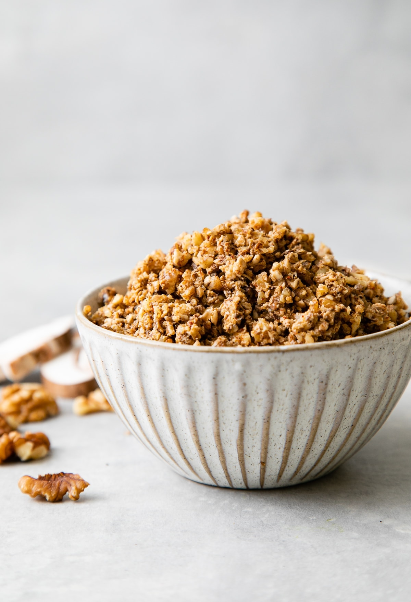{:height 387, :width 291}
			- MAKES: 2 cups/250g DIFFICULTY: Easy
			  collapsed:: true
				- These crumbles add tremendous texture and flavour. Sprinkle them on top of cooked whole grains and vegetables, or add them to stuffing and pasta. The savoury flavour is similar to Italian sausage. For a spicy kick, add ½ teaspoon of red pepper flakes and use the optional cayenne.
				- **Ingredients**
					- 6 ounces/175g baby portobello mushrooms
					- ½ cup/60g walnut pieces
					- ⅓ cup/45g raw sunflower seeds
					- ⅓ cup/45g raw pumpkin seeds
					- ¼ cup/30g ground flaxseeds
					- 3 tablespoons nutritional yeast
					- 1 teaspoon smoked paprika
					- 1 teaspoon onion powder
					- 1 teaspoon garlic powder
					- 1 teaspoon ground fennel seeds
					- 1 teaspoon dried oregano
					- 1 teaspoon dried basil
					- ¼ teaspoon cayenne (optional)
					- ¼ teaspoon ground black pepper
				- **Instructions**
					- 1. Pulse the mushrooms in a food processor until finely chopped. Transfer to a bowl and set aside.
					- 2. In the same food processor (no need to wipe it out), combine the walnuts, sunflower seeds and pumpkin seeds and pulse to coarsely grind. Add the ground nuts and seeds to the bowl of finely chopped mushrooms. Add all the remaining ingredients. Mix well.
					- 3. Heat a large skillet or heavy-based frying pan over a medium heat. Cook the mixture, stirring frequently, for 10 minutes, or until the mushroom liquid has been released and evaporated, and crumbles begin to form. Cook a few minutes longer, until the crumbles begin to crisp. Remove from the heat and allow to cool. Use the crumbles immediately in recipes, or store them in an airtight container in the refrigerator for up to 3 days or in the freezer for up to 1 month.
					- **For Variation:** Substitute cold cooked whole grains (barley is a good choice) or grated cauliflower for the mushrooms.
		- BASIC BROL (BARLEY, RYE, OATS AND LENTILS)
		  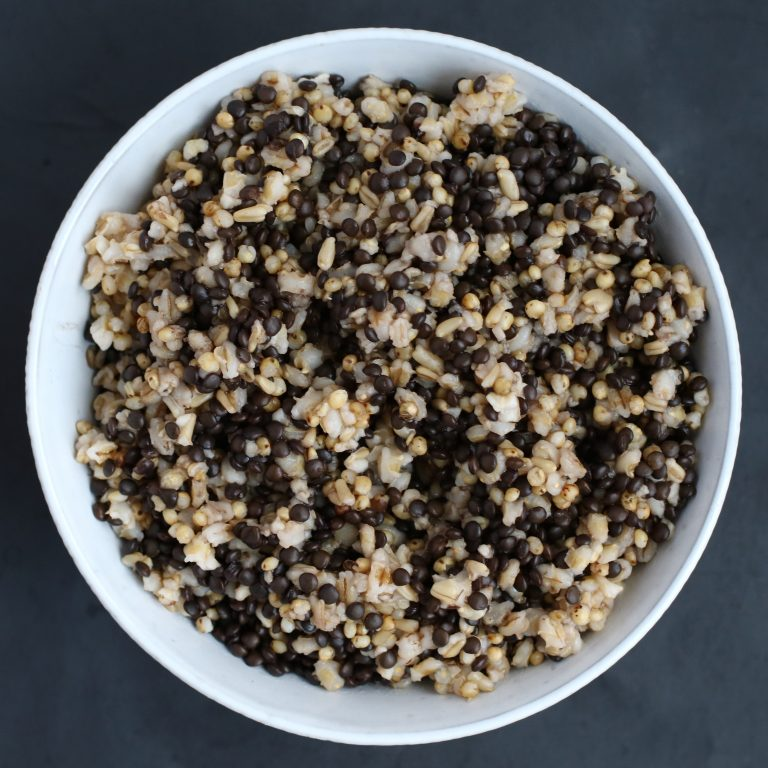{:height 319, :width 330}
			- MAKES: 5 cups/900g DIFFICULTY: Easy
			  collapsed:: true
				- BROL stands for barley, rye, oats and lentils. Barley groats, sold as pot or hull-less barley, rye grains, and oat groats are available in well-stocked supermarkets or online. Use purple barley, if you can find it, for the extra antioxidant boost. For the same reason, I use black lentils because they are the most antioxidant-packed lentils. Sometimes sold as beluga lentils due to their resemblance to caviar, you can also find black lentils in well-stocked supermarkets or online. For a gluten-free version of my Basic BROL, use gluten-free oats and substitute sorghum and millet for the rye and barley (SMOL!). Finger millet is one of the healthiest types. For convenience, you may want to cook your whole grains and lentils in larger proportions, then portion and freeze them for future use.
				- **Ingredients**
					- ½ cup/100g dried black lentils, rinsed
					- ½ cup/100g pot barley, rinsed
					- ½ cup/85g rye grains, rinsed
					- ½ cup/90g oat groats, rinsed
				- **Instructions**
					- 1. In an electric pressure cooker or multicooker, such as an Instant Pot, pressure-cook the lentils in 1 cup/250ml of water on high. (I use the Steam setting.) Allow time for natural pressure release so the remaining water gets absorbed. Remove the cooked lentils from the pot and set aside.
					- 2. Combine the barley, rye and oat groats in the cooker. Stir in 3 cups/750ml of water. Pressure cook for 30 minutes, or use the Mixed Grain button if your cooker has one.
					- 3. Add the cooked lentils to the cooked grains and toss gently to combine. The Basic BROL is now ready to use in recipes. You can also portion and freeze to use as needed.
					- **For Variation:** If you prefer to cook your whole grains on the stovetop, cook them separately, or cook them in larger amounts. Turn to the Legumes and Grains Cooking Charts here for instruction, if needed.
		- FRESH TOMATO SALSA
		  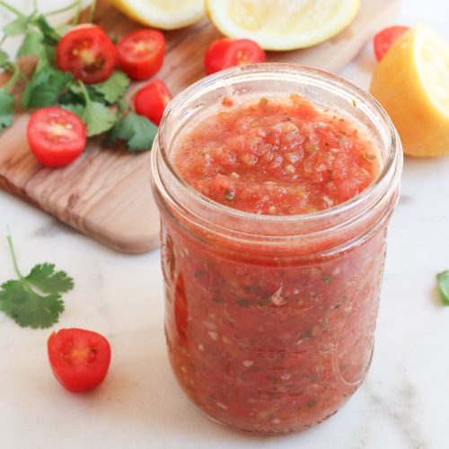{:height 332, :width 332}
			- MAKES: 3 cups/500g DIFFICULTY: Easy
				- Salsa is simple to make and especially delicious when fresh tomatoes are in season. Best of all, you can have it your way without the added salt and other ingredients often found in commercial salsas.
				- **Ingredients**
					- 6 firm plum tomatoes, cored and coarsely chopped
					- ½ pepper of any colour, de-seeded and finely chopped
					- 2 tablespoons finely chopped red onion
					- 1 jalapeño pepper or other small hot chilli, de-seeded and finely chopped
					- 1 tablespoon apple cider vinegar
					- 2 tablespoons finely chopped fresh coriander or parsley
					- Super-Charged Spice Blend (here)
				- **Instructions**
					- 1. Combine all the ingredients, including the Super-Charged Spice Blend to taste, in a bowl and stir to combine. Cover and let stand at room temperature for 1 hour before serving. If not using right away, store in an airtight container in the refrigerator. The salsa will keep refrigerated for 3 to 4 days.
		- BRAZIL NUT PARM
		  {:height 335, :width 327}
			- MAKES: 1½ cups/200g DIFFICULTY: Easy
				- I store this topping in a glass shaker with large holes and a tight-fitting lid so I can easily sprinkle it onto pasta and wholegrain dishes or salads for a cheesy flavour. Although the recipe calls for Brazil nuts and cashews, I sometimes mix it up and substitute other varieties of nuts. Experiment creatively and enjoy!
				- **Ingredients**
					- ¾ cup/100g raw Brazil nuts
					- ¼ cup/40g raw cashews
					- ½ cup/70g nutritional yeast
					- 2 teaspoons Dr Greger’s Special Spice Blend (here)
				- **Instructions**
					- 1. Combine all the ingredients in a food processor and process until the nuts are finely ground. Transfer to a covered container or shaker with a tight-fitting lid and keep refrigerated. The Brazil Nut Parm will keep for up to 1 week in the refrigerator or 1 month in the freezer.
		- BERBERE SPICE BLEND
		  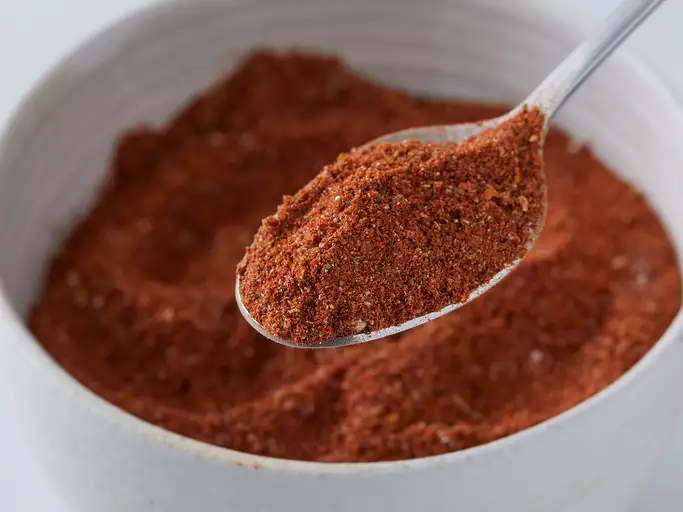{:height 261, :width 328}
			- MAKES: ⅓ cup/100g DIFFICULTY: Easy
				- Because this spice blend features several spices, it’s more economical to buy a small amount of the various spices sold in bulk, if available. You can also buy ready-made berbere in spice shops, ethnic markets or online.
				- **Ingredients**
					- 3 tablespoons paprika
					- 1 tablespoon cayenne, or to taste
					- 2 teaspoons ground coriander
					- 1 teaspoon ground ginger
					- 1 teaspoon ground turmeric
					- 1 teaspoon ground cumin
					- 1 teaspoon onion powder
					- ½ teaspoon ground cardamom
					- ½ teaspoon ground fenugreek seeds
					- ½ teaspoon ground black pepper
					- ¼ teaspoon ground nutmeg
					- ⅛ teaspoon ground cloves
					- ⅛ teaspoon ground cinnamon
					- ⅛ teaspoon ground allspice
				- **Instructions**
					- 1. Combine all the ingredients in a spice grinder or small food processor and grind finely to mix well. Transfer the spice mixture to a small jar with a tight-fitting lid and store in a cool, dry place.
		- SUPER-CHARGED SPICE BLEND
			- MAKES: ⅔ cup/50g DIFFICULTY: Easy
			  collapsed:: true
				- Similar to Dr Greger’s Special Spice Blend from The How Not to Die Cookbook, included in this collection on here, this super-charged spice blend boasts the added benefits of cumin, nigella seeds, ginger and black pepper. I always have this seasoning blend on hand to boost flavours or to use in place of salt.
				- **Ingredients**
					- ¼ cup/35g nutritional yeast
					- 1 tablespoon garlic powder
					- 1 tablespoon onion powder
					- 1 tablespoon dried parsley
					- 1 tablespoon dried basil
					- 2 teaspoons ground thyme
					- 2 teaspoons mustard powder
					- 2 teaspoons paprika
					- 2 teaspoons ground cumin
					- 1 teaspoon ground nigella seeds
					- 1 teaspoon ground ginger
					- ½ teaspoon ground turmeric
					- ½ teaspoon celery seeds
					- ½ teaspoon ground black pepper
				- **Instructions**
					- 1. Combine all the ingredients in a spice grinder to mix well and pulverize the dried herbs. Transfer the mixture to a shaker bottle with a tight-fitting lid. Store in a cool, dry place.
		- DR GREGER’S SPECIAL SPICE BLEND
			- MAKES: ½ cup/120g DIFFICULTY: Easy
			  collapsed:: true
				- For those times when your food needs seasoning without the flavour of cumin, here’s my original spice blend recipe from The How Not to Die Cookbook.
				- **Ingredients**
					- 2 tablespoons nutritional yeast
					- 1 tablespoon onion powder
					- 1 tablespoon dried parsley
					- 1 tablespoon dried basil
					- 2 teaspoons ground thyme
					- 2 teaspoons garlic powder
					- 2 teaspoons mustard powder
					- 2 teaspoons paprika
					- ½ teaspoon ground turmeric
					- ½ teaspoon celery seeds
				- **Instructions**
					- 1. Combine all the ingredients in a spice grinder to mix well and pulverize the dried herbs. Transfer the mixture to a shaker bottle with a tight-fitting lid. Store in a cool, dry place.
		- UMAMI SAUCE REDUX
		  {:height 383, :width 331}
			- MAKES: 1¼ cups/300ml DIFFICULTY: Easy
			  collapsed:: true
				- Umami is one of the five basic tastes, though many people are only learning about it now. The word was created by a Japanese chemist named Kikunae Ikeda from umai, which means ‘delicious’, and mi, which means ‘taste’. This new and improved umami sauce is perfect in sautés or stir-fries to boost flavour without adding the sodium of salt or soy sauce.
				- **Ingredients**
					- 1 cup/250ml Light Vegetable Broth (here)
					- 1 teaspoon finely chopped garlic
					- 1 teaspoon grated ginger
					- 1½ tablespoons treacle
					- 1 teaspoon salt-free tomato puree
					- ½ teaspoon ground black pepper
					- 2 teaspoons miso paste blended into 2 tablespoons water
					- 1 tablespoon apple cider vinegar
					- 1 tablespoon fresh lemon juice
				- **Instructions**
					- 1. Heat the Light Vegetable Broth in a small saucepan over a medium heat. Add the garlic and ginger and simmer for 3 minutes. Stir in the treacle, tomato puree and black pepper, and bring just to the boil. Lower the heat to low and simmer for 1 minute.
					- 2. Remove from the heat, and then stir in the miso mixture, apple cider vinegar and lemon juice. Blend well. Taste and adjust the seasonings, if needed.
					- 3. Allow the sauce to cool before transferring to a jar or bottle with a tight-fitting lid. The sauce will keep in the refrigerator for up to 1 week. Alternatively, pour the cooled sauce into an ice cube tray and freeze into individual portions.
		- RICH ROASTED VEGETABLE BROTH
		  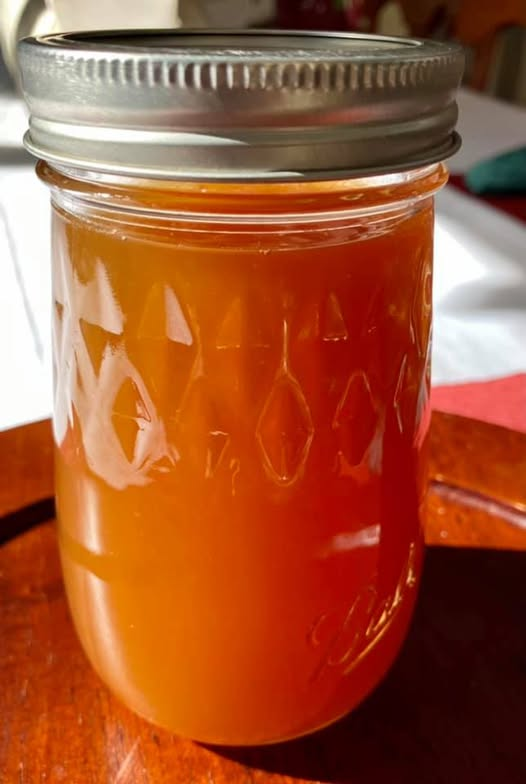{:height 224, :width 136}
			- MAKES: 6-8 cups/1.5–2 litres DIFFICULTY: Easy
				- Use this broth in any recipes when you want to enrich the flavour of the dish. For a lighter broth, use the Light Vegetable Broth on here.
				- **Ingredients**
					- 1 large onion, cut into wedges
					- 1 red pepper, de-seeded and cut into 2-inch/5cm pieces
					- 2 celery stalks, cut into 2-inch/5cm pieces
					- 2 to 3 carrots, cut into 2-inch/5cm pieces
					- 2 garlic cloves, coarsely chopped
					- 8 ounces/225g baby portobello mushrooms, quartered
					- 8 ounces/225g tomatoes, cored and halved
					- 3 tablespoons white miso paste
					- 2 tablespoons salt-free tomato puree
					- 1 bunch parsley, chopped
					- 1 bay leaf
					- 6 whole black peppercorns
					- 1 strip kombu (dried sea vegetable) (optional)
				- **Instructions**
					- 1. Preheat the oven to 220°C/425°F/gas mark 7. Line a large roasting tin or rimmed baking tray with a silicone mat or baking parchment. (You may need to use two trays.) Spread the vegetables evenly in the prepared tin.
					- 2. Roast the vegetables in the oven, stirring occasionally, until lightly browned and slightly caramelized, about 60 minutes. Remove the tin from the oven and transfer the roasted vegetables to a large soup pot.
					- 3. Stir in the miso paste and tomato puree. Add the parsley, bay leaf, peppercorns, kombu (if using) and 2.85 litres of water. Bring to the boil, then lower the heat to a simmer. Cook, uncovered, until the liquid is reduced by about half.
					- 4. Remove from the heat and allow to cool. Pour the broth through a colander into a large bowl or pot. The Rich Roasted Vegetable Broth is now ready to use.
					- 5. To store the broth, allow it to cool completely before portioning it into containers with tight-fitting lids. Refrigerate or freeze until needed. Instead of discarding the vegetable solids, you can either eat them as is or, after removing and discarding the bay leaf, kombu and peppercorns, puree the vegetables and then portion and freeze them in small containers for later use to enrich soups or gravies. For an even richer broth, add some of the pureed vegetables back into the broth before using.
		- LIGHT VEGETABLE BROTH
		  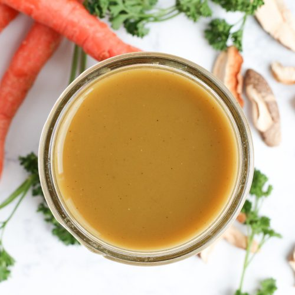{:height 339, :width 328}
			- MAKES: 6 cups/1.5 litres DIFFICULTY: Easy
			  collapsed:: true
				- Use this light, all-purpose salt-free broth in any recipe calling for any kind of broth.
				- **Ingredients**
					- 1 red onion, coarsely chopped
					- 2 carrots, cut into 1-inch/2.5cm pieces
					- 2 celery stalks, coarsely chopped
					- 3 garlic cloves, crushed
					- 2 plum tomatoes, cored and halved
					- 2 dried shiitake mushrooms
					- 1 (2-inch/5cm) piece of kombu (dried sea vegetable) (optional)
					- ½ cup/15g fresh, coarsely chopped parsley
					- 2 bay leaves
					- ½ teaspoon ground black pepper
					- 2 tablespoons white miso paste
					- Dr Greger’s Special Spice Blend (here)
				- **Instructions**
					- 1. In a large pot, heat 1 cup/250ml of water over a medium heat. Add the onion, carrot, celery and garlic and cook for 5 minutes. Stir in the tomatoes, mushrooms, kombu (if using), parsley, bay leaves and black pepper.
					- 2. Add 7 cups/1.75 litres of water and bring to the boil. Lower the heat to low and simmer for 1½ hours.
					- 3. Remove from the heat, let cool slightly; then remove and discard the kombu if used. Transfer the broth to a high-powered blender and blend until smooth. Strain the blended broth through a fine-mesh sieve back into the pot or a large bowl, pressing the vegetables against the sieve to release their juices.
					- 4. Ladle about ⅓ cup/75ml of the broth into a small bowl or cup. Add the miso paste and Dr Greger’s Special Spice Blend to taste and stir well before incorporating back into the broth. Let the broth cool to room temperature before dividing into containers with tight-sealing lids and storing in the refrigerator or freezer. Properly stored, the broth will keep for up to 5 days in the refrigerator or up to 3 months in the freezer.
				- **COOKING TO LIVE LONGER**
					- Food prepared at home tends to have less saturated fat, cholesterol and sodium, and more fibre, so benefits may include chronic disease prevention. But do people who cook live longer? Yes! Those who cooked more than five times a week versus not at all had higher vegetable consumption and only 59 per cent of the mortality risk. So, put on that apron!
		- BALSAMIC SYRUP
		  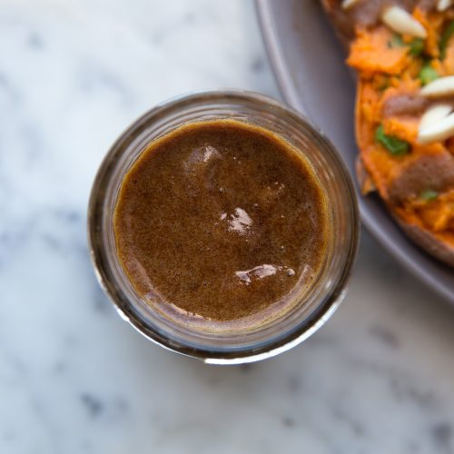{:height 363, :width 330}
			- MAKES: ½ cup/120ml DIFFICULTY: Easy
			  collapsed:: true
				- Three tips for you: First, be sure to watch carefully when reducing the vinegar so it doesn’t reduce too much and burn. Second, if the syrup hardens after being refrigerated, place the container in a bowl filled with warm water to gently warm it. And, third, double, triple or make even more of the recipe, depending on how much you want to have on hand.
				- **Ingredients**
					- 1 cup/250ml balsamic vinegar
				- **Instructions**
					- 1. Pour the vinegar into a small saucepan and bring just to the boil. Lower the heat to a low simmer and allow the vinegar to reduce by about half, or until it is thick enough to coat the back of a spoon. Watch closely so it doesn’t burn. The reduction should take 15 to 20 minutes (or longer if you make a larger quantity).
					- 2. Remove from the heat and allow to cool. The syrup will continue to thicken as it cools. Once cool, it is ready to use. If not using right away, transfer the syrup to an airtight container and store at room temperature or in the refrigerator. It keeps for up to 3 days at room temperature or 2 weeks in the fridge.
		- BASIL PESTO
		  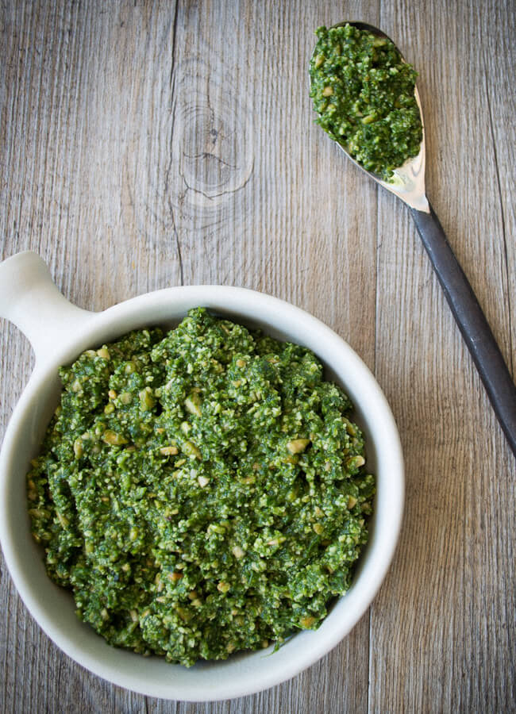{:height 399, :width 256}
			- MAKES: 2 cups/200g DIFFICULTY: Easy
			  collapsed:: true
				- For convenience, portion this pesto and freeze it for future use. (A silicone ice cube tray works well for this.)
				- **Ingredients**
					- 3 garlic cloves, crushed
					- ½ cup/75g raw unsalted cashews, soaked for 30 minutes in hot water and then drained
					- ⅓ cup/45g nutritional yeast
					- ½ cup/60g walnut pieces
					- 2 teaspoons white miso paste
					- 3 cups/120g packed fresh basil leaves
					- 1 teaspoon Dr Greger’s Special Spice Blend (here), or to taste
				- **Instructions**
					- 1. In a food processor, combine the garlic, cashews, nutritional yeast and walnuts and process to a paste. Add the miso paste, basil, Dr Greger’s Special Spice Blend and ¼ cup/60ml of water and process until smooth and combined. The Basil Pesto will stay fresh for 1 or 2 days in an airtight container in the refrigerator or up to 1 month in the freezer.
		- SALT-FREE HOT SAUCE
		  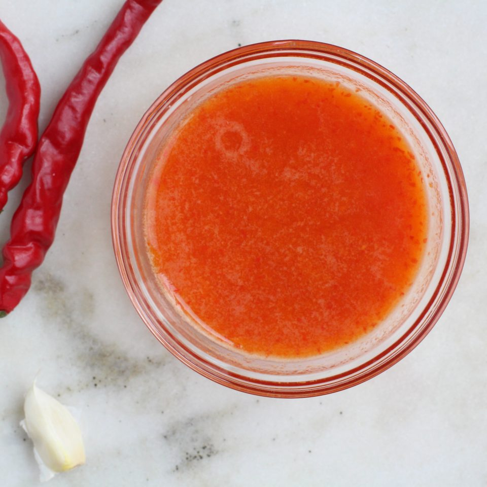{:height 338, :width 330}
			- MAKES: 2 cups/500ml DIFFICULTY: Easy
			  collapsed:: true
				- For the spice and heat without the salt found in most bottled hot sauces, look no further than this recipe. The type of chillies you use will determine the heat level of the sauce, but regardless of which hot chillies you use, be sure to use rubber gloves when handling them and do not touch your eyes.
				- **Ingredients**
					- 12 ounces/350g fresh hot chillies of your choice, destemmed, halved lengthways, de-seeded and chopped
					- ½ cup/75g chopped red onion
					- 1 tablespoon finely chopped garlic
					- ½–1 cup/120–250ml apple cider vinegar, to taste
				- **Instructions**
					- 1. In a saucepan, combine the chillies, onion, garlic and ¼ cup/60ml of water. Cook over a high heat, stirring, for 2 to 3 minutes. Lower the heat to medium-high, add 1¾ cups/425ml of water, and continue to cook, stirring occasionally, for 15 to 20 minutes, or until the chillies are very soft and the water is reduced by about half. Remove from the heat and let the mixture cool to room temperature.
					- 2. Transfer the cooled mixture to a food processor and process until very smooth. Add ½ cup/120ml of the apple cider vinegar and process to blend. Taste the sauce and add more of the vinegar, if desired, according to your taste. Transfer the hot sauce into a clean glass jar or bottle, secure with an airtight lid, and keep refrigerated.
		- ROASTED GARLIC
		  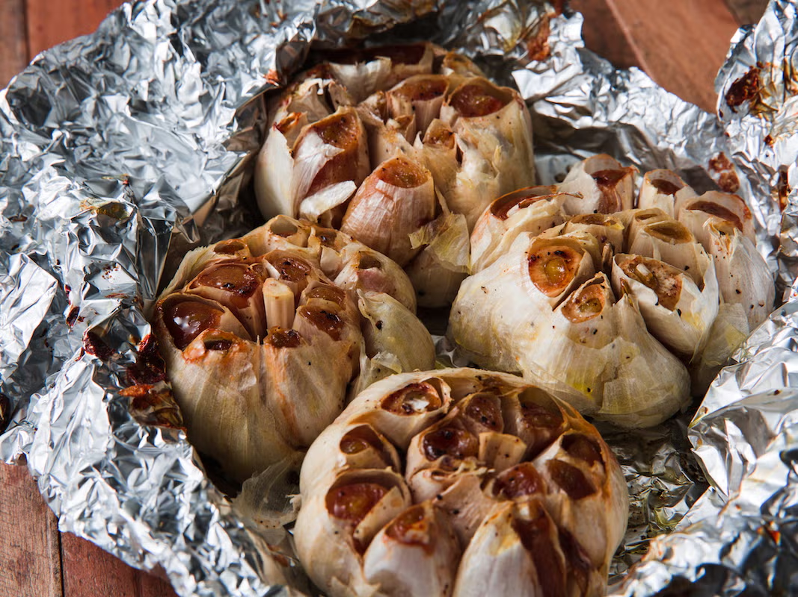{:height 306, :width 391}
			- MAKES: 3 tablespoons DIFFICULTY: Easy
				- Roasted garlic is easy to make and can be used to add flavour to many of the recipes in this book.
				- **Ingredients**
					- 1 whole head garlic
				- **Instructions**
					- 1. Preheat the oven to 200°C/400°F/gas mark 6.
					- 2. Use a sharp knife to cut about ⅓ inch/1cm off the top of the garlic head to expose the tops of the garlic cloves. Place the bulb, cut side up, inside a terracotta garlic baker or wrap it securely in aluminium foil. Bake for 30 to 40 minutes, or until the garlic cloves are soft.
					- 3. Remove from the oven and open the garlic baker or foil to let the garlic cool. Remove one garlic clove and squeeze it over a small bowl, allowing the soft roasted garlic to slip out of the papery skin. If it is not very soft and golden brown, then return the rest of the bulb back to the garlic baker or rewrap it in the foil and bake for a few minutes longer.
					- 4. When the garlic is soft inside and cool enough to handle, squeeze the roasted garlic out of each clove and into the bowl. The Roasted Garlic is now ready to use and can be stored in the refrigerator in a jar or other container with a tight-fitting lid for up to 5 days.
				- **GARLIC FOR CANCER AND THE COMMON COLD**
					- Garlic lowers blood pressure, regulates cholesterol, stimulates immunity, and may prevent occurrences of the common cold. Is it also a stake through the heart of cancer? Those who eat more garlic appear to have lower cancer rates than those who eat less.
		- DATE SYRUP
		  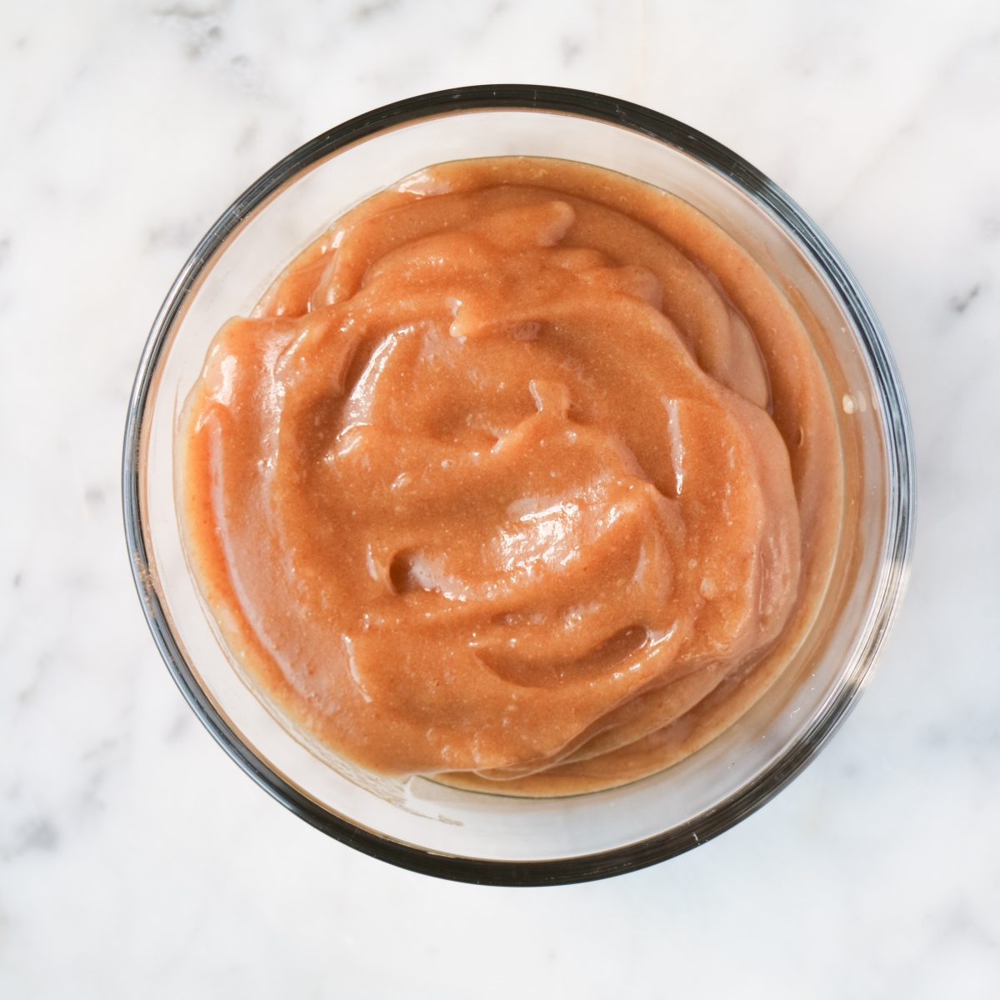{:height 346, :width 334}
			- MAKES: 1½ cups/370ml DIFFICULTY: Easy
				- Date Syrup is great to have on hand when you need a whole food sweetener.
				- **Ingredients**
					- 1 cup/225g pitted dates
					- 1 cup/250ml boiling water
					- 1 teaspoon fresh lemon juice
				- **Instructions**
					- 1. Combine the dates and water in a heatproof bowl, and set aside for 1 hour to allow the dates to soften. Transfer the dates and the soaking water to a high-powered blender. Add the lemon juice and process until smooth. Transfer to a glass jar or other container with a tight-fitting lid. Store the syrup in the refrigerator for 2 to 3 weeks.
				- **What About Stainless-Steel and Cast-Iron Cookware?**
					- Under day-to-day conditions, stainless-steel cookware is considered safe even for most people acutely sensitive to nickel and chromium, and cast iron can help to improve iron status and potentially reduce anaemia incidence among reproductive-age women and children.
		- ROASTED RED PEPPER
		  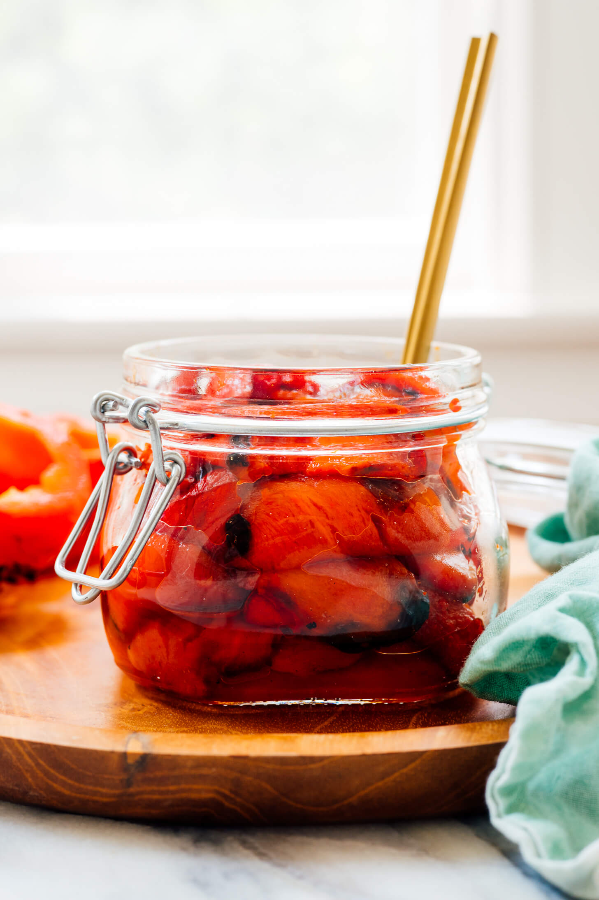{:height 587, :width 367}
			- MAKES: 1 pepper DIFFICULTY: Easy
			  collapsed:: true
				- Roasted red peppers add a beautiful colour and delicious smoky flavour to dishes. You can buy them water-packed in jars, but they’re easy to make at home in the oven or on the stovetop – and homemade always tastes so much better!
				- **Ingredients**
					- 1 large red pepper
				- **Instructions**
					- 1. **IN THE OVEN:** Set the oven to grill and place the pepper 8 inches/20cm from the heat source. Grill, turning every few minutes as needed, for about 15 minutes, or until much of the skin has blistered.
					- 2. **ON THE STOVETOP:** Over high heat, cook the pepper either directly over an open flame or in a cast-iron skillet or griddle pan, turning every minute or so as needed with kitchen tongs, until it’s mostly blistered.
					- 3. Once the pepper is roasted, transfer it to a bowl. Cover tightly for about 15 minutes to allow the pepper to steam. (The heat from the pepper enables it to essentially steam itself, softening it and making it easier to remove the skin.)
					- 4. After the pepper has steamed, remove it from the bowl and place it on a clean surface. Rub off the charred skin from the pepper (it should come off easily); then remove the stem with a paring knife and scrape out the seeds with a spoon. The Roasted Red Pepper is now ready to use in recipes.
	- COOKING CHARTS: LEGUMES AND GRAINS
		- Cooking legumes and whole grains is fairly formulaic. It’s a simple process that results in amazingly delicious – and healthy – food. The following are instructions for preparing these staples on the stovetop or in a multicooker, such as an Instant Pot, or a pressure cooker.
		- COOKING LEGUMES ON THE STOVETOP
			- Generally, 1 cup of dried legumes yields about 3 cups of cooked legumes.
			- When cooking on a stovetop, dried legumes – with the exception of lentils – require soaking prior to cooking. Soaking rehydrates the legumes and shortens their cooking time. It also dissolves some of the complex sugars that cause digestive gas. Before soaking legumes, rinse them, and then pick through to remove any small stones or other debris.
			- To soak the legumes, place them in a bowl with enough water to cover them by about 3 inches (7.5cm). Soak them overnight and drain before cooking. To quick-soak legumes, put them in a pot with enough water to cover by about 3 inches (7.5cm) and boil for 2 minutes. Remove the pot from the heat, cover, and leave to stand for 2 hours before draining. The quick-soaked legumes are then ready for cooking.
			- **STOVETOP COOKING TIMES FOR SOAKED LEGUMES**
				- | LEGUME (1 CUP DRIED) | WATER | COOKING TIME |
				  | --- | --- | --- |
				  | Adzuki beans | 3 cups | 45 to 50 minutes |
				  | Black beans | 4 cups | 50 to 60 minutes |
				  | Black-eyed beans | 3 cups | 45 minutes |
				  | Cannellini beans (white) | 4 cups | 60 minutes |
				  | Chickpeas | 4 cups | 60 to 70 minutes |
				  | Great northern beans (white) | 3½ cups | 50 minutes |
				  | Kidney beans | 3½ cups | 50 to 60 minutes |
				  | Lentils (brown)* Lentils (black or green)* Lentils (red)* | 3 cups | 25 to 30 minutes 30 minutes 10 to 15 minutes |
				  | Navy beans | 3½ cups | 50 minutes |
				  | Pinto beans | 3½ cups | 50 minutes |
			- *Note: Lentils do not require soaking.
			- Cooking time may vary, depending on the type, quality and age of the legumes as well as the altitude at which you are cooking. Cooked legumes should be firm but tender. Once cooked, drain in a colander and rinse with cold water before using.
			- Cooked legumes will keep well in an airtight container in the refrigerator for up to 5 days or in the freezer for 3 months or longer.
		- COOKING LEGUMES IN A MULTICOOKER OR PRESSURE COOKER
			- If you have a large (5.7–7.6 litres) multicooker, such as an Instant Pot, or another pressure cooker, you can cook 1 pound/450g (2 cups) of legumes at a time. Generally, 1 cup of dried legumes yields about 3 cups cooked.
			- Cooking time may vary, depending on the type, quality and age of the legumes as well as the altitude of your kitchen and variables among different appliances.
			- Rinse the dried legumes; then pick through to remove any small stones or other debris. Add the legumes to your cooker along with the water quantity specified in the following chart.
			- Close and lock the lid. Set the valve on the lid to Sealing. Select the Pressure Cook function with High Pressure. Cook on high pressure for the directed time. Let the pressure release naturally for at least 20 minutes.
			- Remove the lid. The legumes should be firm but tender. Once cooked, drain in a colander and rinse with cold water before using.
			- Cooked legumes will keep well in an airtight container in the refrigerator for up to 5 days or in the freezer for 3 months or longer.
			- **MULTICOOKER COOKING TIMES FOR UNSOAKED LEGUMES on HIGH PRESSURE**
				- | LEGUME (1 CUP DRIED) | WATER | COOKING TIME |
				  | --- | --- | --- |
				  | Adzuki beans | 2 cups | 20 minutes |
				  | Black beans | 3 cups | 25 minutes |
				  | Black-eyed beans | 3 cups | 20 minutes |
				  | Cannellini beans (white) | 4 cups | 40 minutes |
				  | Chickpeas | 4 cups | 45 minutes |
				  | Great northern beans (white) | 3 cups | 35 minutes |
				  | Kidney beans | 3 cups | 30 minutes |
				  | Lentils (brown) Lentils (black or green) Lentils (red) | 2 cups 2 cups 1¾ cups | 8 minutes 8 minutes 5 minutes |
				  | Navy beans | 3 cups | 25 minutes |
				  | Pinto beans | 3 cups | 25 minutes |
			- **PRESSURE STEAMING GREENS?**
				- I pour a layer of water into the bottom of my electric pressure cooker pot, drop in a metal steamer basket, add greens, and steam them under pressure. The small feet on metal steamer baskets keep the water from touching the food, and you can get the same delicious, melt-in-your-mouth texture of traditional southern collards and Ethiopian greens by just steaming under pressure for one minute or less. Release the steam, and the greens are perfect – bright emerald green and cooked tender.
			- NOTE: There is no need to soak legumes when cooking them in a multicooker or pressure cooker. They will cook well without the overnight soak or quick-soak needed for stovetop cooking. However, some people find that soaking legumes helps make them easier to digest. If you choose to presoak before pressure-cooking, be aware that the cooking time for presoaked legumes in the cooker will be reduced significantly. Generally, presoaking will cut the cooking time in half or even more.
		- COOKING WHOLE GRAINS ON THE STOVETOP
			- Generally, 1 cup of uncooked whole grains yields about 3 cups of cooked whole grains.
			- Before you cook any grains, be sure to rinse them to remove loose hulls, dust, and other impurities. Longer-cooking grains, such as rye grains and oat groats, should be soaked overnight and then drained.
			- To cook grains, add them to a pot and cover with 2 to 3 times as much water. (Adding extra water for longer-cooking grains will help keep them from scorching, and any excess water can be drained off.) Bring the water to the boil, then lower the heat to low, cover, and simmer for the average time specified in the following chart until tender.
			- If the grains are not tender before the water is absorbed, add a little more water and continue to cook until the grains are to your liking. After cooking, remove the pot from the heat and let it stand, covered, for 5 to 10 minutes before serving. If any water remains in the pot, drain it off before serving. When ready to serve, fluff the grains with a fork.
			- Cooked grains will keep well in an airtight container in the refrigerator for up to 5 days or in the freezer for 3 months or longer.
			- **STOVETOP COOKING TIMES FOR WHOLE GRAINS**
				- | GRAIN (1 CUP DRIED) | WATER | COOKING TIME |
				  | --- | --- | --- |
				  | Barley (pot) | 3 to 4 cups | 50 to 60 minutes |
				  | Millet | 2½ cups | 30 minutes |
				  | Oat groats | 3 to 4 cups | 50 to 60 minutes |
				  | Quinoa | 2 cups | 15 to 20 minutes |
				  | Rye grains | 3 to 4 cups | 60 minutes |
				  | Sorghum | 3 to 4 cups | 50 to 60 minutes |
				  | Teff | 2 cups | 15 to 20 minutes |
		- COOKING WHOLE GRAINS IN A MULTICOOKER OR PRESSURE COOKER
			- Generally, 1 cup of uncooked whole grains yields about 3 cups of cooked whole grains. If you have a large (6-to 8-quart) multicooker, such as an Instant Pot, or another pressure cooker, you can cook 2 cups of grains at a time.
			- Before you cook any grains, rinse them to remove loose hulls, dust, and other impurities. There is no need to soak any grains when cooking in an Instant Pot.
			- Add the grains and the water quantity specified in the following chart to your multicooker or pressure cooker. Close and lock the lid. Set the valve on the lid to Sealing. Select the Pressure Cook function with High Pressure. Cook on high pressure for the directed time. Let the pressure release naturally for at least 20 minutes.
			- Remove the lid. The grains should be firm but tender. If any water remains, drain the grains in a colander. When ready to serve, fluff the grains with a fork.
			- Cooked grains will keep well in an airtight container in the refrigerator for up to 5 days or in the freezer for 3 months or longer.
			- **DOES PRESSURE COOKING PRESERVE NUTRIENTS?**
				- Pressure cooking presoaked black beans for 15 minutes, for example, results in six times more antioxidant content than boiling for an hour, and pressure cooking carrots nearly doubles antioxidant value. There was significantly less nutrient loss when pressure cooking spinach for three and a half minutes compared to boiling for eight.
			- **MULTICOOKER COOKING TIMES FOR WHOLE GRAINS ON HIGH PRESSURE**
				- | GRAIN (1 CUP DRIED) | WATER | COOKING TIME |
				  | --- | --- | --- |
				  | Barley (pot) | 3 cups | 20 to 30 minutes |
				  | Millet | 2 cups | 8 to 10 minutes |
				  | Oat groats | 3 cups | 20 to 30 minutes |
				  | Quinoa | 2 cups | 1 minute |
				  | Rye grain | 3 cups | 20 to 30 minutes |
				  | Sorghum | 3 cups | 20 to 30 minutes |
				  | Teff | 2 cups | 2 to 3 minutes |
- REFERENCES
- INDEX
